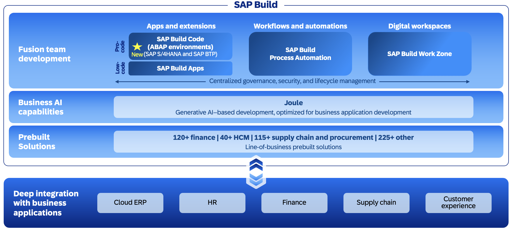

< [Home](../README.md)

# Introduction

With SAP Build, you can create extensions that run on-stack in SAP S/4HANA Cloud Public Edition, SAP S/4HANA Cloud Private Edition, and SAP S/4HANA and/or side-by-side on SAP BTP. Depending on your use cases and the capabilities required, you can choose a flexible combination of on-stack and side-by-side extensions.

Create on-stack extensions to:

- Adapt and extend standard SAP applications.  
- Create custom UI and full-stack applications.  
- Create custom APIs to enable integration.  

Create side-by-side extensions on SAP Business Technology Platform to:  

- Create custom full-stack applications.  
- Automate processes and tasks.  
- Create digital workspaces.  

 

# The scenario

In this workshop, you will learn how to create a side-by-side extensions using the ABAP Environment of SAP Business Technology Platform.  

- Create a **custom ShoppingCart application** using the ABAP RESTful application programming model on SAP BTP ABAP Environment as a side-by-side extension.  
- **Enable the integration** by creating OData client proxies to:   
  a) trigger the creation of a sales order in SAP S/4HANA using the **Sales Order (A2X)** OData API from this application, and   
  b) read product data using the **Product Master Data Including Classification - Read** OData API via a value help in this application

At the end of this workshop, your app will look something like this:

As said, the scenario in this hands-on is a side-by-side scenario. You will build the ShoppingCart App in the SAP BTP ABAP Environment (which is part of SAP Build, hence the session name).   
The ShoppingCart App will use (side-by-side) an SAP S/4HANA Public Cloud System. When creating a Shopping Cart, you will use a value help that allows you to remotely select materials from the SAP S/4HANA Public Cloud System by calling the  **Product Master Data Including Classification - Read** OData API.   
When saving the data of your Shopping Cart a SalesOrder is created remotely in the SAP S/4 HANA for each ShoppingCart using the **Sales Order (A2X)** OData API. The SalesOrderID is stored in the ShoppingCart App alongside with an URL which the user can use to view the data of the SalesOrder that has been created in the backend. The URL will start the SAP Fiori App **Manage Sales Orders V2** in the remote SAP S/4HANA Public Cloud system.
The ShoppingCart App is a RAP application with an responsive Fiori Elements UI which is updated asynchronously after the sales order creation process has finished successfully in the backend which can take up to 1-2 seconds.  

# Tools

We start in the **SAP Build Lobby**, where we create an ABAP(ADT) project. From this project, we launch Eclipse with the ADT PlugIn installed (in short **ADT** for **ABAP Development Tools**) to carry out the actual implementation in the SAP BTP ABAP Environment.  
Here, we use classes that have been prepared for this workshop that perform the OData calls to read product data and finally to create a SalesOrder.  
You as a developer will alongside with the RAP Business Object build a class, which is called asynchronously by the RAP BO using the new background processing framework (BGPF). The use of asynchronous called is required for technical reasons and hence ABAP developers have to learn how to perform such calls.
During the ABAP implementation you can (optionally) use **Joule for ABAP Developers** to leverage **AI** to generate the implementation of determinations and validations.

# Implementation steps

The first part of the development which is about generating the RAP BO and adjusting the generated code, is suitable for beginners.  

The second step, where the class that makes use of BGPF to call the prepared OData Client API's requires some ABAP knowledge to understand the whole context in depth. However it is also possible to achieve the goal of creating a SalesOrder with pure cut & paste 😉.

In the third unit, after having developed the RAP application, we show how either  
  a) directly from ADT   
  b) with SAP Build Code   
a SAP Fiori Elements application can be generated and deployed into the SAP BTP ABAP Environment.   

In the last (optional) part, we deep dive into how ABAP developers can create their own classes that can be used to call OData Services remotely in an S/4 backend to implement a side-by-side extension using the SAP BTP ABAP Environement.  
As a result you will be able to make use of your own OData API Classes in your Shopping Cart app instead of having to use the shared coding. To do so the previously used calls of the prepared classes will be replaced with calls of your own classes.
Here you will again have the option to leverage AI by using Joule for ABAP Developers to generate the OData Client Proxies and to generate the OData Client Proxy Calls. 

# What you will learn

By following the script, we will enable you as developer to create side-by-side implementations on your own, end-to-end also for other OData APIs.  

The goal is, despite being a complex scenario, to create a ShoppingCart App that truly represents a side-by-side scenario by providing preconfigured boiler-plate code.

Please note that already after finishing the first 3 steps of Unit 3, you already have a fully functional application based on the ABAP RESTful Application Programming Model.   

The further optional steps cover the UI generation and UI deployment.

The final and again optional step is the development of your own OData Client Proxy code yourself.

# Used products

**SAP Build** provides you the flexibility to create and extend apps, automate processes and design digital workspaces with SAPs low-code, pro-code and generative AI tools.   
Its collaborative design allows diverse teams to 
build solutions faster using prebuilt solutions, 
AI assistance and seamless integration with SAP applications.   

- Fusion Development: Built with collaboration in mind, SAP Build enables professionals, IT experts, and business users to work together for faster, more effective solution building.
- Intelligent Copilot: Powered by Joule, a copilot leveraging industry data, process knowledge, and customer data to understand your business needs.
- Pre-built Solutions: Accelerate development with over 500 pre-built solutions for industry and lines of business. Both SAP and partners contribute, maintain and update content.
- Seamless Integration: Deeply integrated with SAP's business applications, Build offers quick access from within your applications, leveraging familiar identity, security, and APIs for enhanced simplicity and efficiency. An extensive library of 5,000+ connectors, integration flows and business events for SAP and non-SAP applications all available in the Business Accelerator Hub

  

## Why ABAP Cloud?

ABAP was first designed for developing enterprise business applications. Over time, new concepts, technologies, and statements have been added, but not all are built for cloud technology. Therefore, ABAP needed to clearly define which technologies and languages can support all necessary cloud features. ABAP Cloud helps streamline this process by providing a stable ecosystem for developing complex enterprise apps involving multiple parties and various layers of extensions.

ABAP Cloud provides everything needed to develop lifecycle-stable and cloud-ready business apps, services, and extensions. It is scalable and flexible. With ABAP Cloud, you can build apps that can quickly adapt to changing business requirements.

The ABAP Cloud development model offers you end-to-end support for your development process by building on the ABAP language and the ABAP ecosystem. And it leverages all the advantages of cloud development, such as built-in extensibility, lifecycle-stable APIs, and a cloud-optimized ABAP language.

> **ABAP Cloud Roadmap**   
> For an overview of the ABAP Cloud road map, see [ABAP Cloud Roadmap Information](https://help.sap.com/docs/abap-cloud/abap-cloud/4006ce189d694aaeb6ace3ac8424e191.html).   

This ABAP Basic Trial gives an overview of the ABAP Cloud development model and how to use it to develop apps, services, and extensions. It gives an overview of the technologies and concepts in ABAP Cloud. The end-to-end development process is described in the corresponding development guides that are linked in each chapter.

## ABAP Cloud Development Model
ABAP Cloud is the development model to create lifecycle-stable and cloud-ready business apps, services, and extensions.

The unique strengths of the ABAP ecosystem are integrated into ABAP Cloud. But while ABAP Cloud is firmly integrated into the proven ABAP concepts, such as the lifecycle management or the identity and access management, it also offers other advantages: a release contract framework and a public API lifecycle that guarantees upgrade-safety and lifecycle-stable development.

ABAP Cloud provides tools and techniques that ensure cloud qualities, promotes new technologies, contains a cloud-optimized subset of the ABAP language, and makes upgrade cycles easier by a clear separation between custom code and SAP code by only using released APIs and objects.

The technological core of ABAP Cloud defines the design-time and runtime architecture of all extensions, services, and applications. The main ABAP Cloud elements are:  

- ABAP Core Data Services (CDS) for the data models and analytics.  
- The ABAP RESTful Application Programming Model (RAP) for transactional apps and services.  
- A cloud-optimized ABAP language for the business logic.  
- Mandatory public SAP APIs and extension points to allow automated cloud operations and lifecycle-stable extensibility.   
- ABAP Development Tools (ADT) as the ABAP IDE.   

Building on these key elements, you can use ABAP Cloud to cover the following main use cases:   
- Transactional (OLTP): With ABAP Cloud you can build business objects and expose them as services, to consume them in UIs and integration scenarios. All standard behavior is supported (create, read, update, delete).   
- Analytical (OLAP): ABAP Cloud is equally equipped for creating services and UIs for data analysis, for drilling down in multiple dimensions, like integrating the data with SAP Analytics Cloud.   
- Integration: Both previous use cases are complemented by strong data and application integration to cater to today’s service-oriented environments.  

The development model has two additional three key differentiators:  
- The support of _Generative AI_ using SAP Joule for Developers, including predictive code completion, unit test generation for ABAP CDS and ABAP code, and code explanation to speed up your development with ABAP Cloud.  
- The _Reuse Services and Libraries_ with core business services like the number ranges, the application jobs, an ABAP-integrated SAP Fiori Launchpad and UI repository to deploy SAPUI5 and SAP Fiori Elements UIs.  
- The _Built-In Qualities_ offering end-to-end extensibility in the programming model, major cloud qualities like scalability and upgrade stable APIs and many more.   

The following graphic illustrates the different building blocks that are part of the ABAP Cloud development model:

## Further information

- [SAP Online Help - Getting Started with Extensibility](https://help.sap.com/docs/sap-btp-guidance-framework/extension-architecture-guide/getting-started-with-extensibility)   
- [Public remote API's](https://help.sap.com/docs/link-disclaimer?site=https%3A%2F%2Fapi.sap.com%2Fproducts%2FSAPS4HANACloud%2Fapis%2Fall)  
- [Remote custom API's](https://help.sap.com/docs/SAP_S4HANA_CLOUD/0f69f8fb28ac4bf48d2b57b9637e81fa/f4dcfd6e14b54177b98d6099ddb2014e.html)  
- [Local SAP API's](https://help.sap.com/docs/link-disclaimer?site=https%3A%2F%2Fapi.sap.com%2Fproducts%2FSAPS4HANACloud%2Fdeveloperextensibility%2Fbointerface)  
- [Public SAP Extension Points](https://help.sap.com/docs/link-disclaimer?site=https%3A%2F%2Fapi.sap.com%2Fproducts%2FSAPS4HANACloud%2Fonstackextensibility%2Fbadi)  

 
[Next Unit](../502_BTP_ABAP-Cloud_GettingStarted/README.md) >

