< [Previous Lesson](./2_ABAP-Cloud_GettingStarted-Configure_ADT.md)

# Getting started

As ADT is now installed inside your Eclipse installation and is reachable using the Eclipse **link handler**, your are able to start the development. You will first create a **New ABAP Cloud Project** project in ADT and connect it with the ABAP environment on SAP BTP. After this you will create a package and perform some basic settings.

## Create an ABAP Cloud project in Eclipse/ADT

1. Open Eclipse and create a new ABAP Cloud project.  

   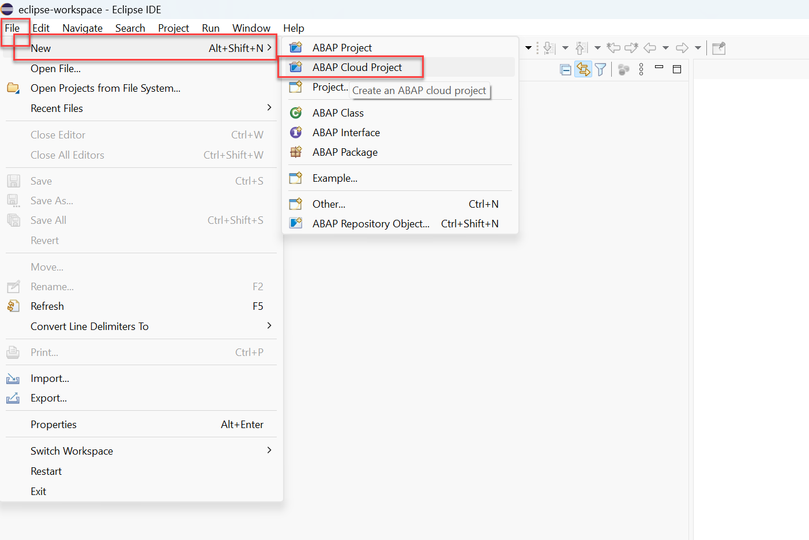  

2. Enter the URL to the ABAP Cloud Environment instance you've created earlier and press **Next**.    

   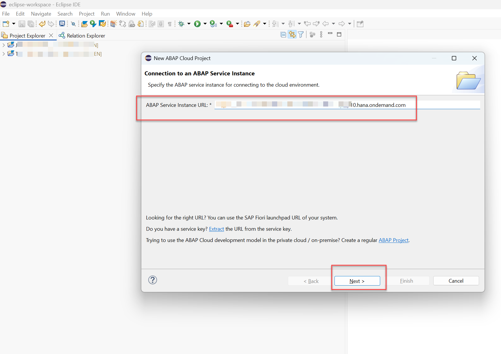

3. Logon to the ABAP Service instance will bring up a WEB page. Press **Open Logon Page in Browser** .

   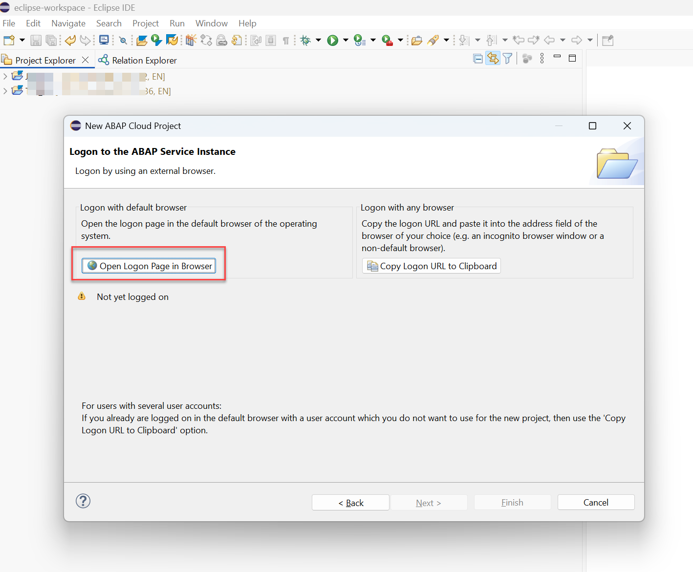

4. Enter the logon credentials that you received from the Administrator who setup the SAP BTP ABAP Environment system if needed (your administrator might have configured Single-Sign-On)

   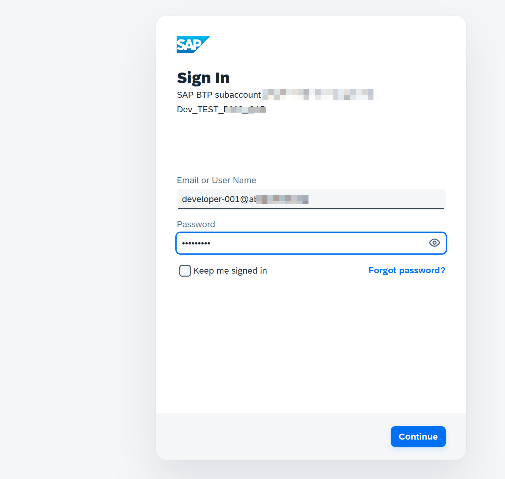

   You should receive a final message that you have been logged on succesfully as a WEB page.
     
   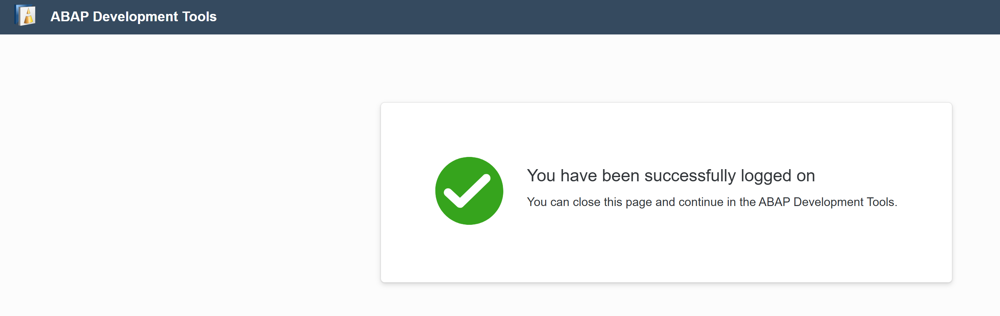

5. Switching back to Eclipse/ADT the UI has automatically changed to this:  
   
   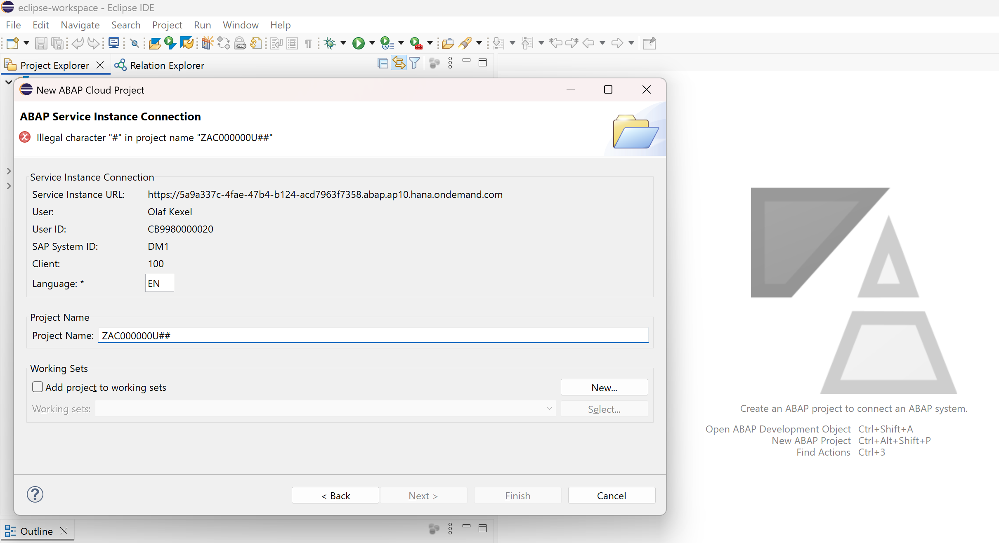
   
   - Name the project: **`ZAC000000U##`** (## ist your ID provided by the instructor)
   - Click **Finish**

     ⚠️ Do not forget to replace the placeholder `##` with your group id.

## Create a new package in ADT

Now let's directly create a package (in ADT) as subpackage of `ZLOCAL`. 

1. Right-click on `ZLOCAL` and complete the following fields: 
    
   - Name of New Package: **`ZAC000000U##`**     
      (## ist your ID provided by the instructor)   
   - Description: **Package for `ZAC000000U##`**   

   > Please be aware that the **Description** is mandatory. The **Next** button will only be enabled when all manadatary information has been entered.  

   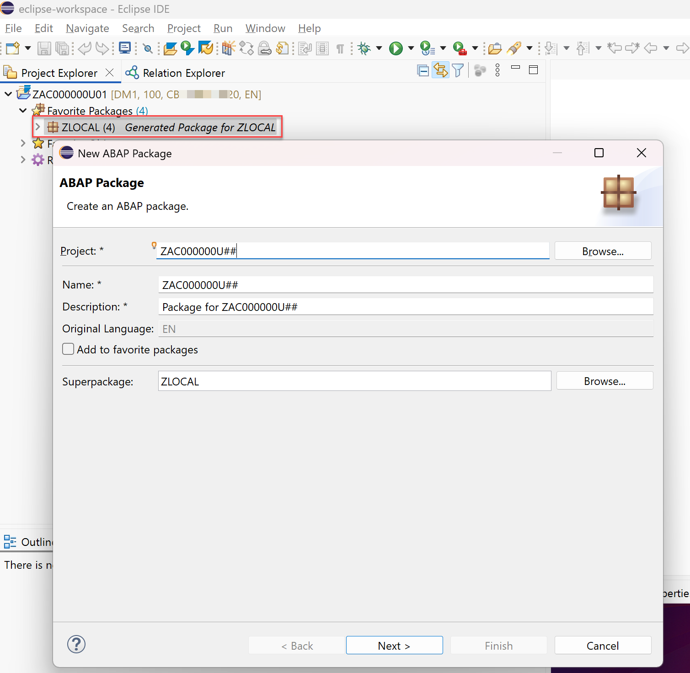

2. Press the **NEXT** button when finished.

3. In the following two dialogues simply press **NEXT** and then **FINISH**
   
   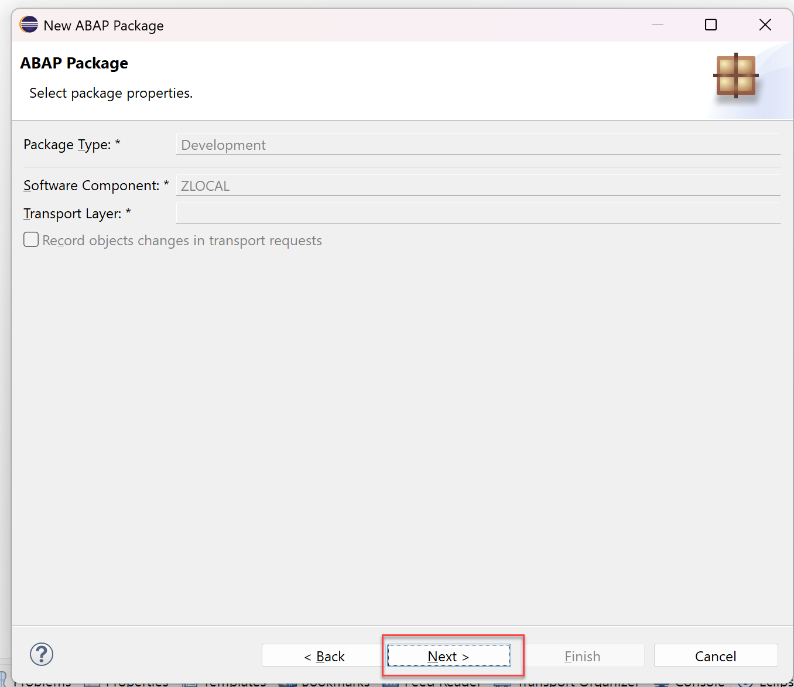  
   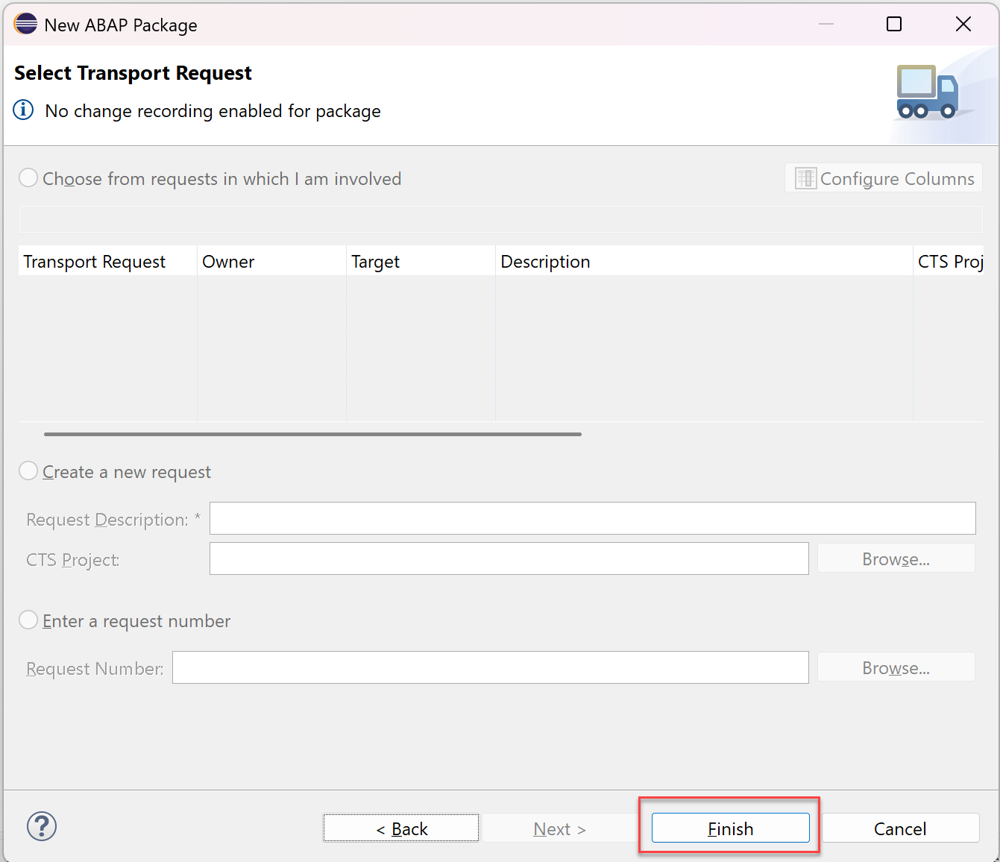  

## Add package to favorite packages and link project explorer with editor

In a next step you should add your - previousely created - package **`ZAC000000U##`** to your favorite packages in Eclipse/ADT.

1. To do so, in the tab Project Explorer, click on your ADT-Project **TDI_EN** and then right click on the folder `Favorite Packages` and select  **Add Package ...** and select the previously created package **`ZAC000000U##`**.   

    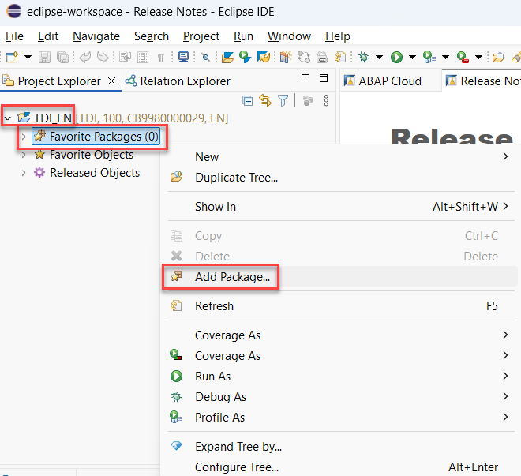

    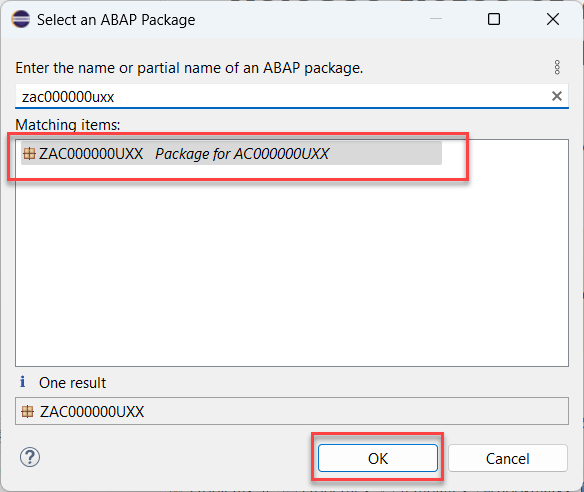

2. Now again click on your ADT project

3. Check if the **"Link with Editor"** feature is active, that means if the button  is highlighted. 

   If not, activate it. 

   This will show the object that you are editing / have opened on left hand side in the hierachy of the _Project Explorer_.
   
   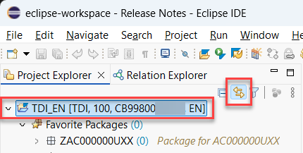  

**Great!**

You can now continue with the development of a RAP business object.  

[Next Unit](../503_BTP_ABAP-Cloud_RAP/README.md) >

