<!-- 
< [Previous Lesson](./README.md)
-->

In this exercise, you will create a transactional UI service along with the underlying RAP business object.

First you will create an ABAP package, a database table, and an ABAP class to fill the database table with demo data. Then you will use an ADT wizard to generate all the needed development RAP artefacts of your UI service on top of the database table. This includes the CDS data model, behavior definition, service definition, and service binding. Afterwards you will publish and check your _ShoppingCart_ application with the SAP Fiori elements preview.    

## Exercise 1.0: Create a package

⚠️ --> describe how to create a package since this has to be done manually since we do not use SAP Build for that

## Exercise 1.1: Create database table

> Create a database table to store the _ShoppingCart_ data.
> A ShoppingCart entity defines general shopping cart data, such as the order ID or the ordered item, overall status of the order, and the total price of the order.

   1. Right-click on your ABAP package **`ZAC000000U##`** and select:

      **> New**

      **> Other ABAP Repository Object**

      from the context menu.

      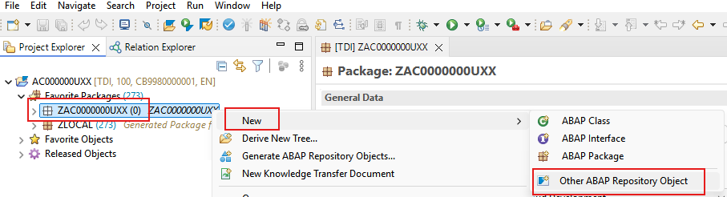
        

   2. Search for **database table**, select it, and click **Next >**.

      <!--   -->
      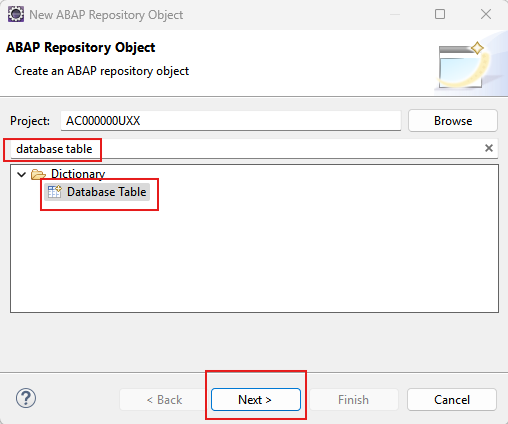

   3. Maintain the required information and click **Next >**.
      - Name: **`ZAC000000U##`**
      - Description: _**`Shopping Cart Data`**_

      <!-- -->
      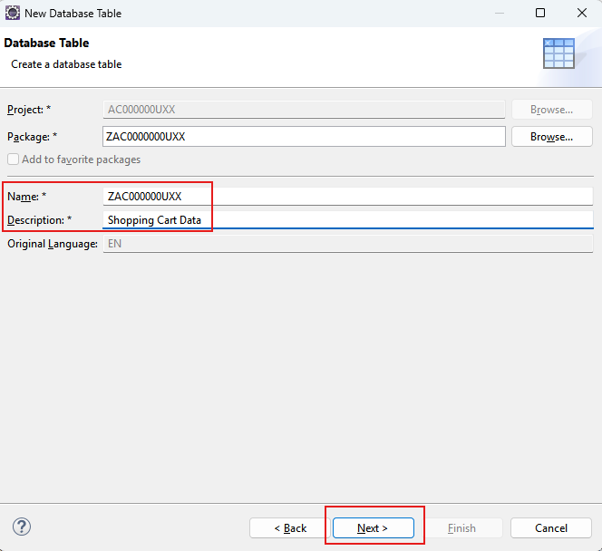

   4. Select a transport request, and click **Finish** to create the database table.

   5. Replace the default code with the code snippet provided below.

      **Hint**: Grab the code snippet using copy and paste.

      ```abap
      @EndUserText.label : 'Shopping Cart'
      @AbapCatalog.enhancement.category : #NOT_EXTENSIBLE
      @AbapCatalog.tableCategory : #TRANSPARENT
      @AbapCatalog.deliveryClass : #A
      @AbapCatalog.dataMaintenance : #RESTRICTED
      define table ZAC000000U## {

        key client              : abap.clnt not null;
        key order_uuid          : sysuuid_x16 not null;
        order_id                : abap.numc(8) not null;
        ordered_item            : abap.char(40) not null;
        order_quantity          : abap.numc(4);
        requested_delivery_date : abap.dats;
        @Semantics.amount.currencyCode : 'ZAC000000U##.currency'
        total_price             : abap.curr(11,2);
        currency                : abap.cuky;
        overall_status          : abap.char(30);
        sales_order_status      : abap.char(30);
        salesorder              : abap.char(10);
        bgpf_status             : abap.int1;
        bgpg_process_name       : abap.char(32);
        manage_sales_order_url  : abap.char(255);
        notes                   : abap.char(100);
        created_by              : abp_creation_user;
        created_at              : abp_creation_tstmpl;
        last_changed_by         : abp_lastchange_user;
        last_changed_at         : abp_lastchange_tstmpl;
        local_last_changed_at   : abp_locinst_lastchange_tstmpl;

      }
      ```

   > Hint:  
   > If you get error/warning messages with regards to UUID, simply ignore it..  

   6. Save  and activate  the changes.

## Exercise 1.2: Fill the table with data   

You will now create and implement a simple class in order to fill the previously created table with some demo data.

### Exercise 1.2.1: Implement the class manually  

<details>   
<summary>Click to expand</summary> 

 1. Right-click on your ABAP package **`ZAC000000U##`** and select **New** > **ABAP class** from the context menu.

 2. Maintain the required information and click **Next >**.   
      - Name: **`zcl_AC000000U##_generate_data`**
      - Description: _**`Generate Shopping Cart Data`**_

 3. Select a transport request, and click **Finish** to create the class.   

 4. Replace the default code with the code snippet provided below.   

 
```abap
CLASS zcl_AC000000U##_generate_data DEFINITION
  PUBLIC
  FINAL
  CREATE PUBLIC .

  PUBLIC SECTION.
    INTERFACES if_oo_adt_classrun.
  PROTECTED SECTION.
  PRIVATE SECTION.
ENDCLASS.


CLASS zcl_AC000000U##_generate_data IMPLEMENTATION.
  METHOD if_oo_adt_classrun~main.
    DATA demo_data TYPE STANDARD TABLE OF zAC000000U##.
    DATA demo_data_line TYPE zAC000000U##.
    DATA number TYPE n LENGTH 3 .
    DATA long_time_stamp TYPE timestampl.

    WHILE number < 10.
      number += 1.
      GET TIME STAMP FIELD long_time_stamp.
      demo_data_line-client = sy-mandt.
      demo_data_line-order_uuid = xco_cp=>uuid( )->value.
      demo_data_line-order_id = number .
      demo_data_line-ordered_item = |HT-1{ number }|.
      demo_data_line-order_quantity =  number .
      "sy-datum
      demo_data_line-requested_delivery_date = xco_cp=>sy->date( )->as( xco_cp_time=>format->abap )->value.   
      demo_data_line-total_price = number * 10.
      demo_data_line-currency = 'EUR'.
      "sy-uname
      demo_data_line-created_by = xco_cp=>sy->user( )->name.
      demo_data_line-created_at = long_time_stamp.
      "sy-uname
      demo_data_line-last_changed_by = xco_cp=>sy->user( )->name.
      demo_data_line-last_changed_at = long_time_stamp.
      demo_data_line-local_last_changed_at = long_time_stamp.
      APPEND demo_data_line TO demo_data.
    ENDWHILE.

    INSERT zAC000000U## FROM TABLE @demo_data.

    COMMIT WORK.

    SELECT * FROM zAC000000U## INTO TABLE @demo_data.

    LOOP AT demo_data INTO demo_data_line.
      out->write( demo_data_line ).
    ENDLOOP.

  ENDMETHOD.
ENDCLASS.

```    

 > Please note that sy-datum and sy-uname should not be used anymore and have been replaced by the following statements   
 > `xco_cp=>sy->user( )->name`   
 > and   
 > `xco_cp=>sy->date( )->as( xco_cp_time=>format->abap )->value`   

 5. Save  and activate  the changes.
 
 6. Press **`F9`** to start the class.   

        

 7. Open the table that you have just created an press **`F8`** to start the data preview.  

    
        


</details>

### Exercise 1.2.2: Implement the class using Joule 💎

<details>   
<summary>Click to expand</summary> 

 1. Right-click on your ABAP package **`ZAC000000U##`** and select **New** > **ABAP class** from the context menu.

 2. Maintain the required information and click **Next >**.   
      - Name: **`zcl_AC000000U##_generate_data`**
      - Description: _**`Generate Shopping Cart Data`**_

 3. Select a transport request, and click **Finish** to create the class.   

 4. Replace the default code with the code snippet provided below.   

 
```abap
CLASS zcl_AC000000U##_generate_data DEFINITION
PUBLIC
FINAL
CREATE PUBLIC .

PUBLIC SECTION.
INTERFACES if_oo_adt_classrun.

PROTECTED SECTION.
PRIVATE SECTION.
METHODS: delete_demo_data.
METHODS: generate_demo_data.

ENDCLASS.

CLASS zcl_AC000000U##_generate_data IMPLEMENTATION.
METHOD if_oo_adt_classrun~main.

delete_demo_data(  ).
out->write( 'Table entries deleted' ).

generate_demo_data(  ).
out->write( 'Demo data was generated' ).

ENDMETHOD.

METHOD delete_demo_data.
DELETE FROM zAC000000U##.
COMMIT WORK.
ENDMETHOD.


METHOD generate_demo_data.
    DATA: demo_data_line TYPE zAC000000U##,
          demo_data      TYPE STANDARD TABLE OF zAC000000U##.
    DATA long_time_stamp TYPE timestampl.

    "begin of code-snippet 
    demo_data_line-client = '100'.
    demo_data_line-order_uuid = xco_cp=>uuid( )->value.
    demo_data_line-order_id = '00000001' .
    demo_data_line-ordered_item = 'HT-1001'.
    demo_data_line-order_quantity =  '0001' .
    demo_data_line-total_price = '10.00'.
    demo_data_line-currency = 'EUR'.
    demo_data_line-requested_delivery_date = xco_cp=>sy->date( )->as( xco_cp_time=>format->abap )->value.
    demo_data_line-created_by = xco_cp=>sy->user( )->name.
    demo_data_line-created_at = long_time_stamp.
    demo_data_line-last_changed_by = xco_cp=>sy->user( )->name.
    demo_data_line-last_changed_at = long_time_stamp.
    demo_data_line-local_last_changed_at = long_time_stamp.
    APPEND demo_data_line TO demo_data.
    "end of code-snippet 
    

    INSERT zAC000000U## FROM TABLE @demo_data.
    COMMIT WORK.

    CLEAR demo_data.
ENDMETHOD.

ENDCLASS.
``` 


> Generate mock data using the **Joule Predictive Code Completion💎** feature in ADT.
> 
> You can toggle **Joule Predictive Code Completion** in the ADT toolbar .  
> Note that this icon only appears in the ADT toolbar when working in the relevant editors, such as the class editor: 
>
> ⚠ **Warning regarding Joule's outputs** ⚠   
> Please be aware that the outputs generated by Joule in this exercise description may differ from yours, and the provided code snippets should be adjusted accordingly. **Always review the code generated by Joule**.

 
 1. In the menu select **Window** --> **View** --> **Joule**.   
 
 2. Open class **`zcl_AC000000U##_generate_data`**.  
 
 3. Select the code lines between the comments `begin of code-snippet` and `end of code-snippet`.

 4. In the **Joule** window enter the following prompt:   

    `use the selected code to add 10 more table entries`  

    > You can play around with the prompt to see how the code that is proposed by Joule changes.  

 5. Once you think the code is correct, press insert.
 
 6. Activate your changes and run the ABAP class by pressing **F9**.  
  
        

 7. Open your database table **`ZAC000000U##`** and press **F8** to start the data preview and display the filled database entries, i.e. _ShoppingCart_ data.  

    
        

</details>

## Exercise 1.3: Generate the transactional UI service

> Create your OData v4 based UI services and the RAP business object (BO) with all the needed ABAP artefacts - e.g. CDS view entities, behavior definition and implementation - using the built-in ADT generator.   
> The generated business service will be transactional, draft-enabled, and enriched with UI semantics for the generation of the Fiori elements app.

   1. Right-click your database table **`ZAC000000U##`**  and select **Generate ABAP Repository Objects** from the context menu. 

       <!--   -->  
       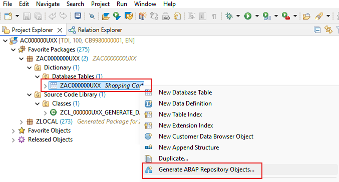

   2. Select **OData UI Service** and click **Next >**.   

      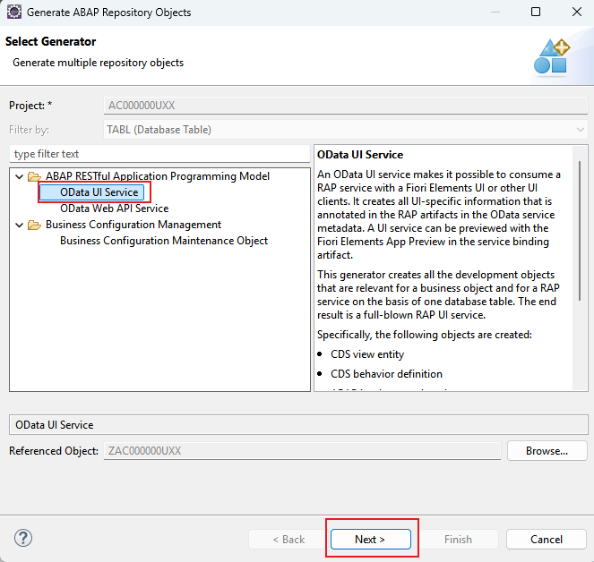

   3. Maintain the required information and click **Next >**.
      - Package: **`ZAC000000U##`**  

      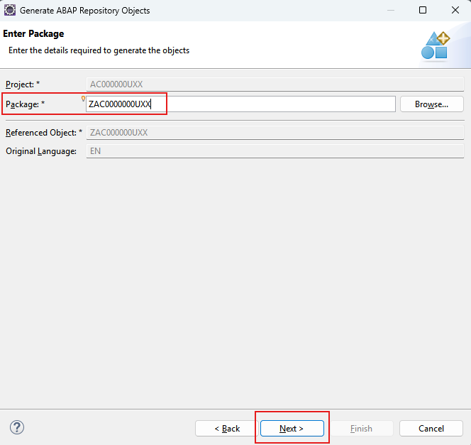

   4. Maintain the **CDS Entity Alias** on the **Configure Generator** dialog in section **Data Model** to provide a readable name for the root entity of your data model and generate them.

      For that, navigate through the wizard tree _Data Model_, maintain the **CDS Entity Alias** artefact name and enter `ShoppingCart`,
      and press **Next >**.

      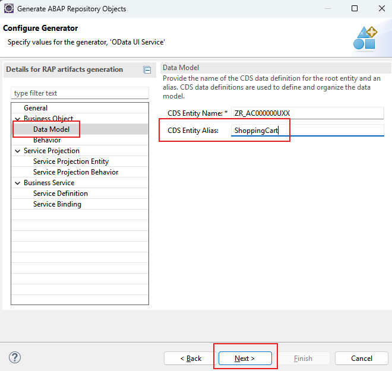

   5. Verify the maintained entries and press **Next >** to confirm.

      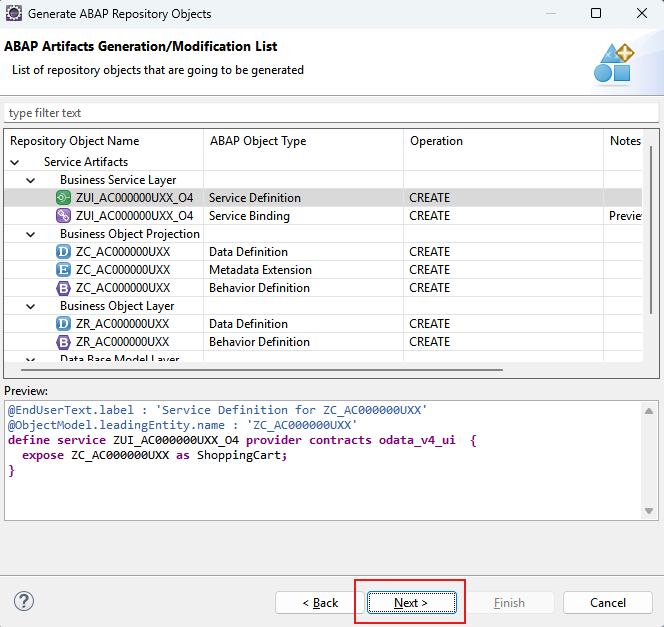

   6. Select a transport request, and click **Finish**. The needed artefacts will be generated. 

      > Please note that the generation process takes some time.    

      <details>   
        <summary>Info about Naming Conventions - Click to expand</summary>   
        ℹ **Info about Naming Conventions**    
        The main aspects of the naming conventions of SAP S/4HANA's Virtual Data Model (VDM) are used in this exercise.      
        More information on VDM can be found on the SAP Help portal:   
        [Here](https://help.sap.com/docs/SAP_S4HANA_CLOUD/0f69f8fb28ac4bf48d2b57b9637e81fa/8a8cee943ef944fe8936f4cc60ba9bc1.html).     
       </details>   

      > ⚠ **Attention** ⚠   
      > Please make sure **NOT** to replace the name proposals in the wizard.   
      > Doing this is important to ensure the correctness of the code snippets provided in the following exercises.   
      > The wizard should generate objects with the following object names:      
       
      <table>
       <thead>
        <tr>
         <th>RAP Layer</th>
         <th>Artefacts</th>
         <th>Artefact Names</th>  
        </tr>
       </thead>
       <tbody>
        <tr>
         <td>Business Object</td> 
         <td> </td>   
         <td> </td>
        </tr>
        <tr>
         <td> </td>  
         <td>Data Model</td>
         <td>CDS Entity Name: <b>ZR_AC000000U##</b></td>
        </tr>
        <tr>
         <td> </td>  
         <td> </td>
         <td>CDS Entity Name Alias: <b>ShoppingCart</b></td>
        </tr>  
        <tr>
         <td> </td>  
         <td>Behavior</td>
         <td>Behavior Implementation Class: <b>ZBP_R_AC000000U##</b></td>
        </tr> 
       <tr>
         <td> </td>  
         <td> </td>
         <td>Draft Table Name: <b>ZAC000000U##_D</b></td>
        </tr> 
        <tr>
         <td>Service Projection</td>  
         <td> </td>
         <td> </td>
        </tr>  
        <tr>
         <td> </td>  
         <td>Service Projection Entity</td>
         <td>CDS Entity Name: <b>ZC_AC000000U##</b></td>
        </tr>   
        <tr>
         <td> </td>  
         <td>Service Projection Behavior</td>
         <td>Behavior Implementation Class: <b>ZBP_C_AC000000U##</b></td>
        </tr>
        <tr>
         <td>SAP Object Type</td>  
         <td> </td>
         <td> </td>
        </tr>  
        <tr>
         <td> </td>  
         <td>SAP Object Type</td>
         <td>SAP Object Type Name: <b>ZAC000000U##</b></td>
        </tr>   
        <tr>
         <td> </td>  
         <td>SAP Object Node Type</td>
         <td>SAP Object Node Type Name: <b>ZAC000000U##</b></td>
        </tr>   
        <tr>
         <td>Business Service</td>  
         <td> </td>
         <td> </td>
        </tr>  
        <tr>
         <td> </td>  
         <td>Service Definition</td>
         <td>Service Definition Name: <b>ZUI_AC000000U##_O4</b></td>
        </tr>   
        <tr>
         <td> </td>  
         <td>Service Binding</td>
         <td>Service Binding Name: <b>ZUI_AC000000U##_O4</b></td>
        </tr>   
        <tr>
         <td> </td>  
         <td> </td>
         <td>Binding Type: <b>OData V4 - UI</b></td>
        </tr> 
       </tbody>
      </table>
  
   7. The wizard finishes with a popup that tells you that the artifacts have been generated successfully. Select **Open**.   

      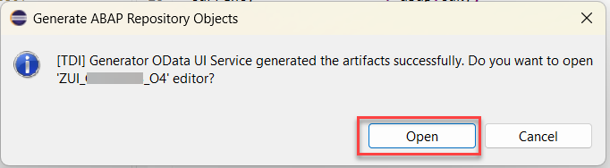

   8. The service binding will be opened. Here you have to press the **Publish** button.   

      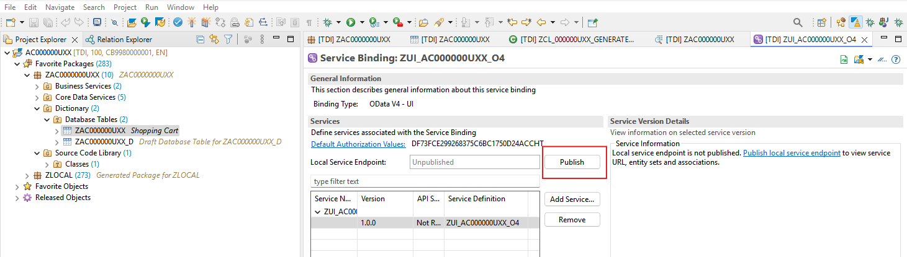  

   2. Go to the **Project Explorer**, select your package  **`ZAC000000U##`**, refresh it by pressing **F5**, and check all generated ABAP repository objects 

      <!--  -->
      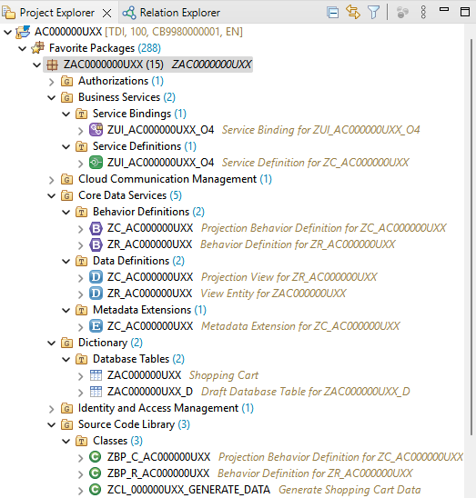  


## Exercise 1.4: Preview the Shopping Cart App on SAP BTP, ABAP environment 

> After having published the local service endpoint of your service binding in the **Service Binding editor** and you can now start the _Fiori elements App Preview_.  
> This allows the ADT developer to test the Fiori Elements app from within ADT.  

   1. Open your service binding  **`ZUI_AC000000U##_O4`**.   

   2. Double-click on the entity **`ShoppingCart`** in the **Entity Set and Association** section to open the _Fiori elements App Preview_ or select the entry **`ShoppingCart`** and press the **Preview** button.   

       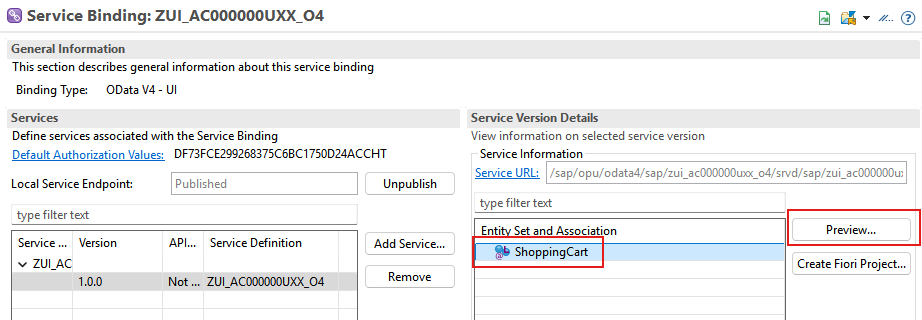

   3. Click the button on the _Shopping Cart_ app **Go** to load the data.

       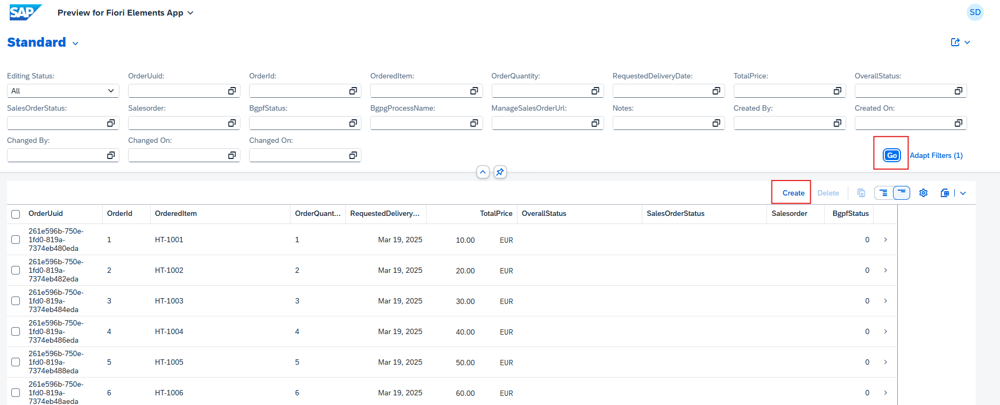

   4. Now click on the button **Create** to enter some test data.

       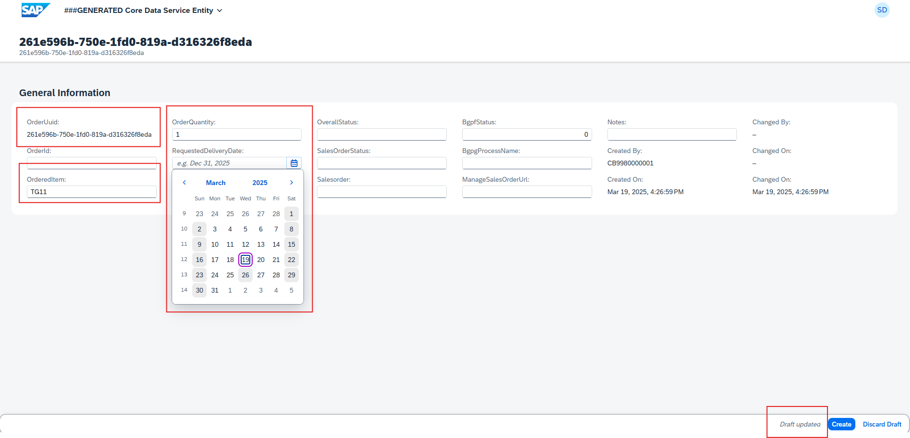

   You will notice that the app works out of the box, but that the UI could be improved reducing the number of select options and by hiding administrative fields. Also the name of a new object is the UUID which is not very comprehensive for human users.

 

## Summary

Now that you have...

- created a database table,
- created a transactional UI service,
- published a local service point, and started the _Fiori elements App Preview_ in ADT,

you can continue with the next exercise.

[Next Lesson](./2_ABAP-Cloud_RAP–Enhance_Generated_Model.md)

