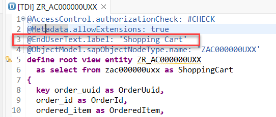
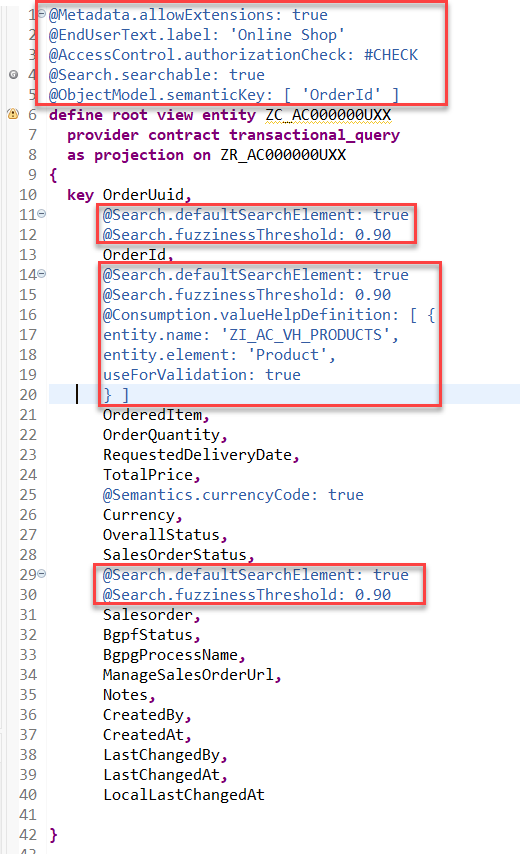
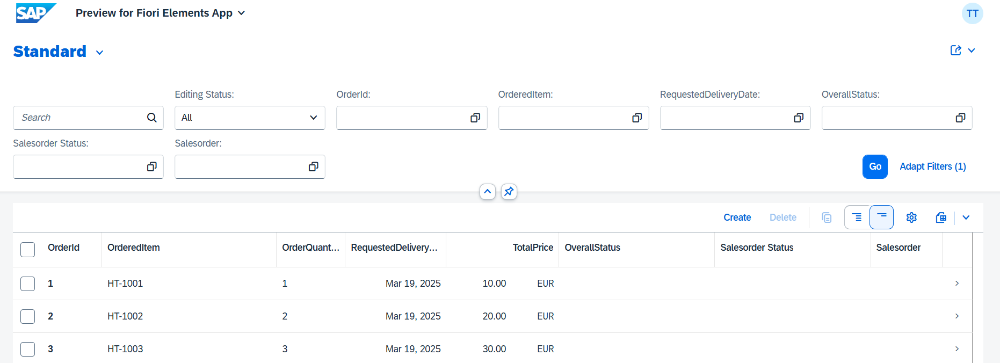
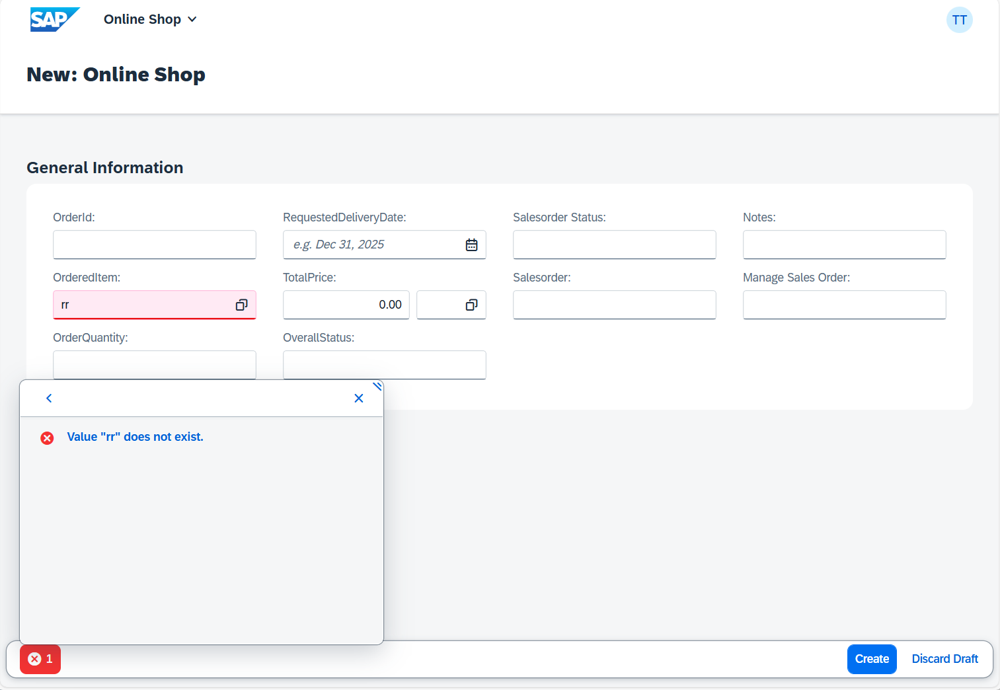
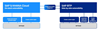
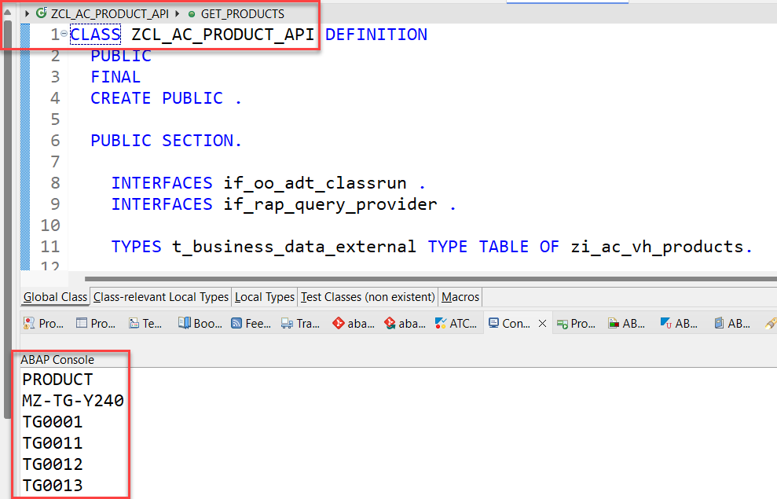

[Previous Lesson](./1_ABAP-Cloud_RAP–Generate_Transactional_UI_Service.md)


In the previous exercise, you have created a database table for storing _ShoppingCart_ data and generated your UI service - comprising the business object (BO) entity _ShoppingCart_ - on top of it.

In this exercise, you will enhance the base BO data model as well as the projected BO data model and its metadata extension, and test the enhanced Fiori elements _ShoppingCart_ app. These enhancements will include the definition of a value help, adding view annotations, and adding element annotations. 

These enhancements are necessary since not all settings can be foreseen by the RAP business object generator.

> ℹ **Further reading**: [CDS Annotations relevant in the RAP context](https://help.sap.com/docs/BTP/923180ddb98240829d935862025004d6/130e02a697e14bf8b05dd6672c56250b.html) 
>   
> ⚠ **Hint: Warnings about missing CDS access control**
> Please ignore the warnings about missing access control that will be displayed for the CDS views entities `ZR_AC000000U##` and `ZC_AC000000U##`. These is due to the view annotation `@AccessControl.authorizationCheck: #CHECK` specified in these entities.
> Due to time constraints, we will not define CDS access control in this workshop.
>   
> You can suppress these warnings by changing the annotation value to `#NOT_REQUIRED`.

## Exercise 2.1: Enhance the Base BO Data Model

> Change the description which is shown when pressing the "Create" button

1. Open the source code of the restricted base view `ZR_AC000000U##` via this 
   ADT [Link](adt://TDI/sap/bc/adt/ddic/ddl/sources/zr_AC000000U##).
     
   You will find the view entity `ZR_AC000000U##` under **Core Data Services -> Data Definitions**.

   Replace the following code snippet right before the **`define root view`** statement as shown on the screenshot below and format the source code (**Shift+F1**).

   New code   

    ```ABAP
   @EndUserText.label: 'Shopping Cart'
   ```

   Old code   

   ```ABAP
   @Endusertext: {
   Label: '###GENERATED Core Data Service Entity'
   }  
   ```

   Your source code should look like this:

   

   > Hint:   
   > You can ignore the warning:   
   > `CDS entity ZR_AC000000U## with "@ACCESSCONTROL.AUTHORIZATIONCHECK: #CHECK" has no access control (runtime behavior: full access) [Access Control Management]`

3. Save  (**Ctrl+S**) and activate  (**Ctrl+F3**) the changes.

## Exercise 2.2: Enhance the Projected BO Data Model 

> Enhance the projected business object data model defined in the CDS projection view **`ZC_AC000000U##`**, aka consumption view.
>   
> For example, you will allow the full-text search on some elements and define a value help for products. To save time we will not add additional values helps.   
>   
> The value help that you will be adding retrieves the data from the SAP S/4HANA Cloud system by calling an OData service remotely.

 1. Open your data definition  `ZC_AC000000U##` and format the generated source code with the **Pretty Printer** (**Shift+F1**) using this ADT [Link](adt://TDI/sap/bc/adt/ddic/ddl/sources/zc_AC000000U##).
    

    Specify the projection view as searchable by adding the following view annotation as shown on the screenshot below:

    ```ABAP
     @Search.searchable: true   
    ```

    Specify the element `OrderID` as the semantic key of the _ShoppingCart_ entity by adding the annotation 

    ```ABAP
    @ObjectModel.semanticKey: ['OrderId']   
    ```

    Replace the end-user label text:  

    ```ABAP
     @EndUserText.label: 'Online Shop'   
    ```

    The view annotation block in your source code at the top of the editor should now  look like this:

    ```ABAP
    @Metadata.allowExtensions: true
    @EndUserText.label: 'Online Shop'
    @AccessControl.authorizationCheck: #NOT_REQUIRED
    @Search.searchable: true 
    @ObjectModel.semanticKey: [ 'OrderId' ] 
    ```

 2. ⚠ If not yet done, please format your source code with the **Pretty Printer** (**Shift+F1**).

 3. Use the provided code snippets to specify various element annotations for the elements **`OrderId`**, **`Salesorder`**, **`OrderedItem`** between the curly brackets as shown on the screenshot below. 

    - For the elements **`OrderId`** and **`Salesorder`** : Enable the full-text search with a specific fuzziness (error tolerance).

       ```ABAP
       @Search.defaultSearchElement: true
       @Search.fuzzinessThreshold: 0.90    
       ```

    - For element **`OrderedItem`**: Enable the full-text search, define a value help. The defined value help shall be automatically used for frontend validations in Fiori elements UIs.

       ```ABAP
      @Search.defaultSearchElement: true
      @Search.fuzzinessThreshold: 0.90
      @Consumption.valueHelpDefinition: [ {
      entity.name: 'ZI_AC_VH_PRODUCTS',
      entity.element: 'Product',
      useForValidation: true
      } ]
       ```

    Alternatively, you can simply replace the source code of your BO projection view **`ZC_AC000000U##`** with the code provided in the source code document linked below.     
    
    ###   Source code **`ZC_AC000000U##`**
    
    <hr> 

    <details>
    <summary>Expand for complete source code</summary>

    ```ABAP
    @Metadata.allowExtensions: true
    @EndUserText.label: 'Online Shop'
    @AccessControl.authorizationCheck: #NOT_REQUIRED
    @Search.searchable: true
    @ObjectModel.semanticKey: [ 'OrderId' ]
    define root view entity ZC_AC000000U##
    provider contract transactional_query
    as projection on ZR_AC000000U##
    {
      key OrderUuid,
      @Search.defaultSearchElement: true
      @Search.fuzzinessThreshold: 0.90
      OrderId,
      @Search.defaultSearchElement: true
      @Search.fuzzinessThreshold: 0.90
      @Consumption.valueHelpDefinition: [ {
      entity.name: 'ZI_AC_VH_PRODUCTS',
      entity.element: 'Product',
      useForValidation: true
      } ]
      OrderedItem,
      OrderQuantity,
      RequestedDeliveryDate,
      TotalPrice,
      @Semantics.currencyCode: true
      Currency,
      OverallStatus,
      SalesOrderStatus,
      @Search.defaultSearchElement: true
      @Search.fuzzinessThreshold: 0.90
      Salesorder,
      BgpfStatus,
      BgpgProcessName,
      ManageSalesOrderUrl,
      Notes,
      CreatedBy,
      CreatedAt,
      LastChangedBy,
      LastChangedAt,
      LocalLastChangedAt
      }

      ```
    </details>
 
    <hr>   
 
    Format your source code with the **ABAP Pretty Printer** (**Shift+F1**).

    Your source code should look like this:

    

    > **Hint: Frontend Validations**   
    > Validations are used to ensure the data consistency.   
    > As the name suggests, frontend validations are performed on the UI. They are used to improve the user experience by providing faster feedback 
    > and avoiding unnecessary server roundtrips. In the RAP context, front-end validations are defined using CDS annotation 
    > (e.g. `@Consumption.valueHelpDefinition.useForValidation: true`) or UI logic.

5. Save  (**Ctrl+S**) and activate  (**Ctrl+F3**) the changes.

## Exercise 2.3: Adjust the UI semantics in the Metadata Extension 

> As you have seen when using the SAP Fiori Elements preview in the previews step, the UI looks a little bit confusing because all fields are shown (even administrative ones) and for all fields filter boxes are displayed as well. In order to get a cleaned-up UI the unneccessary annotations would have to be removed. To speed up the process we have prepared a cleaned-up version for your convenience  **`ZC_AC000000U##`** to change the appearence of the generated Fiori elements based _ShoppingCart App_.   
> To check in detail what has been changed you can compare the code below with the generated code before replacing it.   

 1. Open your metadata extension  `ZC_AC000000U##` and adjust the UI annotations to achieve the following changes on the Fiori elements based UI of the _ShoppingCart App_ using this ADT [Link](adt://TDI/sap/bc/adt/ddic/ddlx/sources/zc_AC000000U##). 

 2. Replace the generated code with the code snippet provided below.   

 3. Save  and activate  the changes.   

    **Hint**: Grab the code snippet using copy and paste.  

    ###   Source code **`ZC_AC000000U##`**   

    <hr>   

    <details>
    <summary>Click to expand the source code</summary>   

    ```ABAP
    @Metadata.layer: #CORE
    @UI.headerInfo.title.type: #STANDARD
    @UI.headerInfo.title.value: 'OrderId'
    @UI.headerInfo.description.type: #STANDARD
    @UI.headerInfo.description.value: 'OrderedItem'
    @UI.headerInfo.description.url: 'ManageSalesOrderUrl'
    annotate view ZC_AC000000U## with
      { 

      @EndUserText.label: 'OrderId'

      @UI.facet: [ {
      label: 'General Information',
      id: 'GeneralInfo',
      purpose: #STANDARD,
      position: 10 ,
      type: #IDENTIFICATION_REFERENCE
      } ]

      @UI.identification: [ {
      position: 20 ,
      label: 'OrderId'
      }
      ]
      @UI.lineItem: [ {
      position: 20 ,
      label: 'OrderId'
      }      
      ]
      @UI.selectionField: [ {
      position: 20
      } ]
      OrderId;

      @EndUserText.label: 'OrderedItem'
      @UI.identification: [ {
        position: 30 ,
        label: 'OrderedItem'
      } ]
      @UI.lineItem: [ {
        position: 30 ,
        label: 'OrderedItem'
      } ]
      @UI.selectionField: [ {
        position: 30
      } ]
      OrderedItem;

      @EndUserText.label: 'OrderQuantity'
      @UI.identification: [ {
        position: 40 ,
        label: 'OrderQuantity'
      } ]
      @UI.lineItem: [ {
        position: 40 ,
        label: 'OrderQuantity'
      } ]
      OrderQuantity;

      @EndUserText.label: 'RequestedDeliveryDate'
      @UI.identification: [ {
        position: 50 ,
        label: 'RequestedDeliveryDate'
      } ]
      @UI.lineItem: [ {
        position: 50 ,
        label: 'RequestedDeliveryDate'
      } ]
      @UI.selectionField: [ {
        position: 50
      } ]
      RequestedDeliveryDate;

      @EndUserText.label: 'TotalPrice'
      @UI.identification: [ {
        position: 60 ,
        label: 'TotalPrice'
      } ]
      @UI.lineItem: [ {
        position: 60 ,
        label: 'TotalPrice'
      } ]
      TotalPrice;

      @EndUserText.label: 'Salesorder Status'
      @UI.identification: [ {
        position: 75 ,
        label: 'Salesorder Status'
      } ]
      @UI.lineItem: [ {
        position: 75 ,
        label: 'Salesorder Status'
      } ]
      @UI.selectionField: [ {
        position: 75
      } ]
      SalesOrderStatus;

      @EndUserText.label: 'OverallStatus'
      @UI.identification: [ {
        position: 70 ,
        label: 'OverallStatus'
      } ]
      @UI.lineItem: [ {
        position: 70 ,
        label: 'OverallStatus'
      } ]
      @UI.selectionField: [ {
        position: 70
      } ]
      OverallStatus;

      @EndUserText.label: 'Salesorder'
      @UI.identification: [ {
        position: 80 ,
        label: 'Salesorder'
      } ]
      @UI.lineItem: [ {
        position: 80 ,
        label: 'Salesorder'
      } ]
      @UI.selectionField: [ {
        position: 80
      } ]
      Salesorder;

      @EndUserText.label: 'Notes'
      @UI.identification: [ {
        position: 90 ,
        label: 'Notes'
      } ]
      @UI.lineItem: [ {
        position: 90 ,
        label: 'Notes'
      } ]
      Notes;
 
      @UI.identification: [ {
        position: 100 ,
        label: 'Manage Sales Order',
        type: #WITH_URL,
        url: 'ManageSalesOrderUrl'    
      } ]
      @UI.lineItem: [ {
        position: 100 ,
        label: 'Manage Sales Order',
        type: #WITH_URL,
        url: 'ManageSalesOrderUrl'
      } ]
      ManageSalesOrderUrl;

      }

      ```

    </details>   

 <hr>

## Exercise 2.4: Preview and Test the enhanced ShoppingCart App

> Test the enhanced SAP Fiori elements application.

 1. Open your service binding  `ZUI_AC000000U##_O4` and double-click the _**ShoppingCart**_ entity set to open the SAP Fiori elements preview using this ADT [Link](adt://TDI/sap/bc/adt/businessservices/bindings/zui_AC000000U##_o4). 

 2. Click **Go** on the app and check the result.

 3. Play around in the app, e.g. filter the entries and test the defined value helps by creating a new entry or editing an existing one.

    a. You will notice that on the list report page there are nice descriptions and options to filter the result. 
      <!--   -->
      

    b. When you create a new entry or change an existing one you see that the value help for the field **OrderedItem** offer an out of the box **frontend validation**. 
    <!--    -->
      

## Exercise 2.5 (optional) - Investigate the implementation of the value help ZI_AC_VH_PRODUCTS

   >   
   >   **Side-by-Side extension**
   >      
   The value help [`ZI_AC_VH_PRODUCTS`](adt://TDI/sap/bc/adt/ddic/ddl/sources/zi_ac_vh_products) has been provided for your convenience. The CDS view is a so called custom entity that uses a query implementation class [`ZCL_CE_AC_PRODUCT`](adt://TDI/sap/bc/adt/oo/classes/zcl_ce_ac_product) to retrieve the data instead of reading the data from a datasource (e.g. a table).
   The query implementation class finally uses the `get_products()` method of the product api class [`ZCL_AC_PRODUCT_API`](adt://TDI/sap/bc/adt/oo/classes/zcl_ac_product_api) to retrieve the product data from the SAP S/4HANA Cloud system.  

   ```ABAP
   CLASS ZCL_CE_AC_PRODUCT IMPLEMENTATION.
     METHOD if_rap_query_provider~select.
           data product_api type ref TO zcl_ac_product_api.
           product_api = new #(  ).
 
           ...
 
           product_api->get_products(
                 EXPORTING
                   it_filter_cond    = filter_condition
                   top               = CONV i( top )
                   skip              = CONV i( skip )
                 IMPORTING
                   et_business_data  = business_data
                 ) .

           ...

     ENDMETHOD.
   ``` 
  
   1. Open the API class in ADT using this ADT link [`ZCL_AC_PRODUCT_API`](adt://TDI/sap/bc/adt/oo/classes/zcl_ac_product_api) or by pressing `Ctrl`+`Shift`+`A` and entering the name of the class `ZCL_AC_PRODUCT_API`.

   2. Then press `F9` to run the `main()` method as an **ABAP Application (console)**.
      This method calls the `get_products()` method which uses an OData Proxy Client that uses the service consumption model `ZSC_AC_API_PRODUCT` and that performs an OData call to the SAP S/4HANA backend using the predefined destination `S4HANA_ODATA_Products`.  

   3. The retrieved **product** data from the SAP S/4HANA Cloud backend system is listed in the **console tab**.

   

## Summary

Now that you have...

- added elements to the selection list and element/view annotations in the consumption view,
- added UI annotations to the metadata extension, and
- checked the preview,

you can continue with the next exercise.

[Next Lesson](./3_ABAP-Cloud_RAP–Determinations.md)

