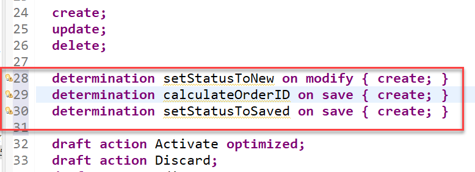
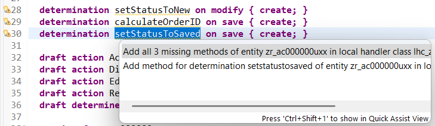
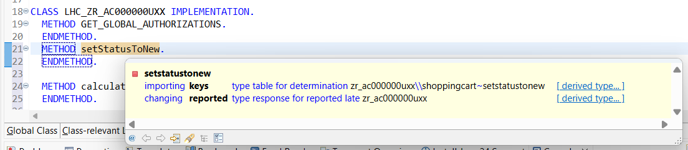
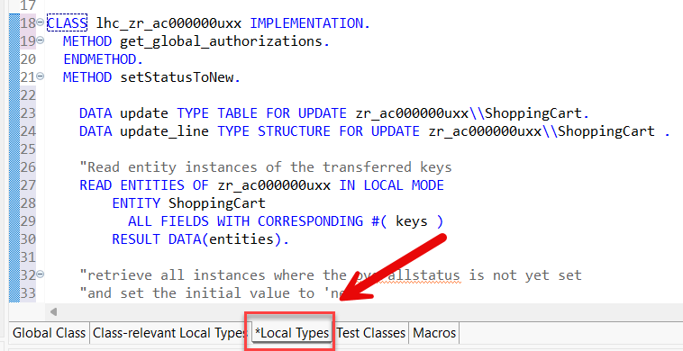
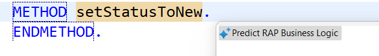
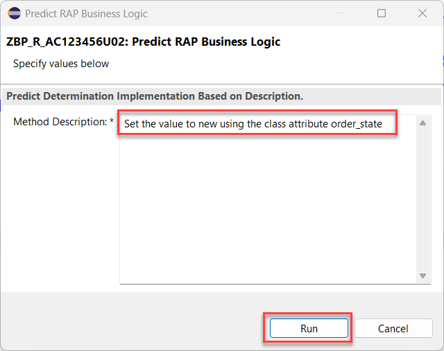
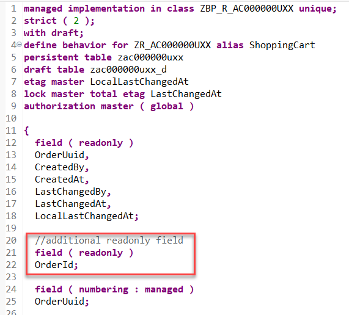
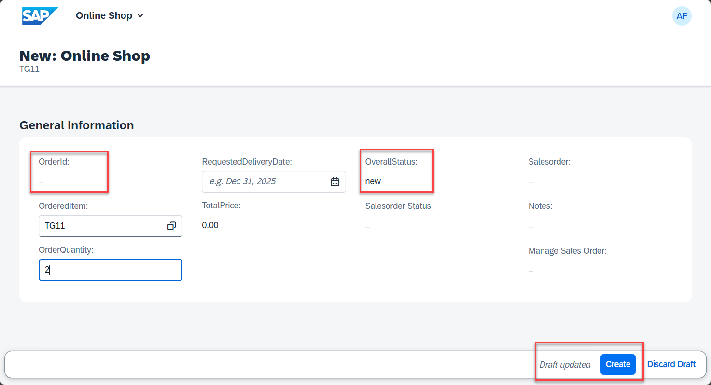
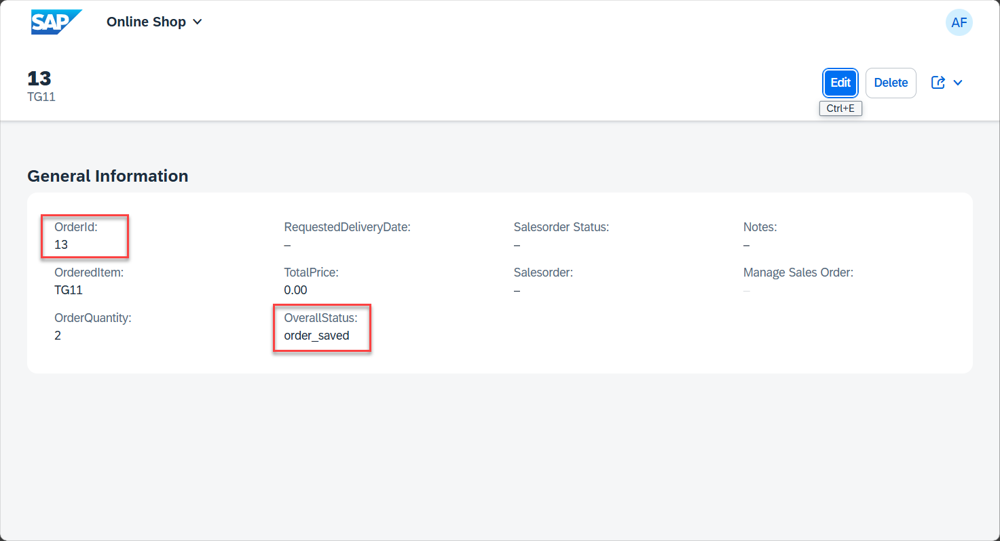

< [Previous Lesson](./2_ABAP-Cloud_RAP–Enhance_Generated_Model.md)

# Determinations

## Introduction

In the previous exercise, you have enhanced the base business object data model as well as the projected business object data model and its metadata extension.

In the present exercise, you will define and implement three determinations:  

- The determination `setStatusToNew` will be used to set a default value for the overall status of a _ShoppingCart_ entity instance.   
- The determination `setStatusToSaved` will be used to set the status if the order could be saved successfully. This status will later be used to trigger the creation of an salesorder.  
- Finally the determination `calculateOrderID` will be used to automatically calculate and set a unique orderID.

You will use the Entity Manipulation Language (EML) to implement the transactional behavior of the _ShoppingCart_ business object. 

### About Determinations  
> A determination is an optional part of the business object behavior that modifies instances of business objects based on trigger conditions. A determination is implicitly invoked by the RAP framework if the trigger condition of the determination is fulfilled. Trigger conditions can be modify operations and modified fields.  
>
> **Further reading**: [Determinations](https://help.sap.com/viewer/923180ddb98240829d935862025004d6/Cloud/en-US/6edb0438d3e14d18b3c403c406fbe209.html)

### About Entity Manipulation Language (EML)
> The Entity Manipulation Language (EML) is an extension of the ABAP language which offers an API-based access to RAP business objects. EML is used to implement the transactional behavior of RAP business objects in the behavior implementation but can also be used to access existing RAP business objects s from outside the RAP context.
>   
> PS: Some EML statements can be used in the so-called local mode - by using the addition **`IN LOCAL MODE`** - to exclude feature controls and authorization checks. This addition can only be used in the behavior implementation (aka _behavior pool_) of a particular RAP business object when accessing its own instances, i. e. not for accessing instances of other RAP business objects.
>
> The EML reference documentation is provided in the ABAP Keyword Documentation.
> You can use the classic **F1 Help** to get detailed information on each statement by pressing **F1** in the ABAP editors.
>
> **Further reading**: [Entity Manipulation Language (EML)](https://help.sap.com/docs/BTP/923180ddb98240829d935862025004d6/af7782de6b9140e29a24eae607bf4138.html) | [ABAP for RAP Business Objects](https://help.sap.com/doc/abapdocu_cp_index_htm/CLOUD/en-US/index.htm?file=abenabap_for_rap_bos.htm) 

## Exercise 3.1: Define determinations

> Define the determinations **`setStatusToNew`**,  **`calculateOrderID`** and **`setStatusToSaved`** in the behavior definition of the _ShoppingCart_ entity.

- `setStatusToNew` will be used to set the default value of the field `OverallStatus` to `new` at the creation time of new _ShoppingCart_ instances.  
- `calculateOrderID` will be used to calculate the sematic key field `OrderId` when the data is saved.
- `setStatusToSaved` sets the value of the field `OverallStatus` to `order_saved` when the order has been saved succesfully.  


1. Go to the behavior definiton of the _ShoppingCart_ business object entity  `ZR_AC000000U##` using this ADT [Link](adt://TDI/sap/bc/adt/bo/behaviordefinitions/zr_AC000000U##) and insert the following statements after the statement **`delete;`** as shown on the screenshot below: 

   <!--
    [`ZR_AC000000U##`](adt://TDI/sap/bc/adt/bo/behaviordefinitions/zr_AC000000U##)   
   -->

   ```ABAP 
   determination setStatusToNew on modify { create; }   
   determination calculateOrderID on save { create; }   
   determination setStatusToSaved on save { create; }  
   ```

   <!--  -->
   

   > **Short explanation**:  
   > The statements specifiy the names of the new determinations.  
   > `setStatusToNew` is configured `on modify`. As a result the determination is executed when creating a new _ShoppingCart_ instance is created.    
   > The other two determinations are configured for `on save` and are thus run when the data is initially saved. (When the **Create** button is pressed.)   

2. Save  and activate  the changes.

3. Now, declare the required method in behavior implementation class with ADT Quick Fix.
  
   Set the cursor on the determination name **`setStatusToNew`** and press **Ctrl+1** to open the **Quick Assist** view and select the entry _`Add all 3 missing methods of entity zr_AC000000U## in local handler class lhc_zr_AC000000U## ...`_ in the popup.   

   As result several `FOR DETERMINE` methods such as **`setStatusToNew`** will be added to the local handler class **`lcl_handler`** of the behavior pool of the _ShoppingCart_ business object entity  **`ZBP_AC000000U##`**.

   <!--  -->
     

4. Save  and activate  the changes in the local handler class **`lcl_handler`**.  

You are now done already with the definition of the determinations.

## Exercise 3.2: Implement the determinations 


You will now implement the logic of the defined determinations in the behavior pool. 

1. First check the interface of the method **`setStatusToNew`** in the declaration part of the local handler class `lcl_handler`. 

   For that, set the cursor on the method name, **`setStatusToNew`**, press **F2** to open the **ABAP Element Info** view, and examine the full method interface. 
   
     

   **Short explanation**:  
   - The addition **`FOR DETERMINE`** indicates that the method provides the implementation of a determination and the addition **`ON MODIFY`** indicates the specified trigger time.
   - `IMPORTING`parameter **`keys`** - is an internal table containing the keys of the instances for which the determination will be executed   
   - Implicit **`CHANGING`** parameter **`reported`** - used to return messages in case of failure   

2.  Define the constants **`order_state`** and **`sales_order_state`** to store the allowed values of the fields `OverallStatus` and `SalesOrderStatus` of a _ShoppingCart_ instance. 

    ⚠️ Both constants will be defined in the public section of the **Global Class** of the behavior pool because we want to use them later in other classes as well.

    Switch to the tab **Global Class** of your behavior pool `ZBP_R_AC000000U##` using this    
    ADT [Link](adt://TDI/sap/bc/adt/oo/classes/zbp_r_AC000000U##).  

    Insert the following code snippet in the definition part of the **Global Class** **`ZBP_R_AC000000U##`** as shown on the screenshot below.

    ```ABAP
    CONSTANTS :

      BEGIN OF order_state,
        saved      TYPE string VALUE 'order_saved',
        new        TYPE string VALUE 'new',
        in_process TYPE string VALUE 'in_process',
        unknown    TYPE string VALUE 'unkown',
        released    type string value 'released',
      END OF order_state,

      BEGIN OF sales_order_state,
        created TYPE string VALUE 'sales_order_created',
        unknown TYPE string VALUE 'unkown',
        failed  TYPE string VALUE 'failed',
        in_process TYPE string VALUE 'in_process',
      END OF sales_order_state.
    
    ```

    

3. Navigate back to the tab **Local Types** to go ahead with the implementation of all three methods in the implementation part of the local handler class. You can use the following ADT link    
   ADT [Link](adt://TDI/sap/bc/adt/oo/classes/zbp_r_AC000000U##/includes/implementations#start=1,6;end=1,24) to open `lhc_zr_AC000000U##`. 

      

### Exercise 3.2.1: Implement the determinations manually

<details>   
<summary>Click to expand</summary>   

1. Now implement the method **`setStatusToNew`** in the implementation part of the local handler class.

   The logic consists of the following steps:
     1. Read the ShoppingCart instance(s) of the transferred keys (**`keys`**) using the EML statement **`READ ENTITIES`**.  
     2. The addition **`IN LOCAL MODE`** is used to exclude feature controls and authorization checks.   
     3. Skip all _ShoppingCart_ instances where the overall status is already set.   
     4. Fill an internal table `update` of type `TABLE FOR UPDATE` to make the EML statement more readable.  
     5. Set the overall status to **`new`** for the remaining entries using the EML statement **`MODIFY ENTITIES`**.        `  
     6. Set the changing parameter **`reported`**.  

   Insert the following code snippet in the method.  
   You can use the **F1 help** to get detailed information on each EML statement.

   Format your source code with the **ABAP Pretty Printer** (**Shift+F1**).

  ```ABAP
    METHOD setStatusToNew.

    DATA update TYPE TABLE FOR UPDATE zr_AC000000U##\\ShoppingCart.
    DATA update_line TYPE STRUCTURE FOR UPDATE zr_AC000000U##\\ShoppingCart .
    
    "Read entity instances of the transferred keys
    READ ENTITIES OF zr_AC000000U## IN LOCAL MODE
        ENTITY ShoppingCart
          ALL FIELDS WITH CORRESPONDING #( keys )
        RESULT DATA(entities).

    "retrieve all instances where the overallstatus is not yet set 
    "and set the initial value to 'new'
    LOOP AT entities INTO DATA(entity) WHERE OverallStatus IS INITIAL.
      update_line-%tky    = entity-%tky.
      update_line-OverallStatus = zbp_r_AC000000U##=>order_state-new.
      APPEND update_line TO update.
    ENDLOOP.

    MODIFY ENTITIES OF zr_AC000000U## IN LOCAL MODE
      ENTITY ShoppingCart
        UPDATE FIELDS ( OverallStatus )
          WITH update
     REPORTED DATA(update_reported).

    "Set the changing parameter
    reported = CORRESPONDING #( DEEP update_reported ).

    ENDMETHOD.
 
  ```  
  
2. Save  and activate  the changes.

3. Now implement the method **`calculateOrderID`** in the implementation part of the local handler class.

   ```ABAP

    METHOD calculateOrderID.

    DATA update TYPE TABLE FOR UPDATE zr_AC000000U##\\ShoppingCart.
    DATA update_line TYPE STRUCTURE FOR UPDATE zr_AC000000U##\\ShoppingCart .

    READ ENTITIES OF zr_AC000000U## IN LOCAL MODE
        ENTITY ShoppingCart
          ALL FIELDS WITH CORRESPONDING #( keys )
        RESULT DATA(entities).

    DELETE entities WHERE orderID IS NOT INITIAL.
    CHECK entities IS NOT INITIAL.

    "Poor man's approach to determine object_id ;-)
   
    SELECT MAX( order_ID ) FROM zAC000000U## INTO @DATA(max_object_id).

    LOOP AT entities INTO DATA(entity).
      update_line-%tky    = entity-%tky.
      update_line-orderid = max_object_id + 1.
      APPEND update_line TO update.
    ENDLOOP.

    MODIFY ENTITIES OF zr_AC000000U## IN LOCAL MODE
      ENTITY ShoppingCart
        UPDATE FIELDS ( orderID )
          WITH update
    REPORTED DATA(update_reported).

    "Set the changing parameter
    reported = CORRESPONDING #( DEEP update_reported ).

    ENDMETHOD.
   ```

4. Save  and activate  the changes.

5. Now implement the method **`setStatusToSaved`** in the implementation part of the local handler class.

   ```ABAP
    METHOD setStatusToSaved.
     DATA update TYPE TABLE FOR UPDATE zr_AC000000U##\\ShoppingCart.
     DATA update_line TYPE STRUCTURE FOR UPDATE zr_AC000000U##\\ShoppingCart .

     READ ENTITIES OF zr_AC000000U## IN LOCAL MODE
        ENTITY ShoppingCart
          ALL FIELDS WITH CORRESPONDING #( keys )
        RESULT DATA(entities).

     LOOP AT entities INTO DATA(entity) WHERE OverallStatus = zbp_r_AC000000U##=>order_state-new.
      update_line-%tky    = entity-%tky.
      update_line-OverallStatus = zbp_r_AC000000U##=>order_state-saved.
      APPEND update_line TO update.
     ENDLOOP.

     MODIFY ENTITIES OF zr_AC000000U## IN LOCAL MODE
      ENTITY ShoppingCart
        UPDATE FIELDS ( OverallStatus )
          WITH update
     REPORTED DATA(update_reported).

     "Set the changing parameter
     reported = CORRESPONDING #( DEEP update_reported ).
    ENDMETHOD.
   ```

6. Save  and activate  the changes. 

7. Test the changes by creating a new ShoppingCart entity and check that the fields `Status`and `OrderId` are filled correctly.

</details> 

### Exercise 3.2.2: Implement the determinations using Joule 💎

<details>   
<summary>Click to expand</summary>  

1. Now implement the method **`setStatusToNew`** in the implementation part of the local handler class.   
Place the cursor behind the statement `METHOD setStatusToNew.` and press **Ctrl+1** to start the quick assistant.

2. In the popup select **Predict RAP business logic**.  

     

3. Enter the following prompt `Set the value to new using the class attribute order_state` in the dialogue box of the instant action and press **Run**.    

 
 
 4. Check that the generated code looks like the following.   

 ```ABAP
  METHOD setStatusToNew.
  
  READ ENTITIES OF ZR_AC000000U## IN LOCAL MODE
    ENTITY ShoppingCart
      FIELDS ( OverallStatus )
      WITH CORRESPONDING #( keys )
    RESULT DATA(entities).

  LOOP AT entities INTO DATA(entity).
    MODIFY ENTITIES OF ZR_AC000000U## IN LOCAL MODE
      ENTITY ShoppingCart
        UPDATE FIELDS ( OverallStatus )
        WITH VALUE #(
          ( %tky = entity-%tky
            OverallStatus = zbp_r_AC000000U##=>order_state-new )
        ).
    APPEND VALUE #(
          %tky        = entity-%tky
          %state_area = 'Determination'
      ) TO reported-ShoppingCart.

  ENDLOOP.

  ENDMETHOD.
 ```  
> At the time of writing the instant action generator was still in development. Hence an optimized coding that would place the modify statement outside the loop will be suggested in the future.  

5. Save and activate your changes.   

6. Now implement the method **`calculateOrderID`** in the implementation part of the local handler class. Place the cursor behind the statement `METHOD calculateOrderID.` and press **Ctrl+1** to start the quick assistant.

7. As in the step before select the **Predict RAP business logic** entry and enter the following prompt `Calculate a semantic key using the number of entries in table ZAC000000U##` in the dialogue box of the instant action and press **Run**.

The suggested code should look like follows:   

```ABAP    

  METHOD calculateOrderID.


    DATA: lv_count        TYPE i,
          lv_semantic_key TYPE string.

    " Count the number of entries in the table ZAC000000U##
    SELECT COUNT(*) FROM zAC000000U## INTO @lv_count.

    " Calculate the semantic key based on the count
    lv_semantic_key = |SEM-{ lv_count + 1 }|.

    " Read the entities to be updated
    READ ENTITIES OF zr_AC000000U## IN LOCAL MODE
      ENTITY ShoppingCart
        FIELDS ( OrderID )
        WITH CORRESPONDING #( keys )
      RESULT DATA(entities).

    " Update the OrderID with the calculated semantic key
    LOOP AT entities INTO DATA(entity).
      MODIFY ENTITIES OF zr_AC000000U## IN LOCAL MODE
        ENTITY ShoppingCart
          UPDATE FIELDS ( OrderID )
          WITH VALUE #(
            ( %tky = entity-%tky
              OrderID = lv_semantic_key )
          ).
      APPEND VALUE #(
          %tky        = entity-%tky
          %state_area = 'Determination'
      ) TO reported-ShoppingCart.
    ENDLOOP.

  ENDMETHOD.

```

8. Finally implement the method **`setStatusToSaved`** in the implementation part of the local handler class. Place the cursor behind the statement `METHOD setStatusToSaved.` and press **Ctrl+1** to start the quick assistant.

9. As in the step before select the **Predict RAP business logic** entry and enter the following prompt `Set the value to saved using the class attribute order_state` in the dialogue box of the instant action and press **Run**.

The suggested code should look like follows:   

```ABAP    
  METHOD setStatusToSaved.

    READ ENTITIES OF zr_AC000000U## IN LOCAL MODE
      ENTITY ShoppingCart
        FIELDS ( OverallStatus )
        WITH CORRESPONDING #( keys )
      RESULT DATA(entities).

    LOOP AT entities INTO DATA(entity).
      MODIFY ENTITIES OF zr_AC000000U## IN LOCAL MODE
        ENTITY ShoppingCart
          UPDATE FIELDS ( OverallStatus )
          WITH VALUE #(
            ( %tky = entity-%tky
              OverallStatus = zbp_r_AC000000U##=>order_state-saved )
          ).
      APPEND VALUE #(
          %tky        = entity-%tky
          %state_area = 'Determination'
      ) TO reported-ShoppingCart.
    ENDLOOP.


  ENDMETHOD.
```

10. Test the changes by creating a new ShoppingCart entity and check that the fields `Status`and `OrderId` are filled correctly.

</details> 

## Exercise 3.3: Make field `OrderId` readonly in the Base Behavior Definition  

  1. Go to the behavior definiton of the _ShoppingCart_ business object entity  **`ZR_AC000000U##`** using this ADT [Link](adt://TDI/sap/bc/adt/bo/behaviordefinitions/zr_AC000000U##) and insert the following statement after the statement **`field ( readonly )`** as shown on the screenshot below: 

  ```ABAP
     //additional readonly field
     field ( readonly )
     OrderId;
  ```

  

## Exercise 3.4: Make several fields readonly in the Projection BDEF 

1. Go to the behavior definiton of the projection layer the _ShoppingCart_ business object entity  `ZC_AC000000U##` using this ADT [Link](adt://TDI/sap/bc/adt/bo/behaviordefinitions/zc_AC000000U##) and insert the following statements beneath the **`use action Prepare;`** statement as shown on the screenshot below: 

  <!--
  ADT [Link](adt://TDI/sap/bc/adt/bo/behaviordefinitions/zc_AC000000U##) 
  -->
  
  ```ABAP

  // should be updatable via EML calls
  // that are not using "in local mode"
  field ( readonly )
  OverallStatus,
  SalesOrderStatus,
  Salesorder,
  TotalPrice,
  BgpfStatus,
  BgpgProcessName,
  ManageSalesOrderUrl,
  Notes;

  ```

  
  
2. Again, save  and activate  the changes.

## Exercise 3.5: Preview and Test the Enhanced ShoppingCart App

> You can now preview and test the changes by creating a new ShoppingCart instance in the ShoppingCart app.

1. Refresh your application in the browser using **F5** if the browser is still open or go to your service binding **`ZUI_AC000000U##_O4`** and start the Fiori elements App preview for the **`ShoppingCart`** entity set.

2. Create a new _ShoppingCart_ instance. The overal status should now be set automatically by the logic you just implemented.
   The initial overall status of the created should now be set to **`new`**.
   When you save a ShoppingCart entity the field `OverallStatus` should be set to **`order_saved`**. In addition the field `OrderId` should be filled with a valid semantic key.

   

   


## Summary

Now that you have...

- defined three determinations in the behavior definition, 
- implemented them in the behavior implementation, and 
- previewed and tested the enhanced Fiori elements app,

you can continue with the next exercise.

[Next Lesson](./4_ABAP-Cloud_RAP–Salesorder_Creation.md)

