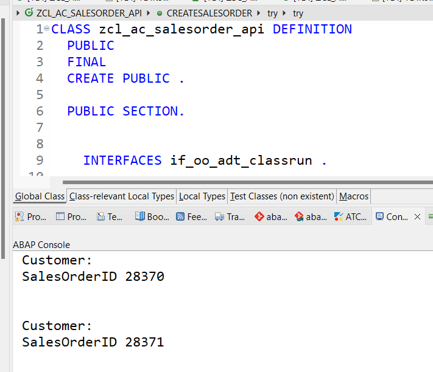
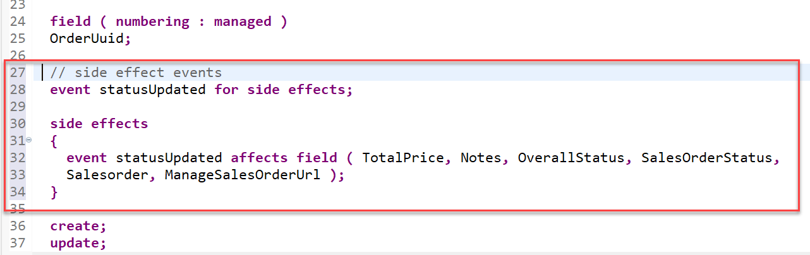
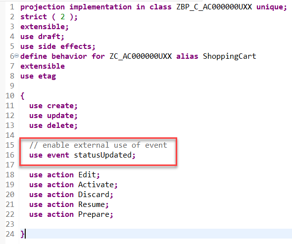
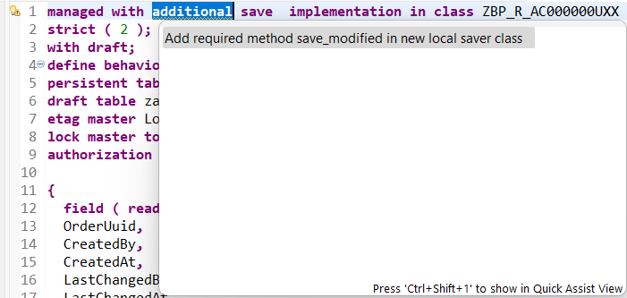
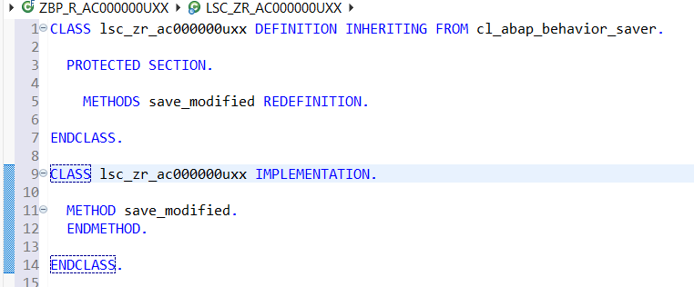
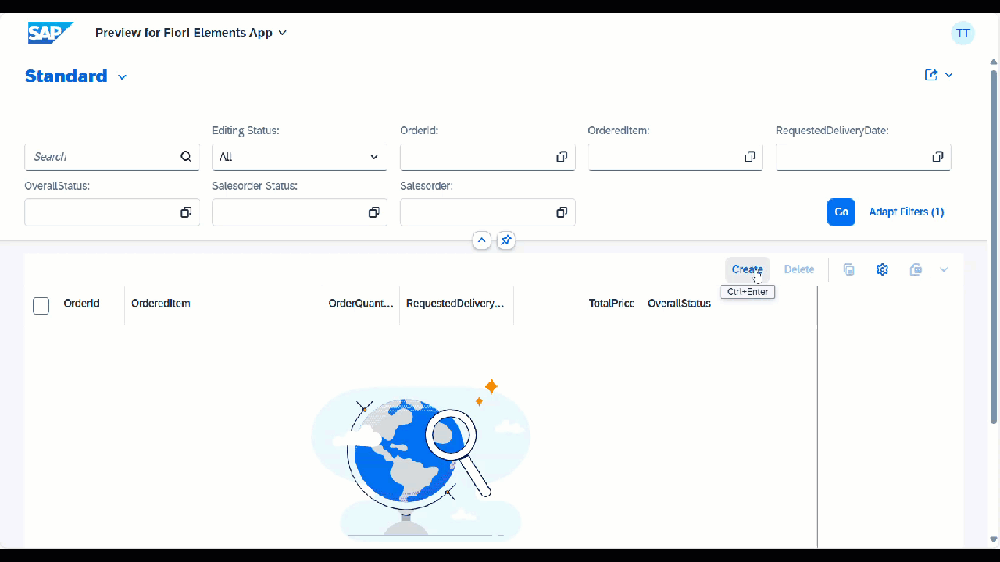
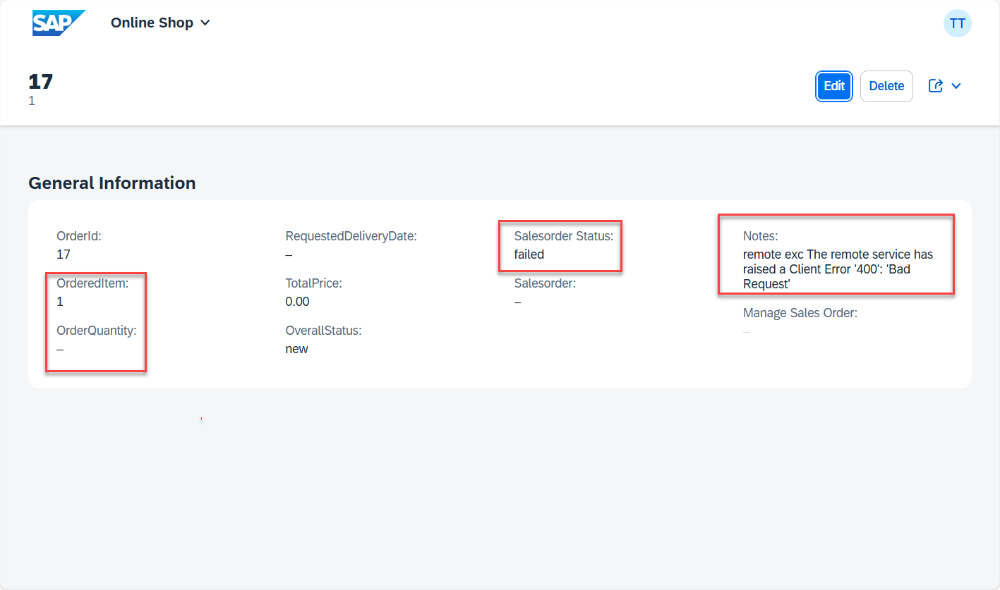

< [Previous Lesson](./3_ABAP-Cloud_RAP–Determinations.md)
# Salesorder creation

## Introduction
  
In the previous exercise, you have defined and implemented determinations that set the `OrderId` and the `OverallStatus`.  

In the current exercise we want to trigger the creation of a sales order using a sales order API class that we have provided for your convenience. 

The problem with side-by-side scenarios in general is, to have a logical unit of work that spans both systems, in our case the SAP BTP ABAP Environment and the SAP S/4HANA Cloud System.  

To be on the safe side we will trigger the creation of the sales order in the SAP S/4HANA backend only after the order has been successully created in our RAP based application in the SAP BTP ABAP Environment. 

Since the sales order api class performs an OData call to the SAP S/4HANA system this will trigger an implicit commit.
This would however violate the logical unit of work in RAP and will lead to a dump as described in the [SAP Online Help](https://help.sap.com/docs/abap-cloud/abap-rap/rap-transactional-model-and-sap-luw).  

Fortunately we can make use of the Background Processing Framework (BGPF) which allows us to start a process asynchronously from within the save sequence thereby leaving the transactional control of the RAP framework.  

```ABAP
zcl_ac000000uxx_start_bgpf=>run_via_bgpf_tx_uncontrolled( i_rap_bo_key = create_shoppingcart-OrderUuid ).         
```
   
<br>
   
## Exercise 4.1: Investigate the implementation of the sales order API `zcl_ac_salesorder_api`

   The sales order API [`zcl_ac_salesorder_api`](adt://TDI/sap/bc/adt/oo/classes/zcl_ac_salesorder_api) has been provided for your convenience.  
   
   You can test the class `zcl_ac_salesorder_api` by simply opening it in ADT using this ADT [Link](adt://TDI/sap/bc/adt/oo/classes/zcl_ac_salesorder_api) or by pressing `Ctrl`+`Shift`+`A` and entering the name of the class  `zcl_ac_salesorder_api`.   
   
   Then press `F9` to run the `main()` method as an **ABAP Application (console)**.  
   
   This method calls the `CreateSalesorder()` method which uses an OData Proxy Client that performs an OData call to the SAP S/4HANA backend. The OData Proxy Client uses the Service Consumption Model `ZSC_AC_API_SALESORDER` as a parameter and it uses an http client object that is using the predefined destination `S4HANA_ODATA_SalesOrder`.
   
   It creates a **Salesorder** in the SAP S/4HANA Cloud backend system.

   


## Exercise 4.2: Build a class for asynchronous sales order creation

>  In this step we will create a class that uses the background processing framework (BGPF) that allows us to start a class asynchronously which will trigger the creation of a sales order. This approach is required since the sales order API performs an OData call. An OData call like any other call of a remote API causes implicit commits. Since it is not allowed to perform any commit within the save sequence of the RAP framework since this would cause a short dump, this call has be performed outside the transactional control of the RAP framework.

1. Right-click on your ABAP package **`ZAC000000U##`** and select **New** > **ABAP class** from the context menu.

2. Maintain the required information and click **Next >**.

      - Name: **`ZCL_AC000000U##_START_BGPF`**
      - Description: **Start salesorder creation via BGPF**

3. Select a transport request and click **Finish**

4. Replace the default code with the code snippet provided below.

   **Hint**: Grab the code snippet using copy and paste.


   >   Source code **`zcl_AC000000U##_start_bgpf`**

<hr>
<details>

<summary>Click to expand the source code</summary>

```abap
    CLASS zcl_AC000000U##_start_bgpf DEFINITION
    PUBLIC
    FINAL
    CREATE PUBLIC.

    PUBLIC SECTION.

    INTERFACES if_serializable_object.
    INTERFACES if_bgmc_operation.
    INTERFACES if_bgmc_op_single_tx_uncontr.
    INTERFACES if_bgmc_op_single.

    CLASS-METHODS run_via_bgpf
      IMPORTING i_rap_bo_key                    TYPE sysuuid_x16
      RETURNING VALUE(r_process_monitor_string) TYPE string.

    CLASS-METHODS run_via_bgpf_tx_uncontrolled
      IMPORTING i_rap_bo_key                    TYPE sysuuid_x16
      RETURNING VALUE(r_process_monitor_string) TYPE string.

    METHODS constructor
      IMPORTING i_rap_bo_key TYPE sysuuid_x16.

    CONSTANTS:
      BEGIN OF bgpf_state,
        unknown         TYPE int1 VALUE IS INITIAL,
        erroneous       TYPE int1 VALUE 1,
        new             TYPE int1 VALUE 2,
        running         TYPE int1 VALUE 3,
        successful      TYPE int1 VALUE 4,
        started_from_bo TYPE int1 VALUE 99,
      END OF bgpf_state.

    PROTECTED SECTION.
    PRIVATE SECTION.
    DATA rap_bo_key TYPE sysuuid_x16.
    CONSTANTS wait_time_in_seconds TYPE i VALUE 5.
   ENDCLASS.


   CLASS zcl_AC000000U##_start_bgpf IMPLEMENTATION.
   METHOD constructor.
     rap_bo_key = i_rap_bo_key.
   ENDMETHOD.

   METHOD if_bgmc_op_single~execute.
     "implement if controlled behavior is needed
   ENDMETHOD.

   METHOD if_bgmc_op_single_tx_uncontr~execute.
     "implement if uncontrolled behavior is needed, e.g. commit work statements

     "There is already a global class **zcl_ac_salesorder_api** available
     DATA start_sales_order_create TYPE REF TO zcl_ac_salesorder_api.
     "In one the next steps you will create your own implementation
     "DATA start_sales_order_create TYPE REF TO zcl_AC000000U##_so_api.

     DATA update TYPE TABLE FOR UPDATE zr_AC000000U##\\ShoppingCart.
     DATA update_line TYPE STRUCTURE FOR UPDATE zr_AC000000U##\\ShoppingCart .

     DATA error_message TYPE string.

     READ ENTITIES OF zr_AC000000U##
             ENTITY ShoppingCart
             ALL FIELDS
             WITH VALUE #( ( %is_draft = if_abap_behv=>mk-off
                             %key-OrderUuid = rap_bo_key
                            )  )
             RESULT DATA(entities)
             FAILED DATA(failed).

     IF entities IS NOT INITIAL.
       LOOP AT entities INTO DATA(entity).
         "There is already a global class **zcl_ac_salesorder_api** available
         start_sales_order_create = NEW zcl_ac_salesorder_api(
      
         "In one the next steps you will create your own implementation
         "start_sales_order_create = NEW zcl_AC000000U##_so_api(
                                         i_material = entity-OrderedItem
                                         i_purchase_order_by_customer = CONV #( sy-uname )
                                         i_quantity = entity-OrderQuantity
                                         i_requested_delivery_date = entity-RequestedDeliveryDate
                                         ).

         DATA(r_data) = start_sales_order_create->CreateSalesorder(
                       IMPORTING
                         r_error_message = error_message
                     ).

         update_line-%is_draft = if_abap_behv=>mk-off.
         update_line-OrderUuid = entity-OrderUuid.

         IF r_data-sales_order IS NOT INITIAL.
           update_line-Salesorder    = r_data-sales_order.
           update_line-TotalPrice    = r_data-total_net_amount.
           update_line-SalesOrderStatus = zbp_r_AC000000U##=>sales_order_state-created.
           update_line-OverallStatus = zbp_r_AC000000U##=>order_state-released.
           update_line-ManageSalesOrderUrl =
            | https://my413601.s4hana.cloud.sap/ui#SalesOrder-manageV2&/SalesOrderManage('{ r_data-sales_order }') |.
         ELSE.
           update_line-Notes = error_message.
           update_line-OverallStatus = zbp_r_AC000000U##=>order_state-new.
           update_line-SalesOrderStatus = zbp_r_AC000000U##=>sales_order_state-failed.
         ENDIF.

         APPEND update_line TO update.
       ENDLOOP.

       MODIFY ENTITIES OF zr_AC000000U##
        ENTITY ShoppingCart
          UPDATE FIELDS ( SalesOrder OverallStatus SalesOrderStatus TotalPrice  ManageSalesOrderUrl Notes )
            WITH update
        REPORTED DATA(reported_ready)
        FAILED DATA(failed_ready).
     ENDIF.

     COMMIT WORK.
   ENDMETHOD.

   METHOD run_via_bgpf.
      TRY.
        DATA(process_monitor) = cl_bgmc_process_factory=>get_default( )->create(
                                              )->set_name( |Calculate order data { i_rap_bo_key }|
                                              )->set_operation(  NEW zcl_AC000000U##_start_bgpf( i_rap_bo_key = i_rap_bo_key )
                                              )->save_for_execution( ).

        r_process_monitor_string = process_monitor->to_string( ).
        CATCH cx_bgmc INTO DATA(lx_bgmc).
      ENDTRY.
   ENDMETHOD.

   METHOD run_via_bgpf_tx_uncontrolled.
     TRY.
        DATA(process_monitor) = cl_bgmc_process_factory=>get_default( )->create(
                                              )->set_name( |Calculate order data { i_rap_bo_key }|
                                              )->set_operation_tx_uncontrolled(  NEW zcl_AC000000U##_start_bgpf( i_rap_bo_key = i_rap_bo_key )
                                              )->save_for_execution( ).

       r_process_monitor_string = process_monitor->to_string( ).
       CATCH cx_bgmc INTO DATA(lx_bgmc).
     ENDTRY.  
   ENDMETHOD.

ENDCLASS.
```  

</details>

<hr>  

5. Save  and activate  the changes.  

## Exercise 4.3: Add side effects

> Because our RAP business object will be updated asynchronously we will leverage a new feature that allows us to trigger a side effect that refreshes the UI automatically.  

1. Open the behavior definition `ZR_AC000000U##` using this ADT [Link](adt://TDI/sap/bc/adt/bo/behaviordefinitions/zr_AC000000U##) and add and an `event for side effects` called `statusUpdated`.  

<!--
ADT [Link](adt://TDI/sap/bc/adt/bo/behaviordefinitions/zr_AC000000U##)
-->

In addition specify which fields the event `statusUpdated` shall effect.

Here we list a number of fields that are going to be updated asynchronously via BGPF.

   ```ABAP
   // side effect events
   event statusUpdated for side effects;

   side effects
   {
    event statusUpdated affects field ( TotalPrice, Notes, OverallStatus, SalesOrderStatus,
    Salesorder, ManageSalesOrderUrl );
   }

   ```

 

## Exercise 4.4: Enable event statusUpdated in the projection layer

After having created the **event for side effects** in the behavior defintion **`ZR_AC000000U##`** we have to enable it using the behavior definition on projection level.   

<!--
[`ZC_AC000000U##`](adt://TDI/sap/bc/adt/bo/behaviordefinitions/zc_AC000000U##).
-->

<!--
Here we have have to add an additional statements at the following location.

First we have to add this statement right after the **`use draft;`** statement.  

```ABAP    
//enable side effects  
use side effects;   
```
-->   

We thus have to add the following statement in order to enable the external use of the event **`statusUpdated`**. To do so open the behavior definition `ZC_AC000000U##` using this ADT [Link](adt://TDI/sap/bc/adt/bo/behaviordefinitions/zc_AC000000U##).   

```ABAP    
 // enable external use of event
 use event statusUpdated;   
```



## Exercise 4.5: Add an additional save 

As mentioned above we have to add the use of an additional save to the behavior of our RAP business object since the API that we plan to call has to be called asynchronously via BGPF.

Navigate to the behavior definition `ZR_AC000000U##` either in the *Project Explorer* or by opening it as a development object using the short cut **Ctrl+Shift+A** or by using this ADT [Link](adt://TDI/sap/bc/adt/bo/behaviordefinitions/zr_AC000000U##).   


  1. Open the behavior definition and add the statement `with additional save` right after the `managed` statement.

   Before

   ```ABAP
   managed implementation in class ZBP_R_AC000000U## unique;
   ```

   after

   ```ABAP
   managed with additional save implementation in class ZBP_R_AC000000U## unique;
   ```

  2. Activate your changes.

  3. After having activated your changes select the key word `additional` and select **Ctrl + 1** to start the code assistant.

       
  
     This will add a local saver class `lsc_zr_AC000000U##` to the local classes of your behavior implementation class. The method `save_modified` is added to the      DEFINITION and the IMPLEMENTATION section of this local class.   

       
     
     <!---
     <pre ABAP>
      CLASS lsc_zr_AC000000U## DEFINITION INHERITING FROM cl_abap_behavior_saver.
        PROTECTED SECTION.
      METHODS save_modified REDEFINITION.
      ENDCLASS.
      CLASS lsc_zr_AC000000U## IMPLEMENTATION.
      ENDCLASS.
     </pre>
     --->  
     
4. Implement the `save_modified()` method as follows:
  
   ```abap
        METHOD save_modified.
        DATA : ShoppingCarts       TYPE STANDARD TABLE OF zAC000000U##,
              ShoppingCart        TYPE                   zAC000000U##,
              events_to_be_raised TYPE TABLE FOR EVENT zr_AC000000U##~statusUpdated.

        IF create-shoppingcart IS NOT INITIAL.
          LOOP AT create-shoppingcart INTO DATA(create_shoppingcart).
            IF create_shoppingcart-%control-OverallStatus = if_abap_behv=>mk-on
              " AND create_shoppingcart-OverallStatus = zbp_r_AC000000U##=>order_state-in_process.
              AND create_shoppingcart-OverallStatus = zbp_r_AC000000U##=>order_state-saved.
              zcl_AC000000U##_start_bgpf=>run_via_bgpf_tx_uncontrolled( i_rap_bo_key = create_shoppingcart-OrderUuid ).
            ENDIF.
          ENDLOOP.
        ENDIF.
        
        "the salesorder and the status is updated via BGPF
        IF update-shoppingcart IS NOT INITIAL.
          LOOP AT update-shoppingcart into data(update_shoppingcart).
            IF update_shoppingcart-%control-SalesOrderStatus = if_abap_behv=>mk-on.
              CLEAR events_to_be_raised.
              APPEND INITIAL LINE TO events_to_be_raised.
              events_to_be_raised[ 1 ] = CORRESPONDING #( update_shoppingcart ).
              RAISE ENTITY EVENT zr_AC000000U##~statusUpdated FROM events_to_be_raised.
            ENDIF.

            IF update_shoppingcart-%control-OverallStatus = if_abap_behv=>mk-on
              "AND update_shoppingcart-OverallStatus = zbp_r_AC000000U##=>order_state-in_process.
              AND update_shoppingcart-OverallStatus = zbp_r_AC000000U##=>order_state-saved.
              zcl_AC000000U##_start_bgpf=>run_via_bgpf_tx_uncontrolled( i_rap_bo_key = update_shoppingcart-OrderUuid ).
            ENDIF.
          ENDLOOP.
        ENDIF.
        ENDMETHOD.

        
   ```

## Exercise 4.6: Preview and Test the enhanced ShoppingCart App

> Now the SAP Fiori elements app can be tested.  

You can either refresh your application in the browser using **F5** if the browser is still open - or go to your service binding `ZUI_AC000000U##_O4` using this ADT [Link](adt://TDI/sap/bc/adt/businessservices/bindings/zui_AC000000U##_o4)  and start the Fiori elements App preview for the **`ShoppingCart`** entity set.

<!--[`ZUI_AC000000U##_O4`](adt://TDI/sap/bc/adt/businessservices/bindings/zui_AC000000U##_o4) -->

You can go ahead and test the business logic that will trigger the creation of a sales order in the SAP S/4HANA Cloud system.

For example, create a new _ShoppingCart_ instance, maintain the needed data.

- **OrderedItem:** `TG11`      
- **OrderedQuantity:** `2`     
- **RequestedDeliveryDate:** `<Select a date in the future>`      

When you press the **Create** button the data will be saved and an order will be created with the status **order_created**.  

In the `save_modified()` method of local saver class the class `zcl_AC000000U##_start_bgpf` will start an asynchronous call of the sales order api class.  

```zcl_AC000000U##_start_bgpf=>run_via_bgpf_tx_uncontrolled( i_rap_bo_key = create_shoppingcart-OrderUuid ).```   

In this asynchronous call the sales order api will create a sales order by calling the **Sales Order (A2X)** OData service and it will update the **ShoppingCart** business object with the sales order id and it will add a URL pointing the the SAP Fiori Sales Order app in the SAP S/4HANA backend system using this code.

```ABAP 
         IF r_data-sales_order IS NOT INITIAL.
           update_line-Salesorder    = r_data-sales_order.
           update_line-TotalPrice    = r_data-total_net_amount.
           update_line-SalesOrderStatus = zbp_r_AC000000U##=>sales_order_state-created.
           update_line-OverallStatus = zbp_r_AC000000U##=>order_state-released.
           update_line-ManageSalesOrderUrl =
            | https://my413601.s4hana.cloud.sap/ui#SalesOrder-manageV2&/SalesOrderManage('{ r_data-sales_order }') |.
         ELSE.
           update_line-Notes = error_message.
           update_line-OverallStatus = zbp_r_AC000000U##=>order_state-new.
           update_line-SalesOrderStatus = zbp_r_AC000000U##=>sales_order_state-failed.
         ENDIF.

```


     

## Summary

Now that you have...

- created a BGPF starter class, 
- enabled and implemented side effects, and 
- created a special `save_modified()` method,

you can continue with the next exercise.

## Things left to do

 - The app allows the user to enter incomplete data which would leed to the creation of incomplete sales orders or the rejection of the creation of a sales order
 - The app allows to change the order after the sales order has been created
 
 Therefore we will implement in the following:  
 
 - validiations that will check the correctness of the data being entered  
 - make fields read-only after the sales order has been successfully created




[Next Lesson](./5_ABAP-Cloud_RAP–Validations.md)

