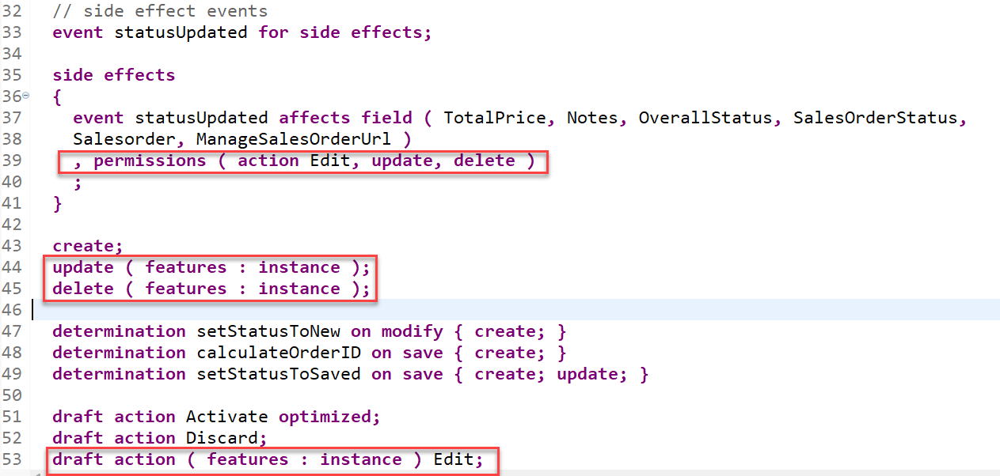
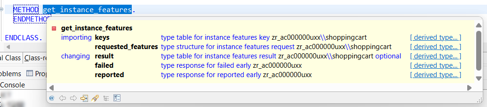
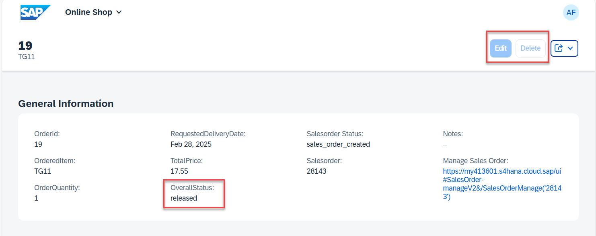

[Previous Lesson](./5_ABAP-Cloud_RAP–Validations.md)

# Dynamic Feature Control

## Introduction 
In the previous exercise, you've defined and implemented validations for the BO entity _ShoppingCart_.

In the present exercise, you will implement business logic that will disable the **Edit** button once a sales order has been created successfully. 

This will be achieved by using the so called dynamic instance feature control for the standard operations **Update** and **Delete** and the **draft action Edit** of the _ShoppingCart_ entity. 

### Information: Dynamic Feature Control
> As an application developer you may want to determine based on certain attributes of your business object entity, which fields should be read-only or mandatory or which functionality like update or actions are allowed.  As this property is related to an instance of this business object it is called Dynamic Feature Control.
> 
> ℹ **Further reading**: [Adding Static and Dynamic Feature Control](https://help.sap.com/viewer/923180ddb98240829d935862025004d6/Cloud/en-US/b6eb96dd784247a99cf8d70f77232ba4.html)

## Exercise 6.1: Define the Dynamic Instance Feature Control 

> Define the dynamic instance feature control for the standard operations **`update`** and **`delete`**, the draft action **`Edit`**.  
    
1. Open your behavior definition **`ZR_AC000000U##`** using this ADT [Link](adt://TDI/sap/bc/adt/bo/behaviordefinitions/zr_AC000000U##) and add the addition **`( features : instance )`** to the following operations as shown on following code snippet and the screenshot below:
    - Standard operations **`update`** and **`delete`** 
    - Draft action **`Edit`** 
    
 2. In addition add the statement `, permissions ( action Edit, update, delete )` to the `side effects` statement of the event `statusUpdated`. This way the changed behavior of the buttons will become active immediately after the sales order has been created asynchronsously.   
     
      ```ABAP
        side effects
        {
         event statusUpdated affects field ( TotalPrice, Notes, OverallStatus, SalesOrderStatus,
         Salesorder, ManageSalesOrderUrl )
         , permissions ( action Edit, update, delete )
         ;
        }

        ...
        
        create;
        update ( features : instance ) ;
        delete ( features : instance ) ;
        
        ...
        
        draft action ( features : instance ) Edit;
      ```
       
       Your souce code will look like this: 
 
       
    
2. Save  and activate  the changes.

3. At the top of the behavior definition, set the cursor on BO entity name **`ZR_AC000000U##`** and press **Ctrl+1** to open the **Quick Assist** view.
  
   Select the entry _**`Add method for operation instance_features of entity zr_AC000000U## ...`**_ to add the required methods to the local handler class `lcl_handler` of your behavior pool **`ZBP_R_AC000000U##`**. 
   
   
   
   The result should look like this:
   
   
    
4. Check the interface of the method **`get_instance_features`** in the declaration part of the local handler class in the behavior pool **`ZBP_R_AC000000U##`**.  
  
   Set the cursor on one of the method name, press **F2** to open the **ABAP Element Info** view, and examine the full method interface.  

   
  
   **Short explanation**:  
   - The addition **`FOR INSTANCE FEATURES`** after the method name indicates that this method provides the implementation of an instance-based dynamic feature control.
   - Method signature of the instance method `get_instance_features`:
     - `IMPORTING`parameter **`keys`** - a table containing the keys of the instances on which the feature control must be executed.
     -  Implicit `IMPORTING`parameter **`requested_features`** - structure reflecting which elements (fields, standard operations, and actions) of the entity are requested for dynamic feature control by the consumer. 
     - Implicit `CHANGING` parameters (aka _implicit response parameters_):  
       - **`result`** - used to store the result of the performed feature control calculation.      
       - **`failed`** - table with information for identifying the data set where an error occurred.
       - **`reported`** - table with data for instance-specific messages.

   Go ahead with the implementation.  

## Exercise 6.2: Implement the Dynamic Instance Feature Control 

> Implement the dynamic instance feature control for the standard operations **`update`** and **`delete`**, the draft action **`Edit`**.
>
> Following dynamic behavior will be implemented in the backend - and shown on the Fiori UI:
> - If a _ShoppingCart_ instance has the overall status `Released`, then the standard operations **`update`** and **`delete`**, and the actions **`Edit`**  must be disabled for the given instance.   


1. Implement the instance feature control method **`get_instance_features`** in the implementation part of the local handler class. 
   
   The logic consists of the following steps:  
   1. Read the relevant data of the transferred _ShoppingCart_ instances. 
      Only the fields **`OrderUuid`** and **`OverallStatus`** are needed to determine the operation state in the present scenario. 
   2. Evaluate the conditions and determine the state of the different operations. 
      The `COND` operator is used inline in the present scenario for the purpose. 
   3. Set the result set appropriately.   
   
   For that, replace the current method implementation with the code snippet provided below.

   You can make use of the **F1 Help** for more information about the EML statements and other ABAP constructs.
  
   ```ABAP
    METHOD get_instance_features.

     " read relevant shopping cart instance data
    READ ENTITIES OF ZR_AC000000U## IN LOCAL MODE
      ENTITY ShoppingCart
        FIELDS ( OrderUuid OverallStatus )
        WITH CORRESPONDING #( keys )
      RESULT DATA(entities)
      FAILED failed.

    " evaluate the conditions, set the operation state, and set result parameter
    result = VALUE #( FOR entity IN entities
                    ( %tky                   = entity-%tky

                      %features-%update      = COND #( WHEN entity-OverallStatus = zbp_r_AC000000U##=>order_state-released
                                                       THEN if_abap_behv=>fc-o-disabled ELSE if_abap_behv=>fc-o-enabled   )
                      %features-%delete      = COND #( WHEN entity-OverallStatus = zbp_r_AC000000U##=>order_state-released
                                                       THEN if_abap_behv=>fc-o-disabled ELSE if_abap_behv=>fc-o-enabled )
                      %action-Edit           = COND #( WHEN entity-OverallStatus = zbp_r_AC000000U##=>order_state-released
                                                       THEN if_abap_behv=>fc-o-disabled ELSE if_abap_behv=>fc-o-enabled )
                    ) ).

    ENDMETHOD.      
   ```   
      
  2. Save  and activate  the changes.
 
 You're through with the implementation.
 

## Exercise 6.3: Preview and Test the enhanced ShoppingCart App

> Now the SAP Fiori elements app can be tested.  

You can either refresh your application in the browser using **F5** if the browser is still open - or go to your service binding **`ZUI_AC000000U##_O4`** and start the Fiori elements App preview for the **`ShoppingCart`** entity set.

You can go ahead and test the logic of the dynamic feature control implemented in the backend.

For example, select a _ShoppingCart_ instance that has the overall status _**new**_, and check the state of the _**Edit**_, and the _**Delete**_ buttons. They all shall be enabled.

In addition select a  _ShoppingCart_ instance that has the overall status _**released**_, and check the state of the _**Edit**_, and the _**Delete**_ buttons. They all shall be disabled.

   

## Summary 

Now that you have... 

- defined the dynamic instance feature control for standard and non-standard operations in the behavior definition, 
- implemented it in the behavior pool, and
- previewed and tested the enhanced Fiori elements _ShoppingCart_ app,

you can continue with the next exercise.


[Next Unit](../504_BTP_ABAP-Cloud_BAS/README.md) >

