< [Previous Lesson](./README.md)

## Create a Fiori Project in SAP Build Code from within ADT

In this exercise we will show you an integration between the ABAP Development Tools in Eclipse and SAP Build Code. It is now possible to start the wizard for the creation of SAP Fiori Project in SAP Build Code from the Service Binding of your RAP business object.  

The advantage of this approach is that all required fields in the wizard in SAP Build Code are being pre-populated with the details of the OData service that is being published by your UI service binding.  

In contrast to the direct deployment that can be started from within ADT you have the option to add capabilities to your SAP Fiori UI that cannot be configured by using backend annotations alone.  

### Create / check your Dev Space 

> In order to configure the connectivity from ADT to SAP Business Application Studio we need the ID of your Dev Space. To retrieve the ID of your existing Dev Space or to create a new Dev Space you have to perform the following steps:

Select [Dev Space Manager]({link|ABAP_bas}) in SAP Business Application Studio.   

If you don't have a Dev Space yet, you have to create one.   

1. Select **Create Dev Space**  

   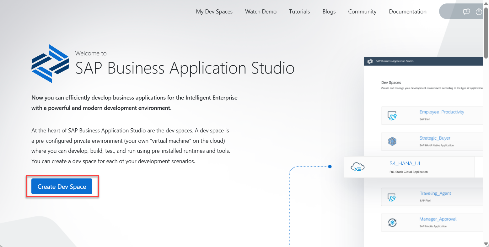  

2. Enter a name for your Dev Space, e.g. `AC000000U##`, select **SAP Fiori** as the application type and press **Create Dev Space**.

   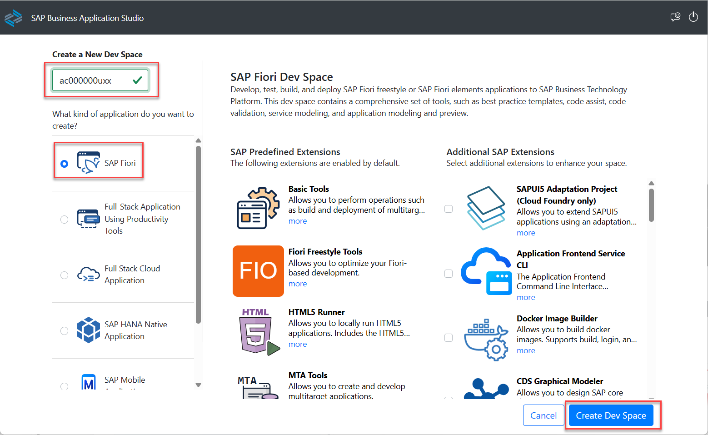 

3. The Dev Space will be created.

   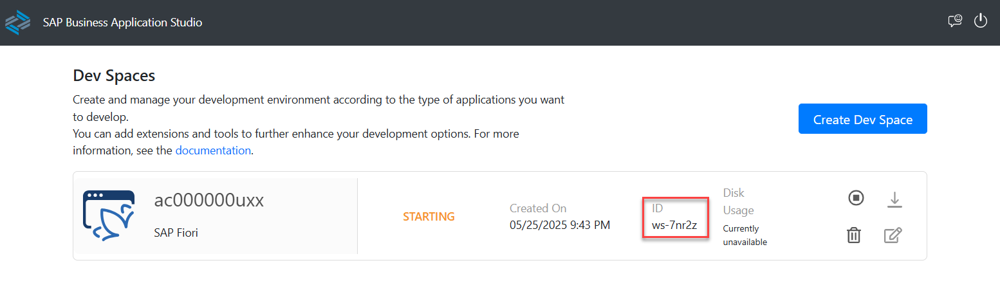 

Now you can check the **ID** of your Dev Space in SAP Build Code.

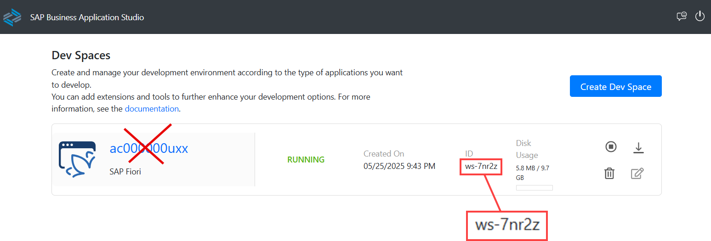  

> ⚠️⚠️⚠️ **Hint:**
> Do **NOT** use the name, but the ID of your Dev Space.

### Configure SAP Business Application Studio as external IDE in ADT

1. Open the service binding `ZUI_AC000000U##_O4` via this ADT [Link](adt://TDI/sap/bc/adt/businessservices/bindings/zui_AC000000U##_o4)

2. Click on **Create Fiori App...**   

   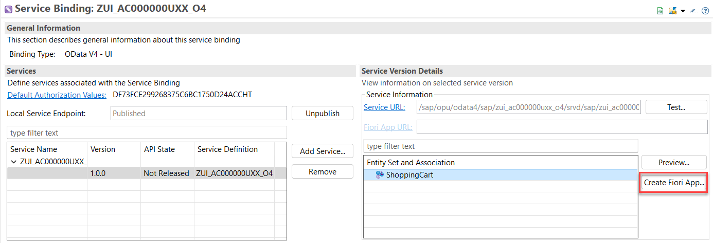

3. Select the option to **Create SAP Fiori Project and app with External IDE** and click on the link **Configure External IDE...**.  

   > If you have already used the **Quick Fiori Application Generator** the second option will be selected as a default. 

   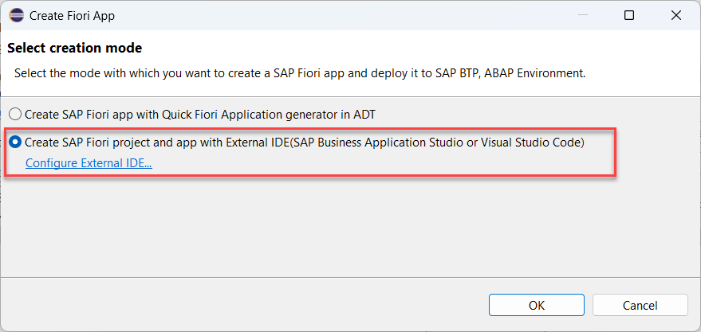

   > ⚠️    
   > If you just click **Ok** you will get a popup that tells you that the external IDE is not yet configured, press the link or **OK** to proceed with the configuration of the connectivity of the external IDE.    
   > 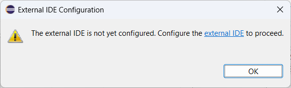   

4. Check the checkbox **Configure the external IDE**  and select the radiobutton **SAP Business Application Studio** and enter the following values:

   | Subject               | Value                                                                                     |
   | --------------------- | ----------------------------------------------------------------------------------------- |
   | **URL:**              | Copy the content of this link and paste it as text only: [BAS]({link\|ABAP_bas})          |
   | **Dev Space ID:**     | `<The ID of your Dev Space>`                                                              |
   | **Destination Name:** | `Build_ABAP`                                                                              |

   > If you want to check the connection you can press the button **Check connection** to test the connection from your SAP Build Code instance to your SAP BTP ABAP Environment System.

   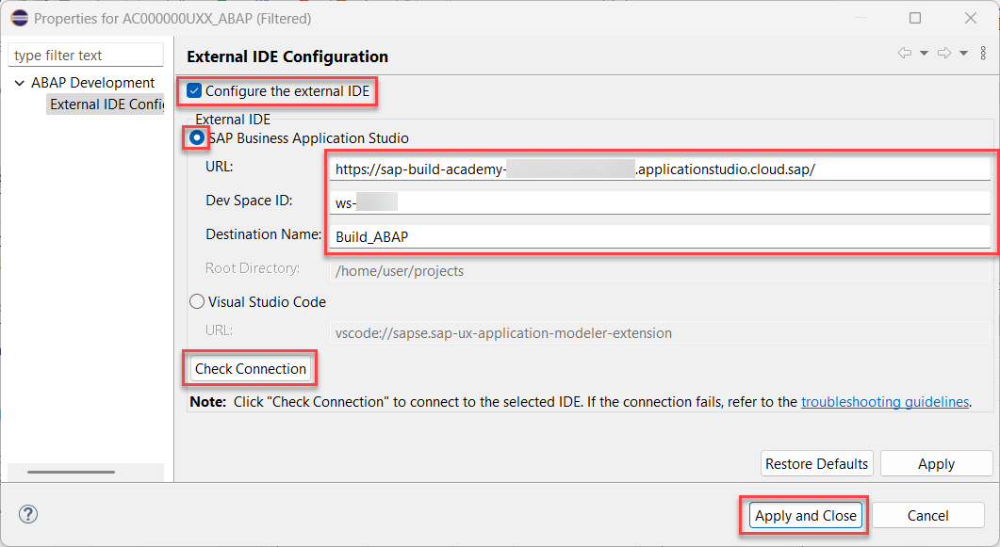 

5. Press **Apply and Close**

### Start creation of a SAP Fiori App using external IDE again

> The wizard will behave differently depending on whether you have used the **Quick Fiori Application Generator** or not. If you have used the Quick Fiori Application Generator several values of the wizard screens will be pre-populated based on the data you have entered in the Quick Fiori Application Generator.

1. Click again on **Create Fiori Project**

2. Select **Create Fiori Project from External IDE(...)**
3. In the **Create Fiori App** dialogue select the entity **`ShoppingCart`**   

     

4. Business Application Studio opens the **SAP Fiori Generator** with the **Template Selection** screen
    - Select **List Report Page**
    - Press **Next >**

5. In the **Entity Selection** screnn the `ShoppingCart` is pre-selected as the **Main Entity**. Press **Next>**
    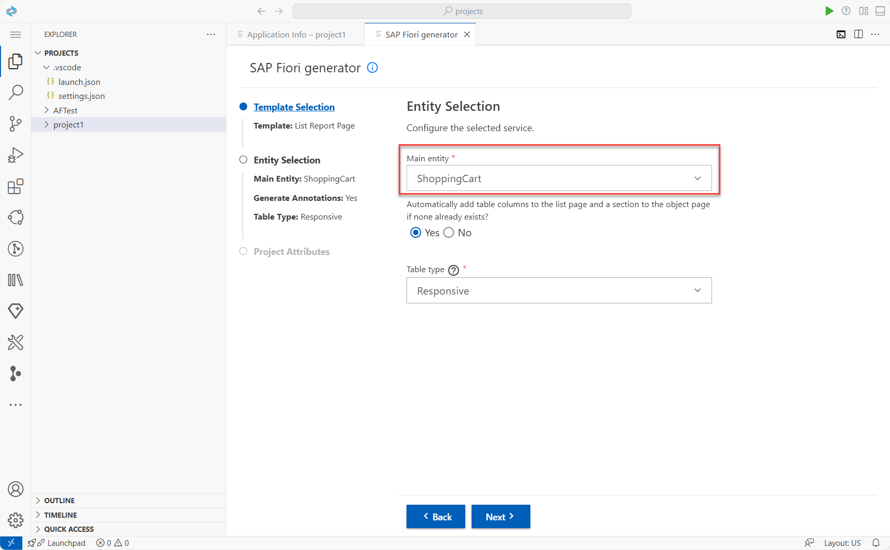  

6. In the **Project Attributes** enter the following values and press **Next >**.  

     > Hint: Your **Module Name** must be in lowercase letters.

     - Module Name: `AC000000U##`
     - Application Title: `ShoppingCart App AC000000U##`
     - Description: `A Fiori application`
     - Enable TypeScript: `No`
     - Add deployment configuration: `Yes`
     - Add FLP configuration: `Yes`
     - Use virtual endpoints for local preview `No`   
     - Configure advanced options: `No`

     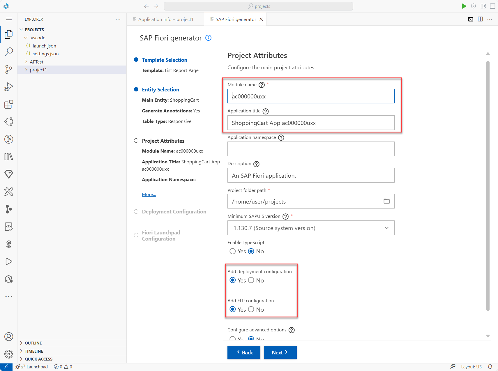

7. In the **Deployment Configuration** enter the following values and press **Next >**.

     > Hint: Your **SAP UI5 ABAP Repository** name must start with `Z` (or with a namespace if you would use your own system) because this is an ABAP repository object.  

    - Target: `ABAP`      
    - Destination: `<your_abap_trial_system> is selected automatically`
    - SAP UI5 ABAP Repository: `zAC000000U##`
    - Package: `zAC000000U##`
    - Transport Request: `<your_transport_request>`

     > Hint: If you want to copy your transport request, please do following: Open Eclipse, search your package `zAC000000U##` and open it. Open your transport organizer to see your transport request. The transport request of the superior folder needs to be chosen. Copy your transport request for later use. You can find your transport request underneath the Modifiable folder.

     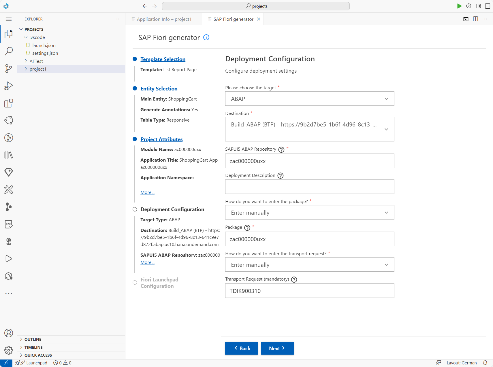   

     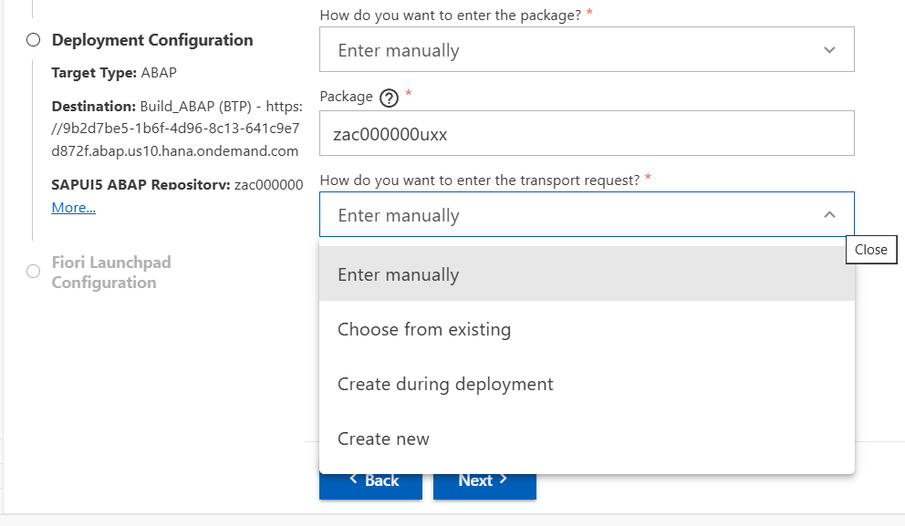  

8. In the **Fiori Launchpad Configuration** screen enter the following values and press **Finish**  

    - Semantic Object: `zAC000000U##`
    - Action: `display`
    - Title: `ShoppingCart App AC000000U##`

    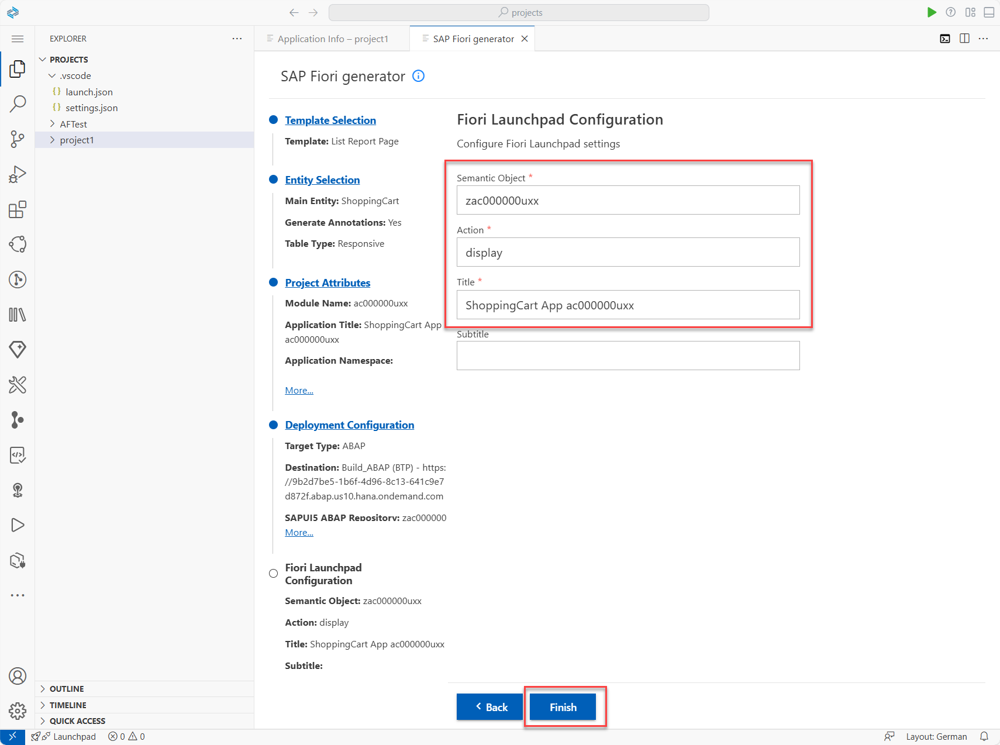 

### Run SAP Fiori application for data preview

1. On the **Application Information** overview page select **Preview Application**  

   >**Hint.** You can open the Application Information also through the menu > View > Command Palette > search and select Application Information.

     

2. From the **Preview Options** select the first entry **start fiori run**.

    

3. A popup might show up telling you that a service is listening on port 8080.  

   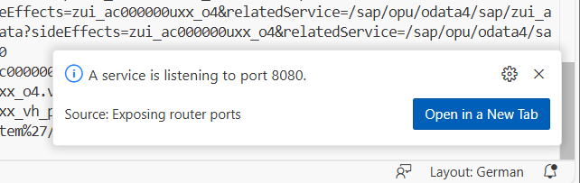 

4. A screen opens where you can open the file **index.html**

5. When the browser opens, press **Go**. Then click on an entry in the list.

   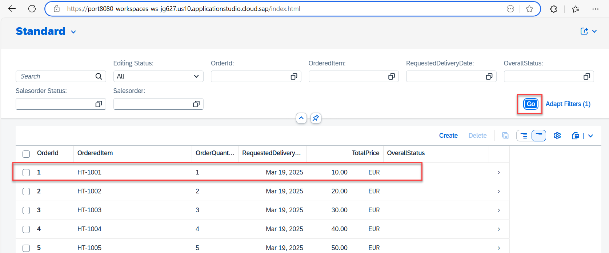

6. When you have clicked on an entry in the list the content of your screen will be replaced by showing the details of that entry in the object page.  

   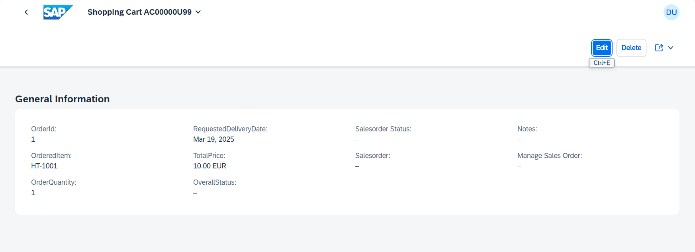

## Adapt the UI using SAP Build Code

After having created a SAP Fiori List Report Application that is so far completely driven by annotations provided by the RAP business object in the backend we will now perform two changes to the UI that can only be adapted using SAP Build Code in the **manifest.json** file of your project.   

- Enable **Initial Load**, that data is loaded automatically, so that you don't have to press the **Go** button.   
- Choose the **Flexible Column Layout** which allows the user to see more details on the screen.   

### Use the Page Map to adapt the UI

1. On the **Application Information** overview page select **Open Page Map** 

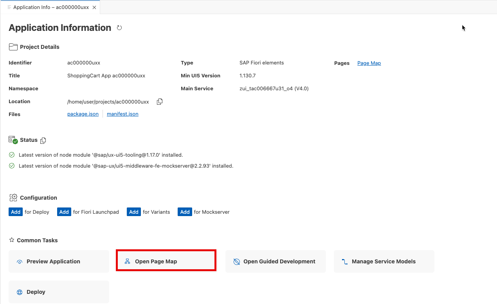 

2. Change the layout from **Standard Layout** to **Flexible Column Layout**

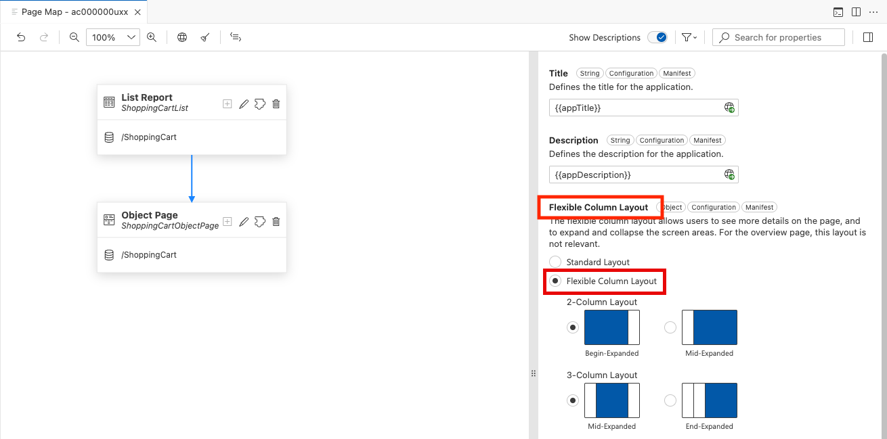 

3. Open the **Edit** mode of the **List Report**   

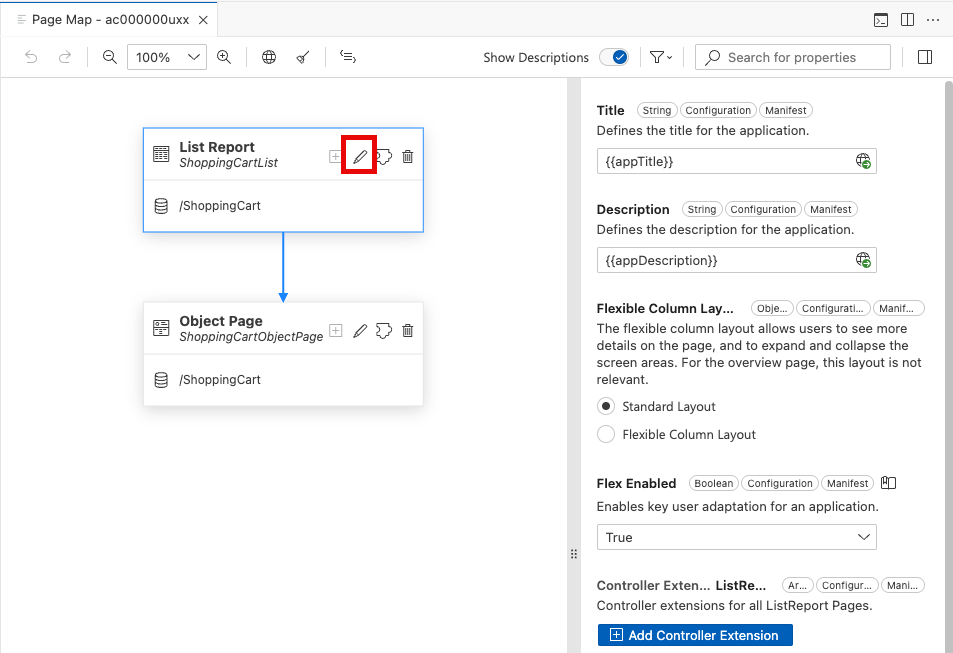 

4. Select the **Table**

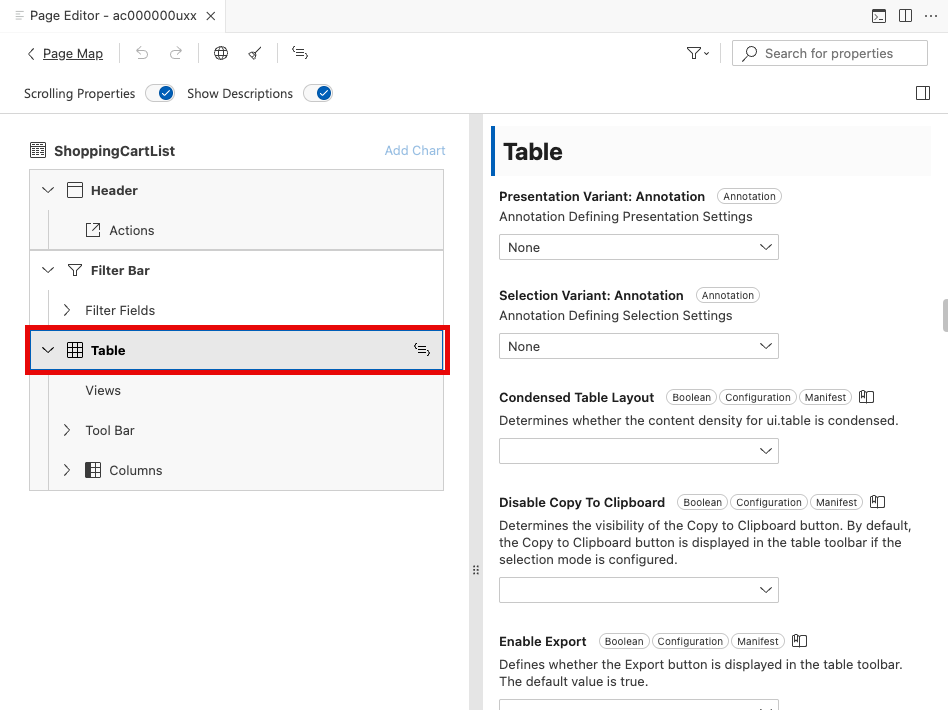 

5. Enable **Initial Load**, that data is loaded automatically. Maybe you need to scroll the menu a bit down to see **Initial Load**   

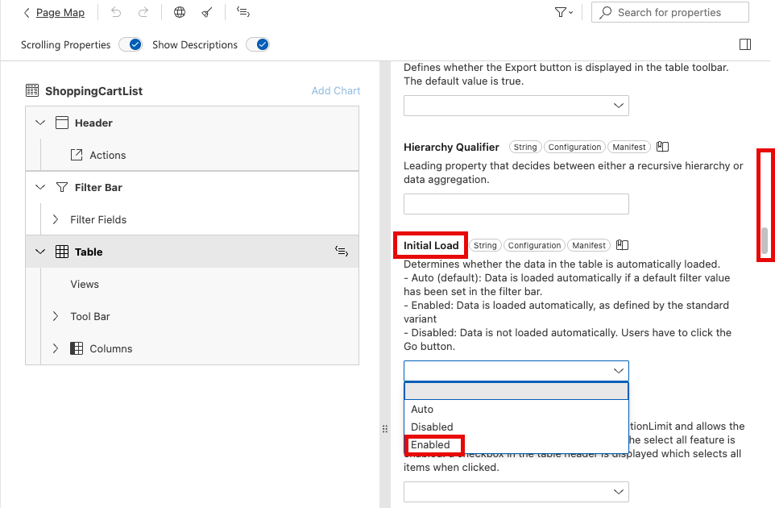

6. We are done with the manual adaptations of the Fiori Elements UI. Now we can close the Page Map.

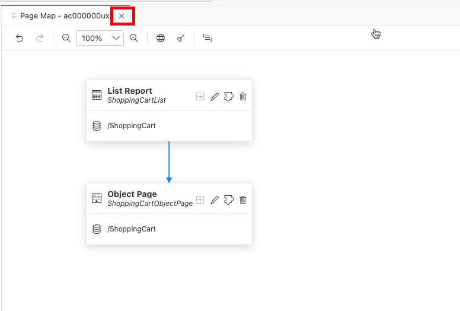

### Run (again) SAP Fiori application for data preview

1. On the **Application Information** overview page select **Preview Application**  

   >**Hint.** You can open the Application Information also through the menu > View > Command Palette > search and select Application Information.

     

2. From the **Preview Options** select the first entry **start fiori run**.

    

3. When the browser opens, data should be loaded automatically (Without having to press the **Go** button).      

    

4. Again click on an entry in the list to test the new behavior of the object page. You will now see the details of the selected entry in the same window.   

   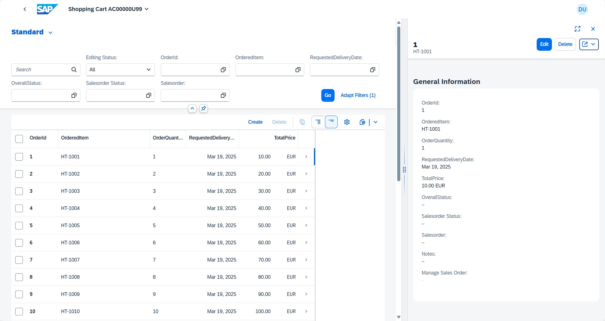

5. You can change the behavior of your application to the standard behavior by simply changing the **Flexible Column Layout**   

### Summary

You have learned:   

- how to use **SAP Build Code** to create a SAP Fiori application.     
- how to perform UI adaptations that cannot be achieved by using backend annotations.   

Now you are ready for next lesson of this unit.   

 
[Next Lesson](./2_ABAP-Cloud_BAS-Deploy_Fiori-Project.md) >

