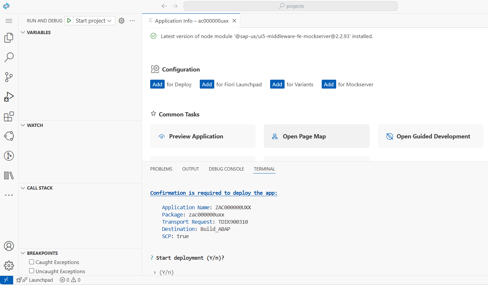
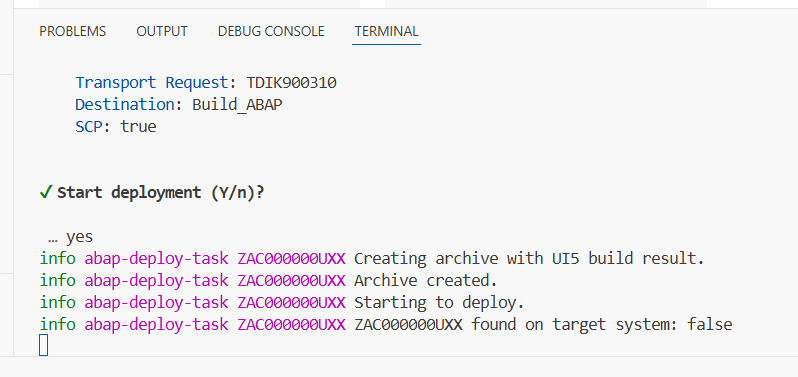
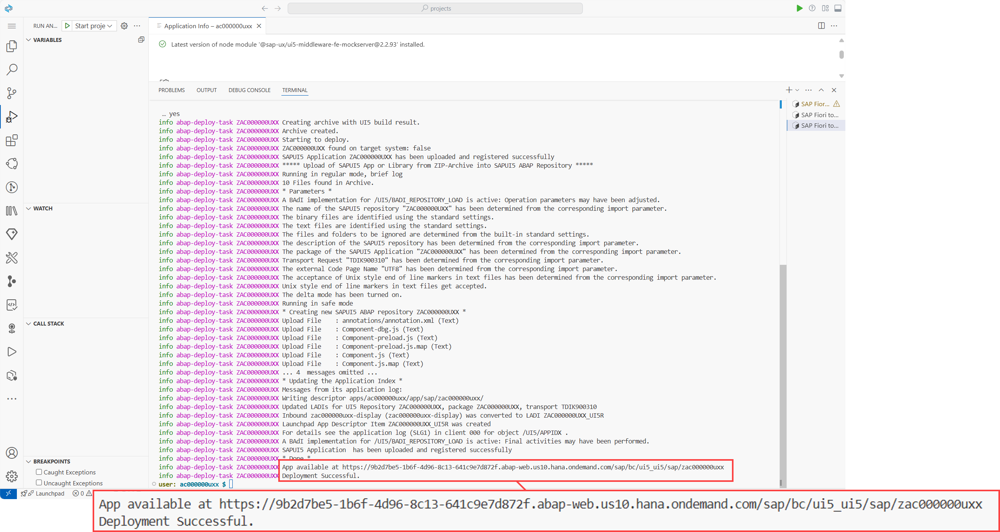
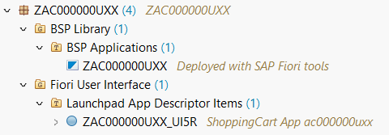
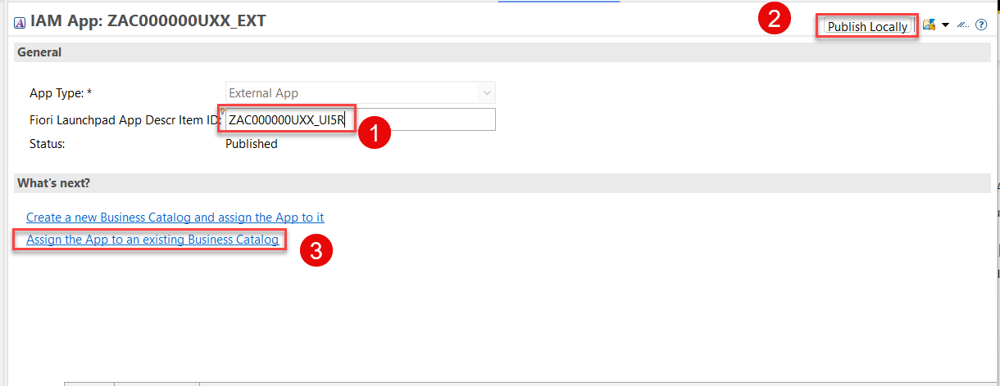

 
< [Previous Lesson](./1_ABAP-Cloud_BAS-Create_Fiori-Project_in_BAS.md)

## Deploy your application from SAP Build Code to SAP BTP ABAP Environment

1. On the **Application Information** overview page select **Deploy**.

   > **Hint.**  
   > You can open the Application Information through the menu > **View** > **Command Palette** > search and select **Application Information**.

2. When prompted, check deployment configuration and press **y**.

   

   > the deployment process will continue

   

3. When the deployment is successful, you will get these two information back as a result:  

   > App available at [{placeholder|ABAP_instance}/sap/bc/ui5_ui5/sap/zaAC000000U##]({placeholder|ABAP_instance}/sap/bc/ui5_ui5/sap/zAC000000U##)   
   > Deployment Successful.   

    

### Check BSP application and SAP Fiori Launchpad app descriptor item in Eclipse

1. Open Eclipse and check the BSP application and the SAP Fiori Launchpad app descriptor item folder in your package `zAC000000U##`. If you are not able to see BSP applications and SAP Fiori Launchpad app description items, refresh your package `zAC000000U##` by pressing F5.

   

### Create IAM app

1. In Eclipse right-click your package `zAC000000U##` and select **New** > **Other Repository Object**.

2. Search for **IAM App**, select it and click **Next >**.

   

3. Create a new IAM App and click **Next >**.  

   - Name: `zAC000000U##`
   - Description: IAM App for ShoppingCart app

     

4. In the transport selection screen click **Finish**.

5. Select **Services** and add press the **Insert** button.

    

6. Select following and click **ok**:

   - Service Type: `OData V4`    
   - Service Name: `ZUI_AC000000U##_O4`

   > Hint: With CTRL + Space you can search for your Service.  
  
    

7. Save your IAM app.

8. Publish your IAM app locally.

### Assign IAM app to predefined business catalog  

1. Open your IAM app [`zAC000000U##`](adt://TDI/sap/bc/adt/aps/cloud/iam/sia6/zAC000000U##_ext) and enter   
   - Fiori Launchpad App Descr Item ID: Use **Ctrl+Space** to select the App Descr Item ID
2. Click **Publish Locally**   
3. Click on **Assign the App to an existing business catalog**.

     

2. In the **New Buisiness Catalog IAM Assignment** screen enter the following values and press **Next>**.  

   - Business Catalog: `ZAC_FIORI_APP_ASSIGNMENT`

   > The name will be chosen by the framework automatically.

    

3. Select a transport request and press **Finish**  
4. You should now see the following in the 

   

### Search your app in the Fiori Launchpad of SAP BTP ABAP Environment

1. Open the Fiori Launchpad of your SAP BTP ABAP environment {placeholder|ABAP_instance}

2. Search for your Fiori application by entering your user id **AC000000U##**

   

3. The app is now visible in the Fiori Launchpad.
 
   

## Summary

Now you are ready for next unit.

 
[Next Unit](../505_BTP_ABAP-Cloud_OData-Service-Consumption/) >

