< [Previous Lesson](./README.md)

## Create SAP Fiori app with the Quick Fiori Application generator in ADT

In this exercise we will show you a simplified option to create and deploy a SAP Fiori Application from withing ADT without the need to use SAP Build Code.  

> You can skip this step when you have already performed the UI development using SAP Build Code.   

This option can be used if no additional UI configurations are needed that can only be performed in SAP Build Code and if you are happy with the UI that is being generated solely based on the the UI annotations that have been set in the metadata extension files. 

As said, this scenario is applicable if there is no additional UI development needed using either SAP Business Application Studio or VS Code and the SAP Fior Elements UI is completely driven by annotations that reside in the ABAP backend.   

> If it later turns out that additional UI configurations are needed you can choose the option to use SAP Build Code and the generated UI application will be overwritten by the application that will be developed and deployed using SAP Build Code.

## Quick Fiori Application Generator

1. Open the service binding `ZUI_{placeholder|userid}_O4`.  
   <!--[`ZUI_{placeholder|userid}_O4`](adt://TDI/sap/bc/adt/businessservices/bindings/zui_{placeholder|userid}_o4)] 
   -->    
2. Click on **Create Fiori App...**   

   

3. Select the option to **Create SAP Fiori app with Quick Fiori Application generator in ADT** and **OK**.

   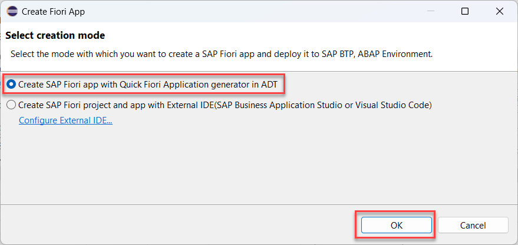

4. Select the package `z{placeholder|userid}` and press **Next**.   

      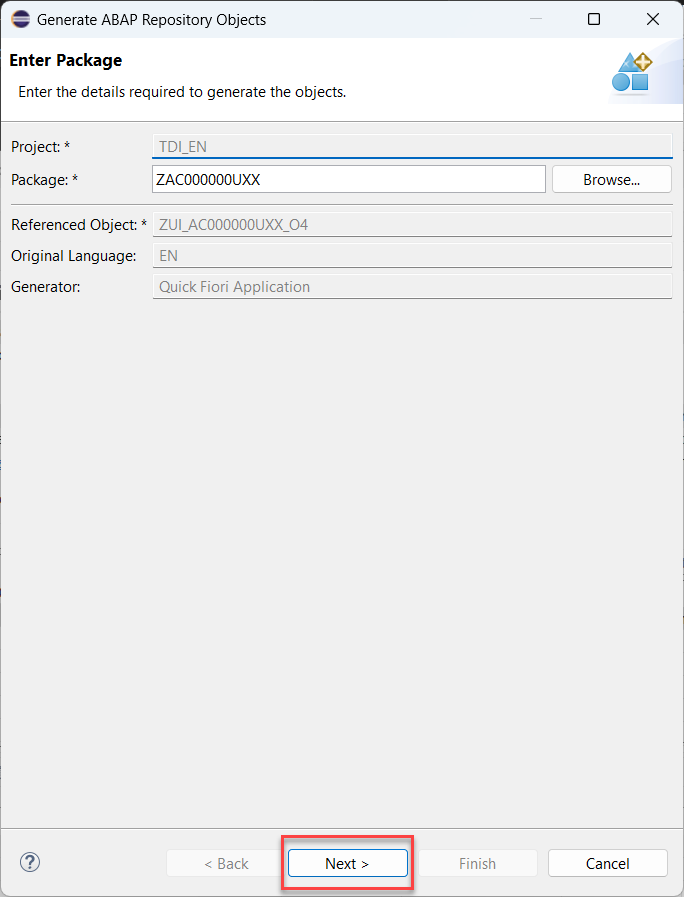

5. In the **Configure Generator** dialogue enter the following values and press **Next >**.  

     > Hint: Your **Module Name** must be in lowercase letters.

     Project Details:    
     - Module Name: `{placeholder|userid}`    
     - Application Title: `ShoppingCart App {placeholder|userid}`  

     Deployment Details:   
     - Repository Name: `z{placeholder|userid}`   
     - Description: `A Fiori application`

    Configure Fiori Launchpad Settings:   
     - Semantic Object: `z{placeholder|userid}`
     - Action: `display`
     - Title: `ShoppingCart App {placeholder|userid}` 

       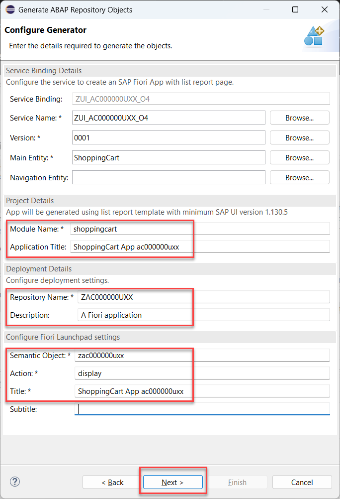   

6. In the **ABAP Artifacts Generation/Modification List** press **Next>** to continue.   

    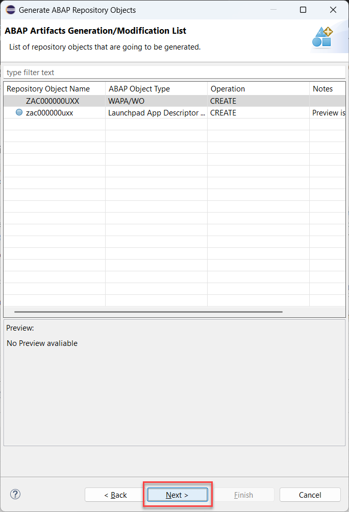 

7. In the **Select transport request** dialogue select a transport request and press **Finish**.    

8. The generation finishes with a success message that again opens the service binding editor. 

    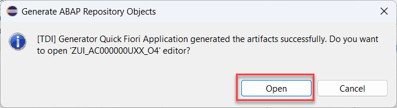 

### Check BSP application in Eclipse

1. Open Eclipse and check the BSP application in your package `z{placeholder|userid}`. If you are not able to see BSP application, refresh your package `z{placeholder|userid}` by pressing F5.

  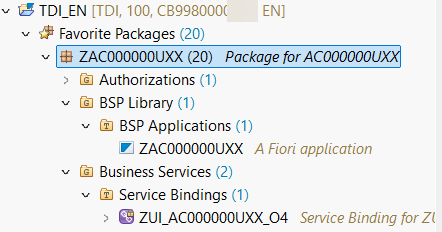 

### Create IAM app

1. In Eclipse right-click your package `z{placeholder|userid}` and select **New** > **Other Repository Object**.

2. Search for **IAM App**, select it and click **Next >**.

   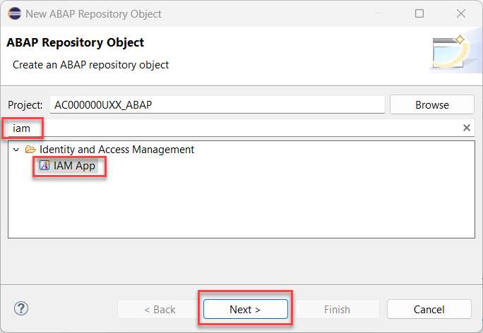

3. Create a new IAM App and click **Next >**.  

   - Name: `z{placeholder|userid}`
   - Description: IAM App for ShoppingCart app

   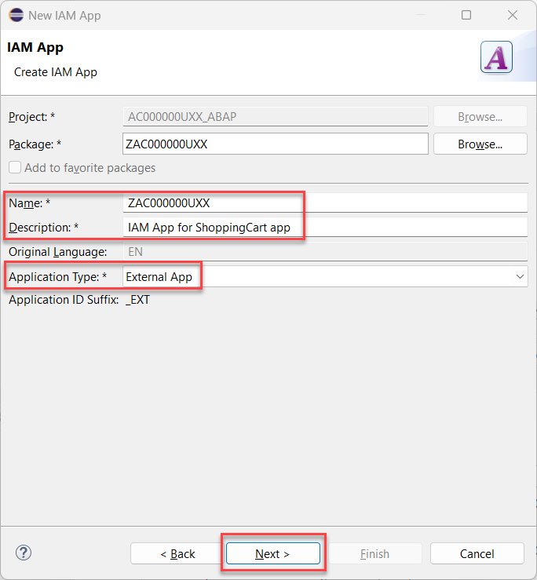  

4. In the transport selection screen click **Finish**.

5. Select **Services** and add press the **Insert** button.

   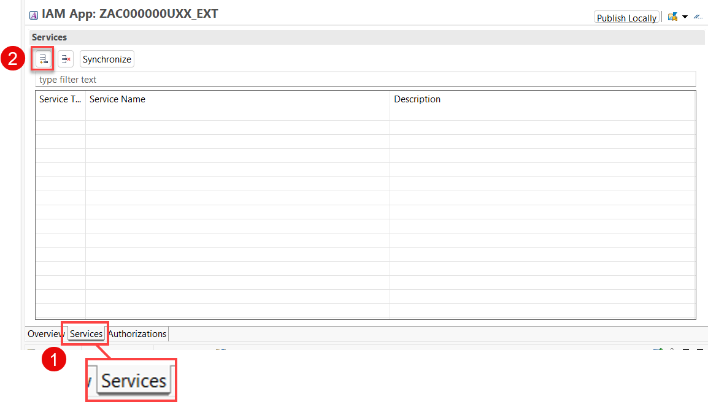 

6. Select following and click **ok**:

   - Service Type: `OData V4`    
   - Service Name: `ZUI_{placeholder|userid}_O4`

   > Hint: With CTRL + Space you can search for your Service.  
  
   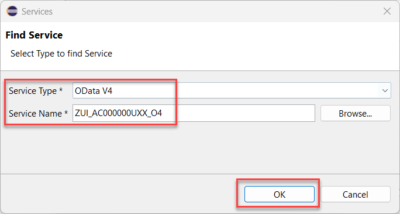 

7. Save your IAM app.

8. Publish your IAM app locally.

### Assign IAM app to predefined business catalog  

1. Open your IAM app [`z{placeholder|userid}`](adt://TDI/sap/bc/adt/aps/cloud/iam/sia6/z{placeholder|userid}_ext) and select the tab **Overview**. 
2. Enter the Fiori Launchpad App Descr Item ID: `ZUI_{placeholder|userid}_UI5R`  
   > You can use the content assist by pressing `Ctrl+Space` to retrieve the ID.   
3. Click **Publish Locally**   
4. Click on **Assign the App to an existing business catalog**.

   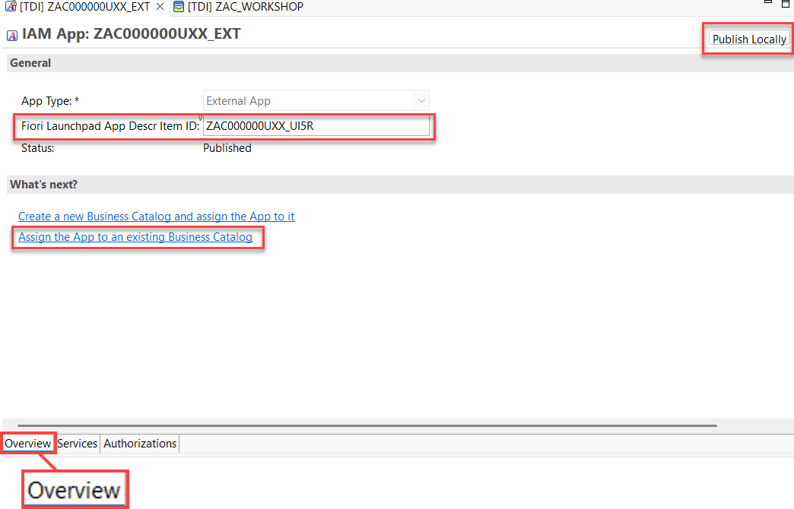  

2. In the **New Buisiness Catalog IAM Assignment** screen enter the following values and press **Next>**.  

   - Business Catalog: `ZAC_FIORI_APP_ASSIGNMENT`

   > The name will be chosen by the framework automatically.

   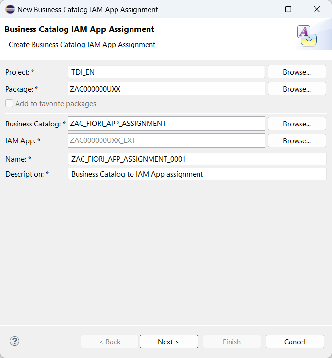 

3. Select a transport request and press **Finish**  
4. You should now see the following in the 

   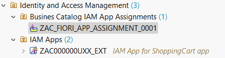

### Search your app in the Fiori Launchpad of SAP BTP ABAP Environment

1. Open the Fiori Launchpad of your SAP BTP ABAP environment {placeholder|ABAP_instance}

2. Search for your Fiori application by entering your user id **{placeholder|userid}**

   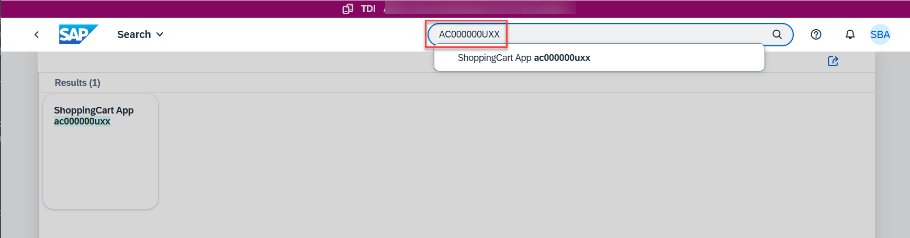

3. The app is now visible in the Fiori Launchpad.
 
   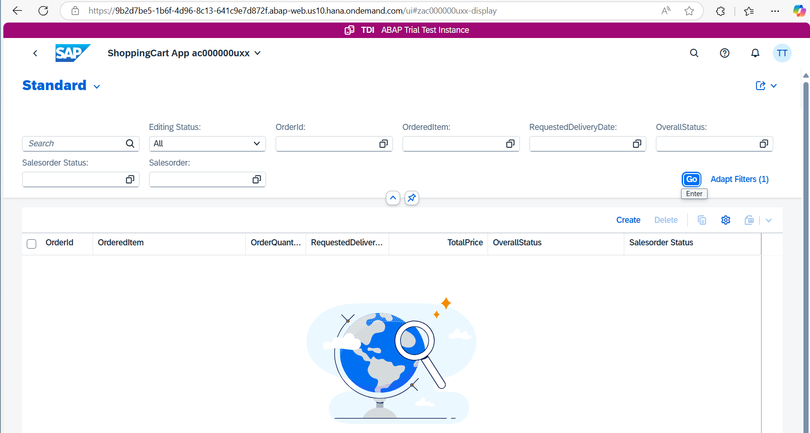

## Summary

Now you are ready for next lesson of this unit.

Congratulations!. You have successfully completed unit: "Getting Started – SAP ABAP Cloud".

 
[Next Unit](../505_BTP_ABAP-Cloud_OData-Service-Consumption/README.md) >

