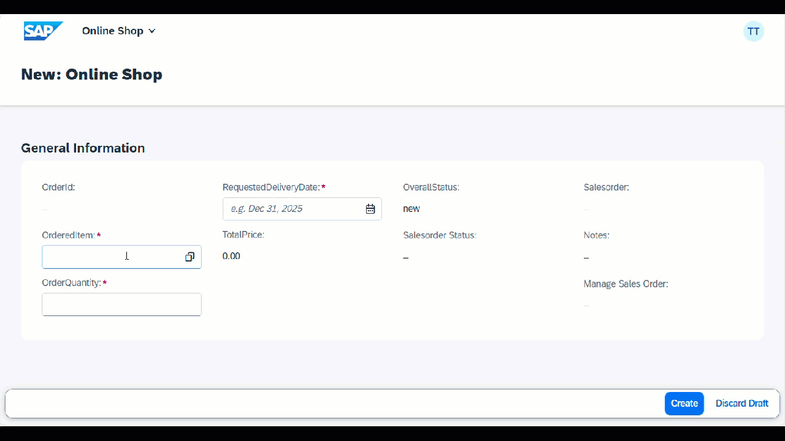

< [Previous Unit](../503_BTP_ABAP-Cloud_RAP/README.md)
< [Home](../README.md)

# Create and deploy an SAP Fiori Application using SAP Build Code

In this unit, you will learn about the different options how to efficiently start the UI development for your RAP based business object.

By the end of the unit, you will have a fully functioning SAP Fiori application based on your RAP business object capable of fetching, processing, and displaying ShoppingCart data and creating sales orders via a side-by-side integration. You’ll also understand how to use SAP Build Code’s tools and features to develop and deploy modern SAP Fiori UI's efficiently. Your app will look something like this:

> **Note:** Make sure to exactly follow the exercise documentation and use the provided naming conventions. Otherwise, you will encounter issues.

## Prerequisites

- You have access to the **SAP Build Lobby** with your **AC000000U##** user and Password

## Goal

You will learn about two options how to deploy a SAP Fiori app in SAP BTP ABAP Environment.   

The first option is required if you want to add advanced features to the SAP Fiori UI that cannot be added via means of backend annotations. We will show this by adding the following two features:   
- Pressing the **Go** button automatically   
- Change the layout to use the flexible column layout

## Exercices

**Option 1**:    
Create and deploy a SAP Fiori app with the Quick Fiori Application generator from within ADT    

[Create Fiori Application in ADT](./3_ABAP-Cloud_BAS-Create_Fiori-App_in_ADT.md)

**Option 2**:   
Create and deploy a SAP Fiori project and app with SAP Build Code (aka SAP Business Application Studio)   

[Create Fiori Project in Business Application Studio](./1_ABAP-Cloud_BAS-Create_Fiori-Project_in_BAS.md)

[Deploy Fiori Project](./2_ABAP-Cloud_BAS-Deploy_Fiori-Project.md)

<!--Navigate to section **1. Create Fiori Project in Business Application Studio** and then continue with with section **2. Deploy Fiori Project**. -->    

## Further information

- [Product Page](https://www.sap.com/products/technology-platform/developer-tools.html)
- [SAP Discovery Center - Services for SAP Build Code](https://discovery-center.cloud.sap/serviceCatalog/sap-build-code?region=all)
- [Developer Community for SAP Build Code](https://pages.community.sap.com/topics/build-code)
- [SAP Builders Interest Group](https://community.sap.com/t5/sap-builders/gh-p/builders)

<!--
[Next Lesson](./1_ABAP-Cloud_BAS-Create_Fiori-Project_in_BAS.md) >

-->