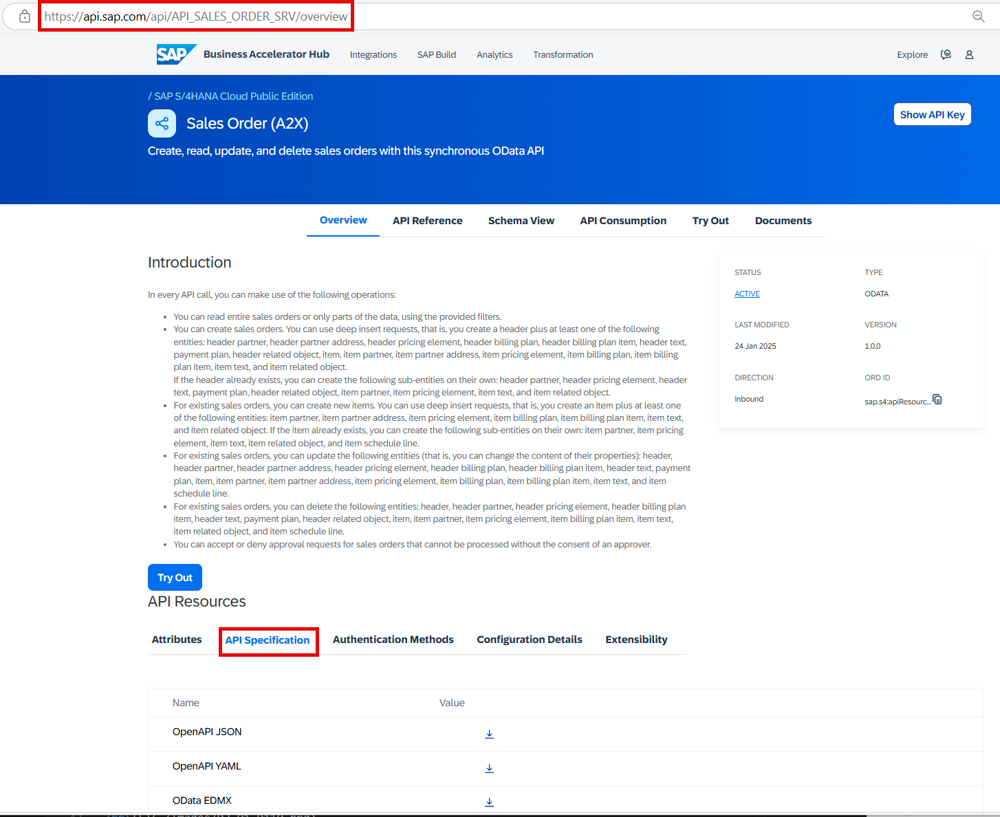
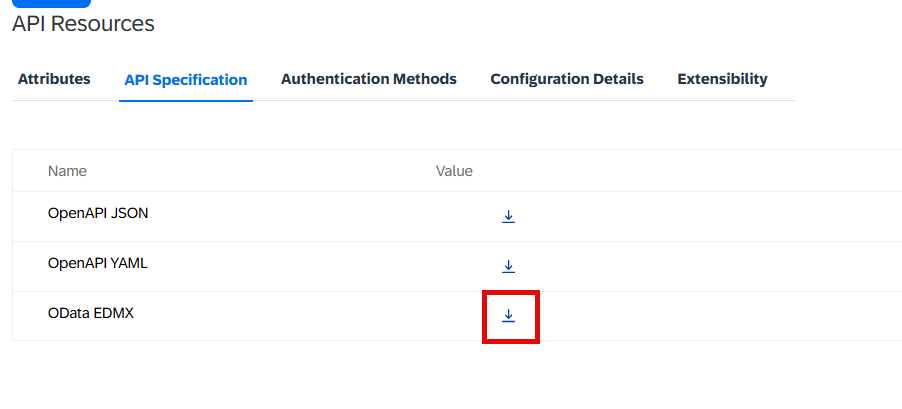
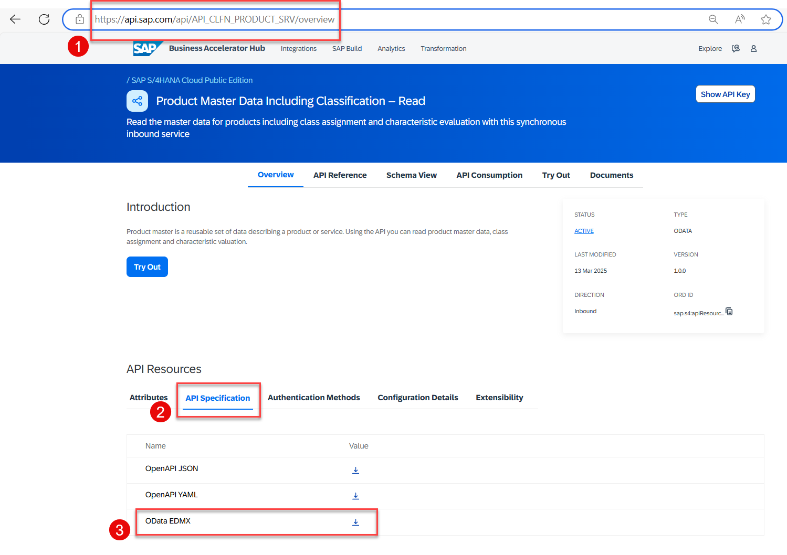

< [Previous Lesson](./README.md)

<!-- # Retrieve Information from the API Hub -->

In this exercise, you will learn how to retrieve the information needed to consume OData based APIs from the [Business Accelerator Hub](https://api.sap.com/).

## How is the API of an OData Service specified

A Service Metadata Document describes the data model (i.e. structure and organization of all the resources) exposed as HTTP endpoints by the service. A Service Metadata Document describes its data in EDM terms using an XML language for describing models called the Conceptual Schema Definition Language (CSDL). CSDL is fully described in [CSDL](https://www.odata.org/media/16348/[mc-csdl].pdf). When exposed by an OData service as a Service Metadata Document, the CSDL document is packed using the format described in [EDMX](https://www.odata.org/documentation/odata-version-2-0/overview/).  

The EDMX files for OData services delivered by SAP can be found on the Business Accelerator Hub (aka SAP API Hub).

## Download the OData API Specification of the SalesOrder A2X Service

1. Navigate to the overview page of the [Sales Order (A2X) Service](https://api.sap.com/api/API_SALES_ORDER_SRV/overview).

2. Click on the tab **API Specification**.  

.

3. Click on the download button for the **OData EDMX** file and store it locally on your computer. 

.

## Download the OData API Specification of the Product Master Data Including Classification - Read - Service

1. Navigate to the overview page of the [Product Master Data Including Classification - Read - Service](https://api.sap.com/api/API_CLFN_PRODUCT_SRV/overview).

2. Click on the tab **API Specification**.  

3. Click on the download button for the **OData EDMX** file and store it as well locally on your computer. 

   .

## Summary

You have retrieved the information that is required to develop OData Proxy Clients to consume the **Salesorder (A2X) OData Service** and the **Product Master Data Including Classification - Read - Service** in ABAP Cloud which you will use in the next exercise.

 
[Next Lesson](./2_ABAP-Cloud_OData.md) >

