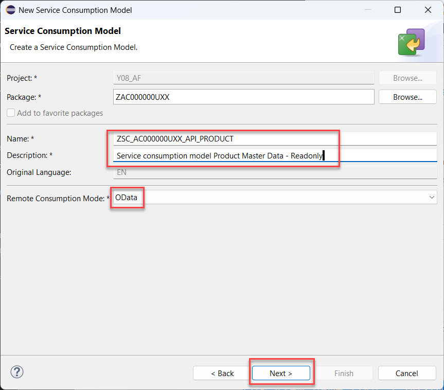
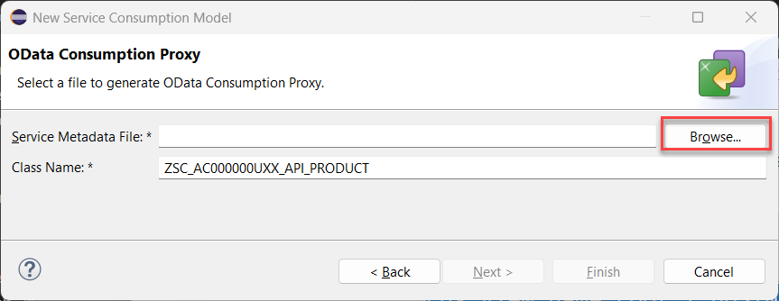
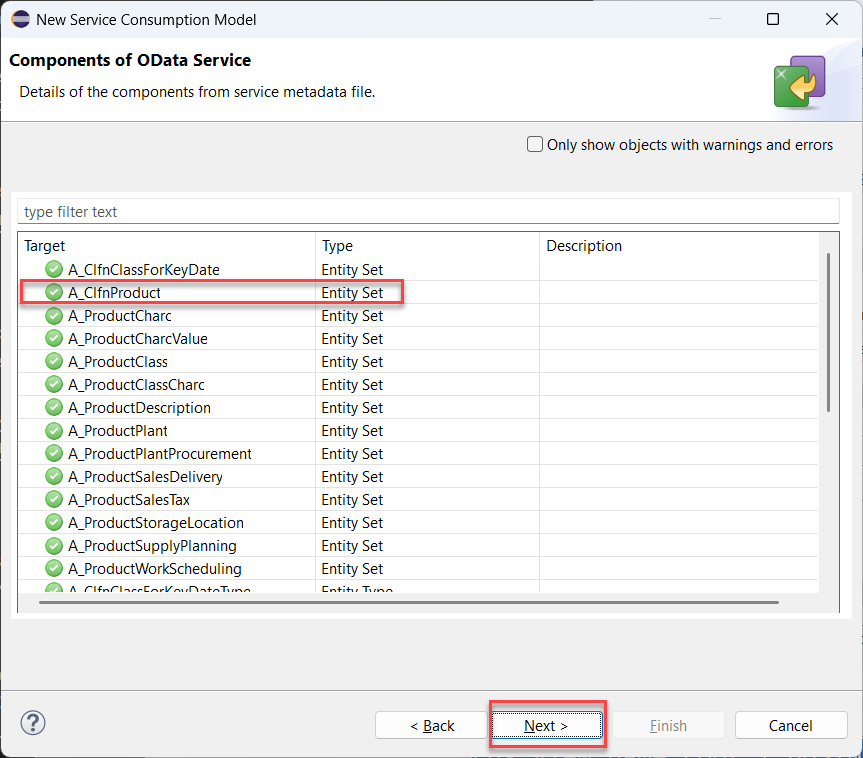
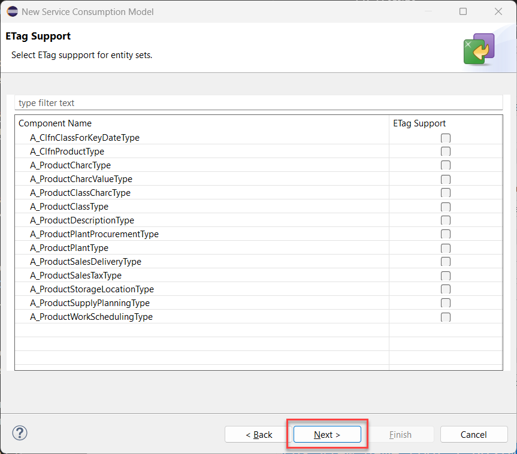

< [Previous Lesson](./1_ABAP-Cloud_OData.md)

## What is a Service Consumption Model ?

In this exerise we will generate a so called **Service Consumption Model**. This type of object takes an external interface description as its input. Currently *OData*, *SOAP* and *RFC* are supported.   
In this chapter we will create a Service Consumption Model for a read-only Product Master Data service. Later we will create a second Service Consumption Model for read/write access to the Sales Order (A2X) service.    
Based on the information found in the *$metadata* file or the *wsdl* file appropriate repository objects are generated (OData Client proxy or SOAP proxy objects). For RFC function modules the metadata file is created in the backend using the transaction *ACO_PROXY*.  
Using these objects you will be able to write ABAP code that lets you consume remote OData services, SOAP services or RFC function modules.

## Create the Service Consumption Model for Product Master Data

We continue by creating a service consumption model for the _Product Master Data Including Classification - Read OData service_. 

This service resides in all SAP S/4HANA public and private cloud systems.

1. The *$metadata* file of the OData service that we want to consume must also be uploaded in file format. We have hence downloaded it in the previous exericse.
 
2. Switch to ADT and right click on your package **`ZAC000000U##`**. Select **New > Other ABAP Repository Object**.   

   

3. In the New ABAP Repository Object dialogue do the following

   -  Start to type **`Service consumption model`**
   -  In the list of objects select **Service Consumption Model**
   -  Click **Next**

      

4. The **New Service Consumption Model** dialogue opens. Here enter the following data:

   - Name: **`ZSC_AC000000U##_API_PRODUCT`**
   - Description: **`Service consumption model Product Master Data - Readonly`**
   - Remote Consumption Model: **`OData`** (to be selected from the drop down box)

   
   
   Then click **Next**. 
   
   > **Caution**   
   > Be sure that you have selected **`OData`** as the **Remote Consumption Mode** from the drop down box. 
   
5. The $metadata file of the OData service that we want to consume must be uploaded in file format. If you have not yet downloaded the $metadata file you have to do this now.

   - Click **Browse** to select the $metadata file that you have downloaded earlier in this exercise
   - Class Name: **`ZSC_AC000000U##_API_PRODUCT`**    
   
     
   

> **Please note**
> The wizard suggest the name of the service consumption model also as the name of the class that is going to be generated. Leave the defaulted value.

6. Check the **Components of the OData Service** and click **Next**.

   You will notice that the the _Product Master Data Including Classification - Read OData service_ provides several entity sets. We will later use the entity set `A_Clfn_Product`. 

          

   Press **Next**.

7. The wizard will now let you choose for which entity sets support for etags should be added. 

    
   
   Just press **Next**.

8. Selection of transport request
   
   - Press **Finish**

9. The Service Consumption Model is automatically opened in ADT. Here press the **Activate** button press or **Ctrl+F3**. 

10. When you check the content of your package you will notice that it contains two objects. 

    -  The service consumption model
    -  The service consumption model class 
    
    > The generated class has the same name as the service consumption model, namely: **`ZSC_AC000000U##_API_PRODUCT`**.

 
[Next Lesson](./3_ABAP-Cloud_OData.md) >

