< [Previous Lesson](./2_ABAP-Cloud_OData.md)


## Introduction

In this exercise you will use the service consumption model for the **Product Master Data Including Classification - Read** - Service that you have created in the previous step and use it in your own class that is used as a product API.

This API is used at two locations of your RAP business object:  

a) in the validation `validateOrderedItem`. This way your RAP business object checks if valid products are being used.    
b) in addition this API is used in the query implementation class of the value help that retrieves valid product names from the SAP S/4HANA Cloud backend. 

### Coding explained

> In the following how to section we will use a coding template for your new product API. This coding template offers you the following functionalities:  
>
> - In the constructor part we create the OData Client proxy object which encompasses the use of the communication arrangment. 
> - The class offers a `get_products()` method which takes the values for **$top** and **$skip** and the select options in a format as they are requested by the generated code of the OData Client proxy.
> - The implementation of the `get_products()` method contains mock data which will be replace by a call of the to be generated code in a later step. 
> - For testing purposes there is also a `main` method that allows to test the `get_products()` method by pressing **F9**.

## How to section

### Create the product API class 

1. Right-click on your ABAP package **`ZAC000000U##`** and select **New** > **ABAP class** from the context menu.

2. Maintain the required information and click **Next >**.
      - Name: **`ZCL_AC000000U##_PRODUCT_API`** 
      - Description: **Product API**

3. In the **Select a transport request** dialogue just click **Finish** 

4. Replace the default code with the code snippet provided below.   

      **Hint**: Grab the code snippet using copy and paste. 


  
    
###    Source code: **`zcl_AC000000U##_product_api`**  
<hr>  
<details>     
<summary>Click to expand the source code</summary>  

```ABAP
 CLASS zcl_AC000000U##_product_api DEFINITION

 PUBLIC
  FINAL
  CREATE PUBLIC .

  PUBLIC SECTION.

    METHODS constructor
              RAISING
                cx_http_dest_provider_error
                cx_web_http_client_error
                /iwbep/cx_gateway.

    INTERFACES if_oo_adt_classrun .

    TYPES tys_a_clfn_product_type TYPE zsc_AC000000U##_api_product=>tys_a_clfn_product_type.
    TYPES tyt_a_clfn_product_type TYPE STANDARD TABLE OF tys_a_clfn_product_type WITH DEFAULT KEY.
    "! <p class="shorttext synchronized">Filter range for property PRODUCT.</p>
    TYPES tyt_range_product       TYPE RANGE OF tys_a_clfn_product_type-product.

    METHODS get_products
      IMPORTING
        it_range_product TYPE tyt_range_product
        i_top            TYPE i OPTIONAL
        i_skip           TYPE i OPTIONAL
      EXPORTING
        et_business_data TYPE zsc_AC000000U##_api_product=>tyt_a_clfn_product_type
      RAISING
        /iwbep/cx_cp_remote
        /iwbep/cx_gateway
        cx_web_http_client_error
        cx_http_dest_provider_error
      .

  PROTECTED SECTION.
  PRIVATE SECTION.

    DATA odata_client_proxy TYPE REF TO /iwbep/if_cp_client_proxy.
    DATA use_mock_data TYPE abap_bool VALUE abap_true.

ENDCLASS.

CLASS zcl_AC000000U##_product_api IMPLEMENTATION.
  METHOD if_oo_adt_classrun~main.
    DATA business_data TYPE zsc_AC000000U##_api_product=>tyt_a_clfn_product_type .
    DATA lt_range_product  TYPE tyt_range_product.

    DATA ranges_table TYPE if_rap_query_filter=>tt_range_option .
    ranges_table = VALUE #(
                                (  sign = 'I' option = 'EQ' low = 'MZ-TG-Y240' )
                                (  sign = 'I' option = 'BT' low = 'TG' high = 'TH' )
                              ).

    MOVE-CORRESPONDING ranges_table TO lt_range_product .

    TRY.
        get_products(
          EXPORTING
            it_range_product    = lt_range_product
            i_top               = 50
            i_skip              = 0
          IMPORTING
            et_business_data  = business_data
          ) .
        out->write( business_data ).
      CATCH cx_root INTO DATA(exception).
        out->write( cl_message_helper=>get_latest_t100_exception( exception )->if_message~get_longtext( ) ).
    ENDTRY.

  ENDMETHOD.

  METHOD get_products.

    IF use_mock_data = abap_true.
      et_business_data = VALUE #( ( Product = 'TG11'  )
                                  ( Product = 'TG12'  )
                                  ( Product = 'TG13'  )
                                  ( Product = 'TG15_not_exists' ) ).
      EXIT.
    ENDIF.

*    DATA read_products TYPE REF TO lcl_read_a_clfn_product.
*    read_products = NEW #( odata_client_proxy ).
*    et_business_data = read_products->execute( it_range_product = it_range_product
*                                               i_top            = i_top
*                                               i_skip           = i_skip ).
  ENDMETHOD.

  METHOD constructor.
    DATA http_client        TYPE REF TO if_web_http_client.
    DATA proxy_model_id     TYPE /iwbep/if_cp_runtime_types=>ty_proxy_model_id.

    proxy_model_id = to_upper( 'ZSC_AC000000U##_API_PRODUCT' ).

    DATA(http_destination) =
    cl_http_destination_provider=>create_by_cloud_destination( i_name       = 'S4HANA_ODATA_Products_ABAP_ReadOnly'
                                                               i_authn_mode = if_a4c_cp_service=>service_specific ).

    http_client = cl_web_http_client_manager=>create_by_http_destination( i_destination = http_destination ).

    odata_client_proxy = /iwbep/cl_cp_factory_remote=>create_v2_remote_proxy(
                             is_proxy_model_key       = VALUE #( repository_id       = 'DEFAULT'
                                                                 proxy_model_id      = proxy_model_id
                                                                 proxy_model_version = '0001' )
                             io_http_client           = http_client
                             iv_relative_service_root = '' ).

  ENDMETHOD.

ENDCLASS.
   
``` 
   
</details>   

<hr> 


5. Save  and activate  the changes.

6. Run the class by pressing **F9**

  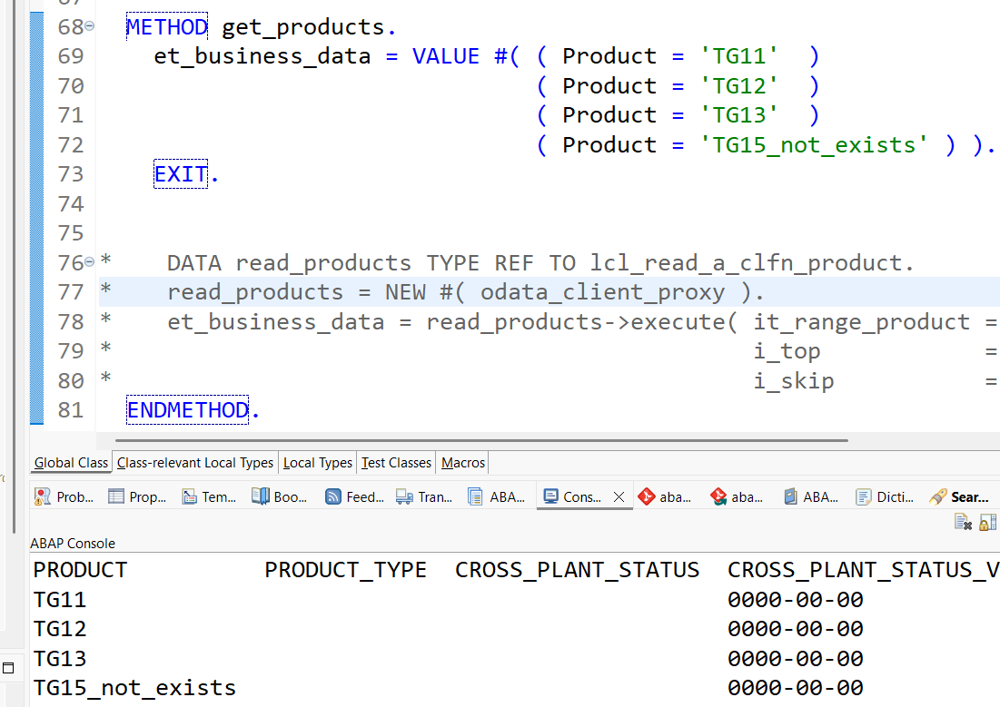


> The output of the class shows the mock data that is set in the `get_products()` method.  

### Generate the code to call the OData Client Proxy using Joule 💎

Since we want to use the results of the remote _Product Master Data Including Classification - Read_ OData service we have to leverage the service consumption model.

1. Open the service consumption model using the following ADT link:  
   [`zsc_AC000000U##_api_product`](adt://TDI/sap/bc/adt/businessservices/consmodels/zsc_AC000000U##_api_product). 

2. Start the Joule chat with either of the following two options:  
   - Choose **Joule** --> **Consume** from the context menu by selecting the service consumption model in the project explorer. 
   
     

   - Open the Joule chat view and select the **Joule topic** `/consume` in the input field at the bottom of the view. 

     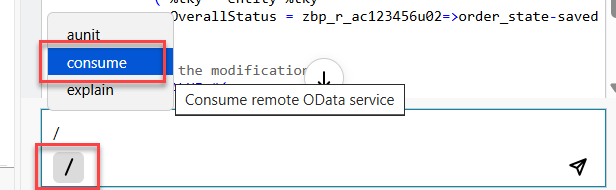

3. Enter the following prompt

   `I want to read the entity A_CLFN_PRODUCT and filter the results by product. `

4. This shall produce the following result:
   - The OData request   
   - The ABAP code to call this OData request      

     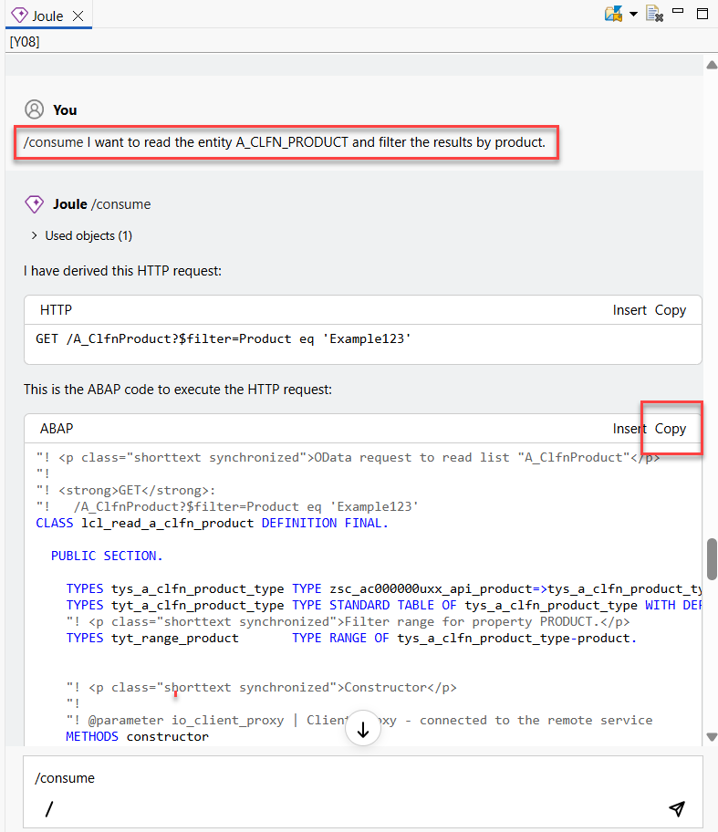

   > Joule will generate the code for a local class called `lcl_read_a_clfn_product`. The name is derived from the entity being referenced. 
   
5. Copy the generated code from the Joule chat into the **Local Types** tab of your product API class `zcl_AC000000U##_product_api`.

    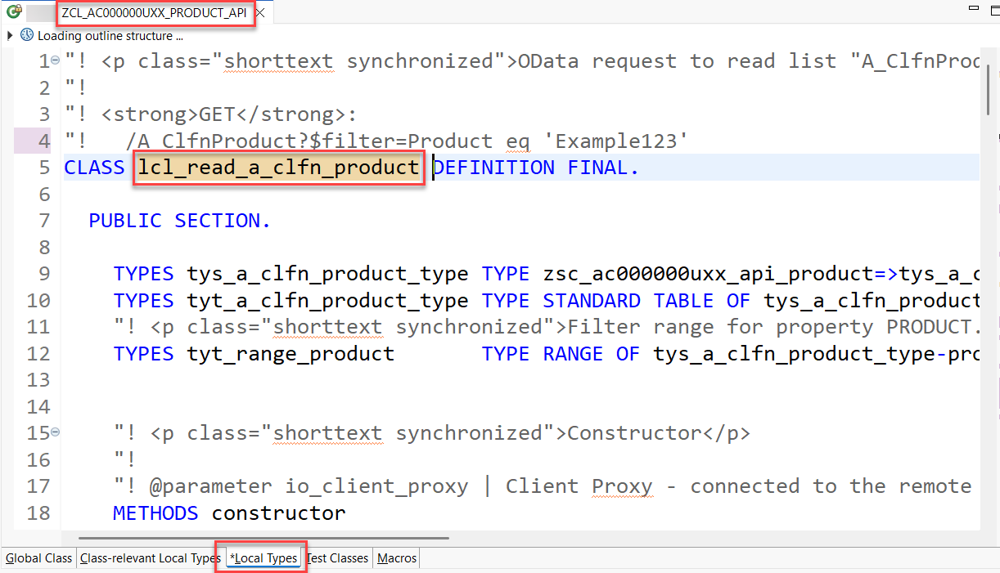

6. We now have to adapt the generated code a little bit since the generated code currently does not support the OData query parameters **$top** and **$skip** which should be used to achieve client side paging. 

   Add the following two optional parameters to the signature of the **execute()** method.

   ```ABAP
        i_top            TYPE i OPTIONAL
        i_skip           TYPE i OPTIONAL
   ```
  
   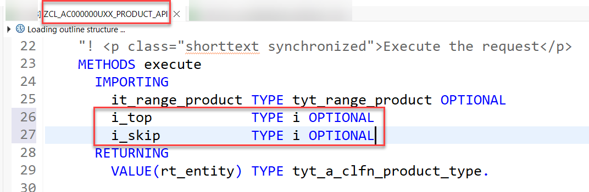

7. Add the following lines of code to the implementation of the **execute()** method.   
   
   ```ABAP
        "begin of insert
        IF i_top > 0 .
          lo_request->set_top( i_top ).
        ENDIF.
        lo_request->set_skip( i_skip ).
        "end of insert
   ```

   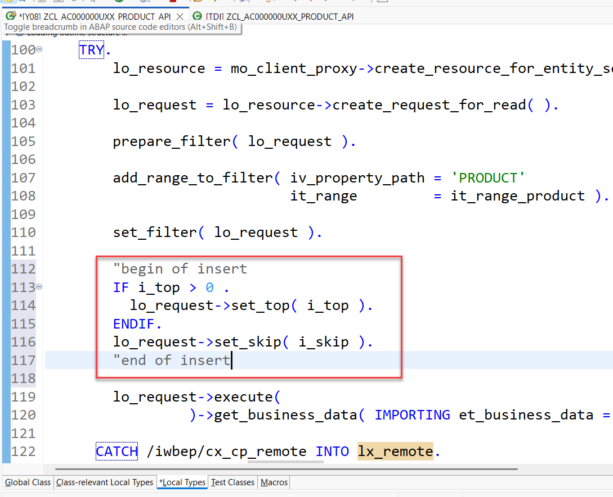

   > Please note that the generated code contains exception handling that you might want to adapt to your needs.  

8. Finally we have to adapt the implementation of the **`get_products()`** method so that the OData client proxy in our local will be used. 
  
   - Navigate back to the implementation of the global class `zcl_AC000000U##_product_api`.

   - Replace the code for method **`get_products()`** as follows: 

    ```ABAP

    METHOD get_products.

    "IF use_mock_data = abap_true.
    "  et_business_data = VALUE #( ( Product = 'TG11'  )
    "                              ( Product = 'TG12'  )
    "                              ( Product = 'TG13'  )
    "                              ( Product = 'TG15_not_exists' ) ).
    "  EXIT.
    "ENDIF.

    DATA read_products TYPE REF TO lcl_read_a_clfn_product.
    read_products = NEW #( odata_client_proxy ).
    et_business_data = read_products->execute( it_range_product = it_range_product
                                               i_top            = i_top
                                               i_skip           = i_skip ).
    ENDMETHOD.

    ```

   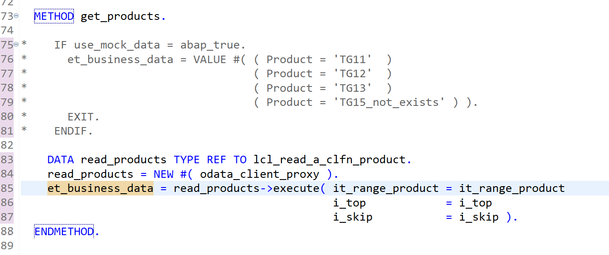


9. Save  and activate  the changes.  

10. Test your implementation by pressing `F9`.  

    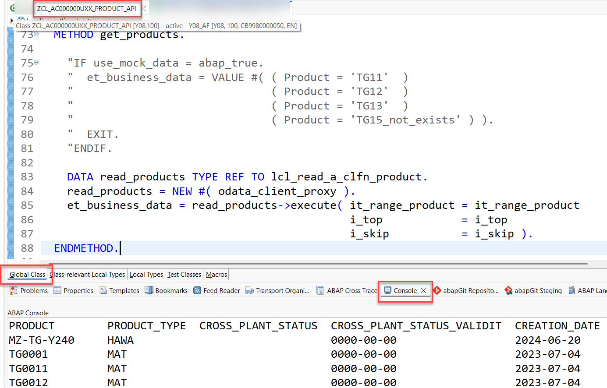 


### How to use the API as a value help ? 

Since we want to use the results of the remote _Product Master Data Including Classification - Read_ OData service using our new API as a value help in our ShoppingCart app we will have to create our own custom entity. 
A custom entity does not read the data from a data source but it uses a class to retrieve the data via coding, e.g. by calling a remote OData service or by calling a local API.

In order to leverage the remote OData service in our application we have to perform two steps.

1.  We have to create custom entity. 
2.  We have to create a class that is used as the query implementation class for the custom entity. This class will use the product api class that we have created beforehand.    


### Create the data definition of the custom entity

In contrast to "normal" CDS views that read data from the database from tables or other CDS views _custom entities_ act as a wrapper for a code based implementation that provides the data instead of a database table or a CDS view. 

For this we have to build a class that implements the interface **if_rap_query_provider**. 

The interface **if_rap_query_provider interface** only offers one method which is called **select**. Within this select method we will call the public **get_products( )** method of our product api class. The select method also expects that the incoming requests provide certain OData specific query parameters. These we will set in our coding as well.

Let’s start with creating a new data definition `ZI_AC000000U##_VH_PRODUCTS` using the template for a custom entity.

1. Right-click on the folder **Data Definition** and select **New Data Definition.**  

2. The **New Data Defintion** dialogue opens. Here you have to enter the following values:  
   - Name: **`ZI_AC000000U##_VH_PRODUCTS`** 
   - Description: **`Custom entity for products from S4`**
   
   Press **Next**
   
   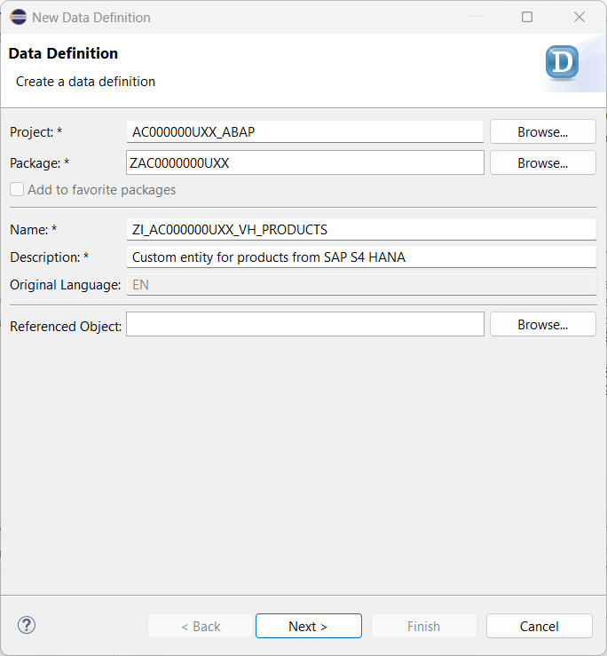
   
3. Selection of a transport request
   
   - **!!! ONLY !!!** Press *Next*. Do **NOT** press *Finish*.

   > Caution

   > If you were to press **Finish** instead of **Next**, the wizard would use the template that was used the last time when this wizard was used by the developer.  

   > In order to be sure that the correct template is selected, we **MUST** press **Next** and not **Finish** which would skip the step of template selection.
  
4. Select Template

   - Use the scroll bar to navigate down the list
   - Select the template **Define custom entity with parameters**
   - Press **Finish**

> **Please note**

> There is only a template for a custom entity with parameters. But this doesn’t matter. We use this template and remove the statement `with parameters parameter_name : parameter_type`.

 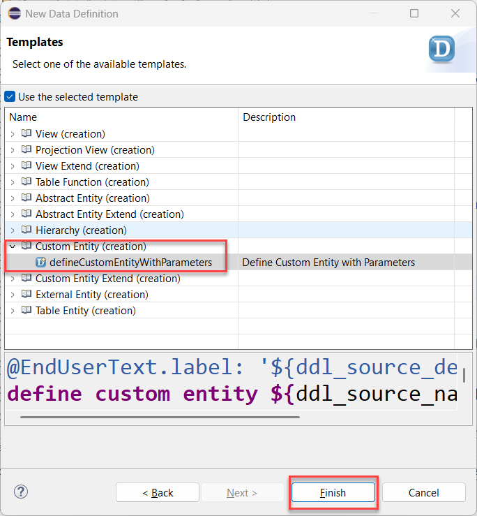
 

5. Edit the source code of the custom entity

   - From the remote OData service that is used by the service consumption model we only use the following field for your value help: `Product`.
   - We add the annotation `@ObjectModel.query.implementedBy: 'ABAP:ZCL_AC000000U##_PRODUCT_API'` right before the `define custom entity` statement.

The DDL source code should now look like follows:

<pre>
@EndUserText.label: 'Custom entity for products from ES5'
//@ObjectModel.query.implementedBy: 'ABAP:ZCL_AC000000U##_PRODUCT_API'
define custom entity ZI_AC000000U##_VH_PRODUCTS
{
  key Product                 : abap.char( 40 );      
}

</pre>
  
   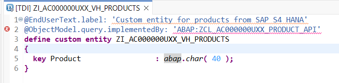   

> As you can see, the syntax of a custom entity differs from the one used in normal CDS views but is very similar to the syntax of a table.

> You will get an error message that the class `ZCL_AC000000U##_PRODUCT_API` is not found. This is because our class does not yet exist or if it already exists that it does not yet implement the interface `IF_RAP_QUERY_PROVIDER`.  

### Create a query implementation class for our custom entity

1. Right-click on your ABAP package **`ZAC000000U##`** and select **New** > **ABAP class** from the context menu.

2. Maintain the required information and click **Next >**.
      - Name: **`ZCL_CE_AC000000U##_PRODUCT`** 
      - Description: **Query implementation class**

3. In the **Select a transport request** dialogue just click **Finish**. 

4. Replace the default code with the code snippet provided below.   

      **Hint**: Grab the code snippet using copy and paste. 

5. Choose **Ctrl** + **Shift** + **F3** to activate both, the custom entity **ZI_AC000000U##_VH_PRODUCTS** and its query implementation class **`ZCL_CE_AC000000U##_PRODUCT`** .

  
    
>     Source code **`ZCL_CE_AC000000U##_PRODUCT`**   

<hr>  

<details>     
<summary>Click to expand the source code</summary>  

```abap
  CLASS zcl_ce_AC000000U##_product DEFINITION
  PUBLIC
  FINAL
  CREATE PUBLIC .

  PUBLIC SECTION.


    INTERFACES if_rap_query_provider .

    TYPES t_business_data_external TYPE TABLE OF zi_AC000000U##_vh_products.

  PROTECTED SECTION.
  PRIVATE SECTION.
  ENDCLASS.


  CLASS zcl_ce_AC000000U##_product IMPLEMENTATION.


  METHOD if_rap_query_provider~select.

    DATA business_data TYPE t_business_data_external.
    DATA business_data_internal TYPE zsc_AC000000U##_api_product=>tyt_a_product_type.

    DATA product_api TYPE REF TO zcl_AC000000U##_product_api.

    product_api = NEW #(  ).

    DATA(top)               = io_request->get_paging( )->get_page_size( ).
    DATA(skip)              = io_request->get_paging( )->get_offset( ).
    DATA(requested_fields)  = io_request->get_requested_elements( ).
    DATA(sort_order)        = io_request->get_sort_elements( ).

    TRY.
        DATA(filter_condition) = io_request->get_filter( )->get_as_ranges( ).
        DATA(filter_condition_string) = io_request->get_filter( )->get_as_sql_string( ).

        product_api->get_products(
                 EXPORTING
                   it_filter_cond    = filter_condition
                   top               = CONV i( top )
                   skip              = CONV i( skip )
                 IMPORTING
                   et_business_data  = business_data_internal
                 ) .

        IF top IS NOT INITIAL.
          DATA(max_index) = top + skip.
        ELSE.
          max_index = 0.
        ENDIF.

        SELECT * FROM @business_data_internal AS data_source_fields
           WHERE (filter_condition_string)
           INTO TABLE @business_data_internal
           UP TO @max_index ROWS
           .

        IF skip IS NOT INITIAL.
          DELETE business_data_internal TO skip.
        ENDIF.

        business_data = CORRESPONDING #( business_data_internal ).

        io_response->set_total_number_of_records( lines( business_data ) ).
        io_response->set_data( business_data ).

      CATCH cx_root INTO DATA(exception).
        DATA(exception_message) = cl_message_helper=>get_latest_t100_exception( exception )->if_message~get_longtext( ).
    ENDTRY.

  ENDMETHOD.
  ENDCLASS.
      
      
      
``` 
   
</details>   

<hr>       
      


## Use your own product api class as a value help

 
1. Open your projection view **`ZC_AC000000U##`** where the product API is used as a value help by using this ADT [Link](adt://TDI/sap/bc/adt/ddic/ddl/sources/ZI_AC_VH_PRODUCTS?version=workingArea) 

2. Navigate to the annotation `@Consumption.valueHelpDefinition` where the value help has been defined   
   
   ```ABAP    
      @Consumption.valueHelpDefinition: [ {
      entity.name: 'ZI_AC_VH_PRODUCTS',
      entity.element: 'Product',
      useForValidation: true
      } ]
   ```     

   and replace the following lines of code:


```ABAP
//      entity.name: 'ZI_AC_VH_PRODUCTS',
        entity.name: 'ZI_AC000000U##_VH_PRODUCTS',
```

  This way your own product API is being used as a value help.   


## Use your own product api class in the validation

 
1. Open the **Local Types** section of your behavior implementation class **`zbp_r_AC000000U##`** where the product API is used as a value help
2. Navigate to the method `validateOrderedItem` e.g. by using this ADT [Link](adt://TDI/sap/bc/adt/oo/classes/zbp_r_AC000000U##/includes/implementations)  
   and replace the coding as follows    
   
   ```ABAP
      "For your convinience there are GLOBAL defined types available:
      "DATA product_api TYPE REF TO zcl_AC_PRODUCT_API.
      "DATA business_data TYPE zcl_AC_PRODUCT_API=>t_business_data_external.

      "... later on, you will be replacing them with your own types.
      DATA product_api TYPE REF TO zcl_AC000000U##_PRODUCT_API.
      DATA business_data TYPE zcl_AC000000U##_PRODUCT_API=>t_business_data_external.
   ```

   Now the validation will use your Product API.

## Test your implementation

Open the service binding to start the Fiori elements preview of your ShoppingCart App and create a new shopping cart. 

Check that the value help for products still works and that an error message is raised in case you use a product name that has not been selected from the value help.   


[Next Lesson](./4_ABAP-Cloud_OData.md) >

