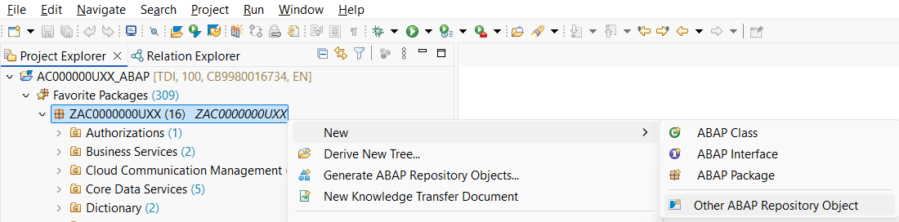
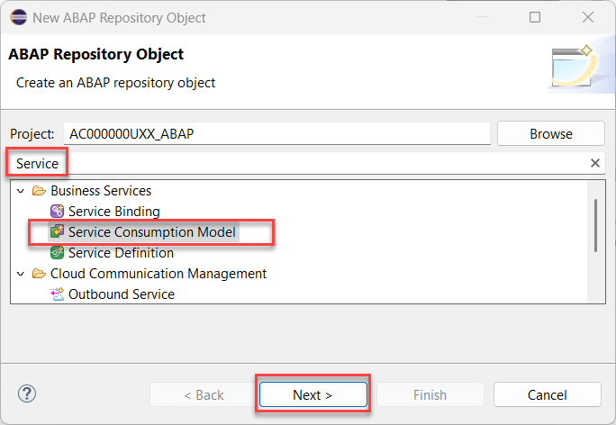
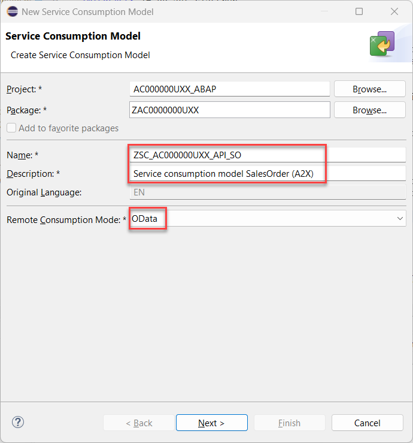
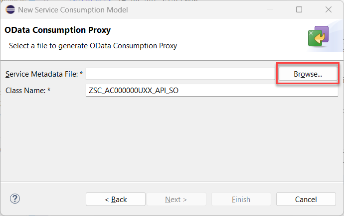
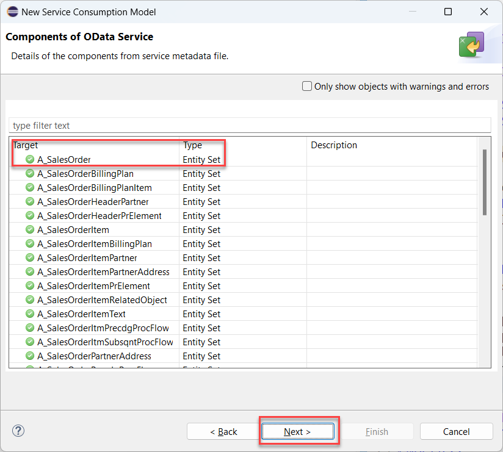
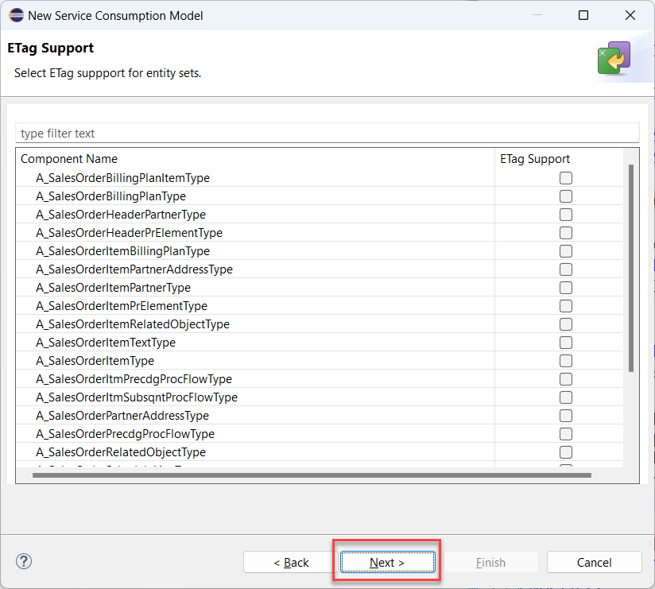
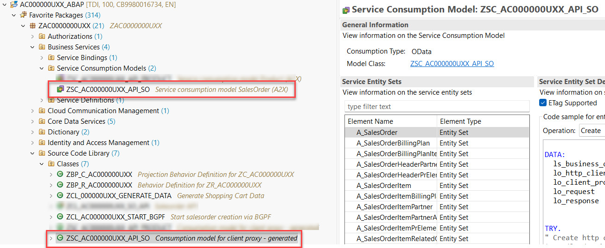
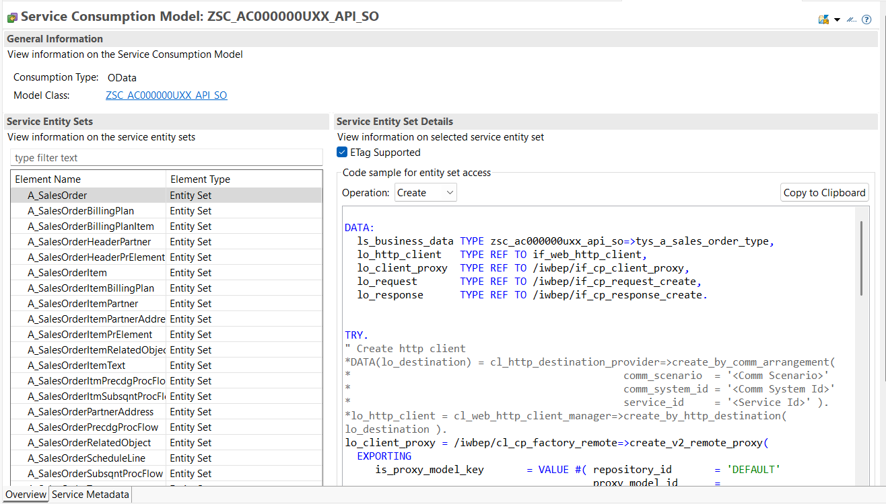
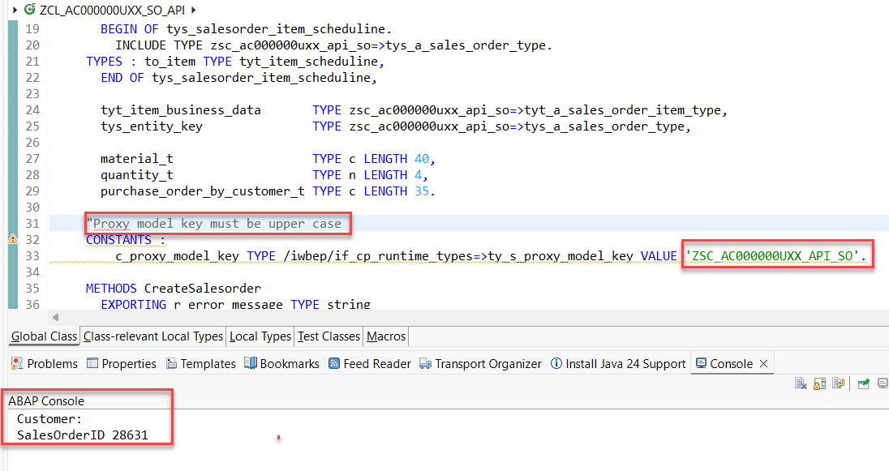

< [Previous Lesson](./3_ABAP-Cloud_OData.md)
# Create a service consumption model

## Introduction

In this exercise you will use the service metadata of the **SalesOrder (A2X) OData service** that you have downloaded earlier to create a service consumption model `zsc_AC000000U##_api_so`.   
This service consumption model will then be used in your own sales order API.

## Create the Service Consumption Model for SalesOrder (A2X) OData service

We start by creating a service consumption model for the SalesOrder (A2X) OData service. This service resides in all SAP S/4HANA public and private cloud systems.

1. The *$metadata* file of the OData service that we want to consume must be uploaded in file format. 
   We have hence downloaded it in the previous exericse.
 
2. Switch to ADT and right click on your package **`ZAC000000U##`**. Select **New > Other ABAP Repository Object**.  

    

2. In the New ABAP Repository Object dialogue do the following

   -  Start to type **`Service consumption model`**
   -  In the list of objects select **Service Consumption Model**
   -  Click **Next**
 
      

4. The **New Service Consumption Model** dialogue opens. Here enter the following data:

   - Name: **`ZSC_AC000000U##_API_SO`**
   - Description: **`Service consumption model SalesOrder (A2X)`**
   - Remote Consumption Model: **`OData`** (to be selected from the drop down box)
   
   Then click **Next**. 
   
   > **Caution**   
   > Be sure that you have selected **`OData`** as the **Remote Consumption Mode** from the drop down box. 
   
    

5. The $metadata file of the OData service that we want to consume must be uploaded in file format. If you have not yet downloaded the $metadata file you have to do this now.

   - Click **Browse** to select the $metadata file that you have downloaded earlier in this exercise
   - Class Name: **`ZSC_AC000000U##_API_SO`**
   
> **Please note**
> The wizard suggest the name of the service consumption model also as the name of the class that is going to be generated. Leave the defaulted value.

 

6. Check the **Components of the OData Service** and click **Next**.

   You will notice that the sales order (A2X) service provides a huge number of entity sets. We will later use the entity set `A_SalesOrder`. 

   

   Press **Next**.

7. The wizard will now let you choose for which entity sets support for etags should be added. 

   

   Just press **Next**.

8. Selection of transport request
   
   - Press **Finish**

9. Select the Service Consumption Model and press the **Activate** button press or **Ctrl+F3**. This will also trigger the generation of the class **`ZSC_AC000000U##_API_SALESORDER`**.    

10. When you check the content of your package you will notice that it contains two objects. 

    -  The service consumption model
    -  The service consumption model class

    

11. Let us briefly investigate the service consumption model.  

   For each operation (**Read List**, **Read**, **Create**, **Update** and **Delete**) some sample code has been created that you can use when you want to call the OData Service with one of these operations. Since we want create a **Sales Order** alongside with one **Item**, we will select the operation **Create** and click on the button **Copy to Clipboard**. We will use this code in the following step where we create a console application to test the call to the remote OData service. 
  
 

 > We won't use the provided code sample because we have provided an complete class that serves as an API to create sales orders. 
 > This is because we will have to perform a so called **deep insert** that requires additional coding. 


## How to section

1. Right-click on your ABAP package **`ZAC000000U##`** and select **New** > **ABAP class** from the context menu.

2. Maintain the required information and click **Next >**.
      - Name: **`ZCL_AC000000U##_SO_API`** 
      - Description: **Salesorder API**

3. In the **Select a transport request** dialogue click **Finish** 

4. Replace the default code with the code snippet provided below.   

      **Hint**: Grab the code snippet using copy and paste. 

   
    
###   Source code **`zcl_AC000000U##_SO_API`**

<hr>  

 <details>     
 <summary>Click to expand the source code</summary>  
 
 ```abap
 
  CLASS zcl_AC000000U##_SO_API DEFINITION
      PUBLIC
  FINAL
  CREATE PUBLIC .

  PUBLIC SECTION.

    INTERFACES if_oo_adt_classrun .

    TYPES:
      BEGIN OF tys_item_scheduline.
        INCLUDE TYPE zsc_AC000000U##_api_so=>tys_a_sales_order_item_type.
          TYPES : to_schedule_line TYPE  zsc_AC000000U##_api_so=>tyt_a_sales_order_schedule_l_2,
      END OF tys_item_scheduline,

      tyt_item_scheduline TYPE STANDARD TABLE OF tys_item_scheduline WITH DEFAULT KEY,

      BEGIN OF tys_salesorder_item_scheduline.
        INCLUDE TYPE zsc_AC000000U##_api_so=>tys_a_sales_order_type.
          TYPES : to_item TYPE tyt_item_scheduline,
      END OF tys_salesorder_item_scheduline,

      tyt_item_business_data       TYPE zsc_AC000000U##_api_so=>tyt_a_sales_order_item_type,
      tys_entity_key               TYPE zsc_AC000000U##_api_so=>tys_a_sales_order_type,

      material_t                   TYPE c LENGTH 40,
      quantity_t                   TYPE n LENGTH 4,
      purchase_order_by_customer_t TYPE c LENGTH 35.

    CONSTANTS :
        c_proxy_model_key TYPE /iwbep/if_cp_runtime_types=>ty_s_proxy_model_key VALUE 'ZSC_AC000000U##_API_SO'.

    METHODS CreateSalesorder
      EXPORTING r_error_message TYPE string
      RETURNING VALUE(r_data)   TYPE  tys_salesorder_item_scheduline.

    METHODS constructor
      IMPORTING i_material                   TYPE material_t OPTIONAL
                i_quantity                   TYPE quantity_t OPTIONAL
                i_purchase_order_by_customer TYPE purchase_order_by_customer_t OPTIONAL
                i_requested_delivery_date    TYPE datn OPTIONAL.

  PROTECTED SECTION.
  PRIVATE SECTION.
    DATA deep_busi_data TYPE tys_salesorder_item_scheduline.
ENDCLASS.

CLASS zcl_AC000000U##_SO_API IMPLEMENTATION.
  METHOD constructor.
    IF i_material <> 'MZ-FG-C900'.
      deep_busi_data    =    VALUE #(
                         sales_order_type            = 'OR'
                         sales_organization          = '1010'
                         distribution_channel        = '10'
                         organization_division       = '00'
                         sold_to_party               = '10100001'
                         purchase_order_by_customer  = i_purchase_order_by_customer
                         requested_delivery_date     = i_requested_delivery_date
                         to_item = VALUE #( (
                            material =  i_material
                            requested_quantity = i_quantity
                            ) )
                         ).
    ELSE.
      deep_busi_data    =    VALUE #(
                         sales_order_type            = 'OR'
*                         sales_organization          = '1710'
*                         distribution_channel        = '10'
*                         organization_division       = '00'
                         sold_to_party               = 'LACU_S01' "'1000292'
*                         purchase_order_by_customer  = i_purchase_order_by_customer
                         requested_delivery_date     = i_requested_delivery_date
                         to_item = VALUE #( (
                            material =  i_material
                            requested_quantity = i_quantity
                            ) )
                         ).
    ENDIF.
  ENDMETHOD.

  METHOD if_oo_adt_classrun~main.
    DATA deep_busi_data TYPE tys_salesorder_item_scheduline.
    DATA error_message TYPE string.

    deep_busi_data    =    VALUE #(
                       sales_order_type            = 'OR'
                       sales_organization          = '1010'
                       distribution_channel        = '10'
                       organization_division       = '00'
                       sold_to_party               = '10100001'
                       purchase_order_by_customer  = |SalesOrder Simulation{ sy-uname }|
                       requested_delivery_date     = sy-datum
                       to_item = VALUE #( (
                          material = 'TG1  11'
                          requested_quantity = '5'
                          ) )
                       ).


    DATA(response) = CreateSalesorder(
                       IMPORTING
                         r_error_message  = error_message
                     ).

    IF error_message IS NOT INITIAL.
      out->write( error_message ).
    ELSE.
      out->write( | Customer: { response-purchase_order_by_customer } | ).
      out->write( | SalesOrderID { response-sales_order } | ).
      LOOP AT response-to_item INTO DATA(item).
        out->write( |ItemId { item-sales_order_item }|  ).
        out->write( |Name { item-purchase_order_by_customer }|  ).
        LOOP AT item-to_schedule_line INTO DATA(schedule_line).
          out->write( | amount { schedule_line-confd_order_qty_by_matl_av } | &&
                      | requested delivery date { schedule_line-requested_delivery_date } | &&
                      | confirmed delivery date { schedule_line-confirmed_delivery_date } | ).
        ENDLOOP.
      ENDLOOP.
    ENDIF.
  ENDMETHOD.


  METHOD CreateSalesorder.
    DATA:
      lt_item_business_data      TYPE tyt_item_business_data,
      ls_entity_key              TYPE tys_entity_key,
      lo_http_client             TYPE REF TO if_web_http_client,
      lo_client_proxy            TYPE REF TO /iwbep/if_cp_client_proxy,
      lo_response                TYPE REF TO /iwbep/if_cp_response_create,
      lo_create_request          TYPE REF TO /iwbep/if_cp_request_create,
      lo_data_desc_node_root     TYPE REF TO /iwbep/if_cp_data_desc_node,
      lo_data_desc_node_child    TYPE REF TO /iwbep/if_cp_data_desc_node,
      lo_data_desc_node_gc_child TYPE REF TO /iwbep/if_cp_data_desc_node,
      ls_deep_response_data      TYPE tys_salesorder_item_scheduline.

    TRY.
        " Create http client
        TRY.
            DATA(lo_destination) = cl_http_destination_provider=>create_by_cloud_destination(
                                      i_name = 'S4HANA_ODATA_SalesOrder'
                                      i_authn_mode            = if_a4c_cp_service=>service_specific
                                   ).
          CATCH cx_http_dest_provider_error INTO DATA(dest_provider_error).
            "handle exception
            r_error_message = dest_provider_error->get_text(  ).
            EXIT.
        ENDTRY.

        lo_http_client = cl_web_http_client_manager=>create_by_http_destination( lo_destination ).
        lo_client_proxy = /iwbep/cl_cp_factory_remote=>create_v2_remote_proxy(
          EXPORTING
             is_proxy_model_key       = VALUE #( repository_id       = 'DEFAULT'
                                                 proxy_model_id      = c_proxy_model_key
                                                 proxy_model_version = '0001' )
            io_http_client             = lo_http_client
            iv_relative_service_root   =  'sap/opu/odata/SAP/API_SALES_ORDER_SRV/' ).

        IF lo_http_client IS NOT BOUND.
          r_error_message = 'http client not bound'.
          EXIT.
        ENDIF.

        " Navigate to the resource and create a request for the create operation
        lo_create_request = lo_client_proxy->create_resource_for_entity_set( 'A_SALES_ORDER' )->create_request_for_create( ).

        "Description of the deep business data
        TRY.

            lo_data_desc_node_root = lo_create_request->create_data_descripton_node( ).
            lo_data_desc_node_root->set_properties( VALUE #( ( |{ to_upper( 'sales_order_type' ) }| )
                                                             ( |{ to_upper( 'sales_organization' ) }| )
                                                             ( |{ to_upper( 'distribution_channel' ) }| )
                                                             ( |{ to_upper( 'organization_division' ) }| )
                                                             ( |{ to_upper( 'sold_to_party' ) }| )
                                                             ( |{ to_upper( 'purchase_order_by_customer' ) }| )
                                                                  ) ).

            lo_data_desc_node_child = lo_data_desc_node_root->add_child( 'TO_ITEM' ).
            lo_data_desc_node_child->set_properties( VALUE #(
                                                                ( |{ to_upper( 'sales_order_item' ) }| )
                                                                ( |{ to_upper( 'material' ) }| )
                                                                ( |{ to_upper( 'requested_quantity' ) }| )
                                                             ) ).

            lo_data_desc_node_gc_child = lo_data_desc_node_child->add_child( 'TO_SCHEDULE_LINE' ).

          CATCH  /iwbep/cx_gateway  INTO DATA(gw_error).
            r_error_message = gw_error->get_text(  ).
            EXIT.
        ENDTRY.


        lo_create_request->set_deep_business_data(
          EXPORTING
            is_business_data            = deep_busi_data
            io_data_description         = lo_data_desc_node_root
            ).

        " Execute the request
        lo_response = lo_create_request->execute( ).

        " Get the after image
        lo_response->get_business_data( IMPORTING es_business_data = ls_deep_response_data ).

        " Set entity key
        ls_entity_key = VALUE #(
                  sales_order  = ls_deep_response_data-sales_order ).

        " Navigate to the resource
        DATA(lo_resource) = lo_client_proxy->create_resource_for_entity_set( 'A_SALES_ORDER' )->navigate_with_key( ls_entity_key )->navigate_to_many( iv_navigation_property_name = 'TO_ITEM' ).

        " Execute the request and retrieve the business data
        DATA(lo_response_read_deep) = lo_resource->create_request_for_read( )->execute( ).
        lo_response_read_deep->get_business_data( IMPORTING et_business_data = lt_item_business_data ).

        IF lt_item_business_data IS NOT INITIAL.
          ls_deep_response_data-to_item = CORRESPONDING #(  lt_item_business_data ).
        ENDIF.

        r_data = ls_deep_response_data.


      CATCH /iwbep/cx_cp_remote INTO DATA(lx_remote).
        " Handle remote Exception
        " It contains details about the problems of your http(s) connection
        r_error_message = |remote exc { lx_remote->get_text(  ) }| .
        EXIT.
      CATCH /iwbep/cx_gateway INTO DATA(lx_gateway).
        " Handle Exception
        r_error_message = |gateway exc { lx_gateway->get_text(  ) }| .
        EXIT.
      CATCH cx_web_http_client_error INTO DATA(lx_web_http_client_error).
        " Handle Exception
        r_error_message = |gateway exc { lx_web_http_client_error->get_text(  ) }| .
        EXIT.
    ENDTRY.

  ENDMETHOD.
  ENDCLASS.

   ``` 

</details>

<hr>   
 
6. Save  and activate  the changes.

7. Run the class by pressing **F9**

  

## Coding explained 

The constructor of the sales order API takes some basic data that are needed to create a new sales order such as the material number, the quantity and the requested delivery date.  
With this data a deep structure is being filled alongside with default data.   
The `create_salesorder( )` method creates an OData Client Proxy object that uses the name of the destination being used and the name of the service consumption model that contains the model information of the OData service that is being called.  
The OData Client Proxy finally performs the call to the remote OData service in the SAP S/4HANA backend system and returns the data of the sales order that has been created.

## Use your own sales order api class

1. Open your BGPF starter class [`ZCL_AC000000U##_start_bgpf`](adt://TDI/sap/bc/adt/oo/classes/zcl_AC000000U##_start_bgpf).   

2. Navigate to the method `if_bgmc_op_single_tx_uncontr~execute` and replace the following lines of code:

  ```ABAP
    "DATA start_sales_order_create TYPE REF TO zcl_ac_salesorder_api.
    DATA start_sales_order_create TYPE REF TO zcl_AC000000U##_so_api.
  ```

  ```ABAP
         "start_sales_order_create = NEW zcl_ac_salesorder_api(
        start_sales_order_create = NEW zcl_AC000000U##_so_api(
                                         i_material = entity-OrderedItem
                                         i_purchase_order_by_customer = CONV #( sy-uname )
                                         i_quantity = entity-OrderQuantity
                                         i_requested_delivery_date = entity-RequestedDeliveryDate
                                         ).
  ```

  This way the asynchronous process now uses your own sales order api class.   

## Test your implementation

Open the service binding to start the Fiori elements preview of your ShoppingCart App and create a new shopping cart. 

Check if a sales order is still being created.

 
[Next Unit](../506_BTP_ABAP-Cloud_Appendix/README.md) 