# Prerequisites 

In order to run this workshop in your own system landscape you have perform some configuration- / installation steps.

You need the following components:

- **SAP S/4HANA on premise or private cloud system** - In this system two Data services have to be published and technical users have to be created that are used 
- **SAP BTP ABAP Environment** - The system has to be setup (we recommend to use the booster for this), users for your developers have to be created and content has to be imported from this repository and communication arrangements have to be setup
- **Cloud Connector** - that connects the SAP S/4HANA system with the sub account where the SAP BTP ABAP Environment System is running

And you need to perform the following configuration / development steps

- In your SAP BTP ABAP Environment System
  - Import of the content of this repository which contaisn amongst others the communication scenario and two classes that are used as API's to perform the http calls to the OData service that are published in your backend system
  - Create two service consumption models based on $metadata documents that have to be downloaded from the API hub
  - Create users for your developers
  - Create two communication arrangements based on the communication scenarios that have been imported beforehand
- In your SAP S/4HANA system
  - Create a technical user that is entitled to
    - read product data
    - create sales orders

You can then finally test your setup

- By testing the communication arrangments that shows that the connectivity works in principle
- By running the API classes which perform OData calls to read products and to create a salesorder using the published services in your SAP S/4HANA backend system

# Step-by-step Guide 

## Configuration steps in your SAP S/4HANA System

We start with some configuration steps in your SAP S/4HANA System. This is because we will later consume the technical user and the OData services from the SAP BTP ABAP Environment.

### Create a technical user in SAP S/4HANA

Create a technical user in your SAP S/4HANA system that is able 
- to create sales orders
- read product data

### Check whether services are published in your S/4

Start transaction **/IWFND/MAINT_SERVICE** by entering **/n/IWFND/MAINT_SERVICE** in the command field for transactions that is located on the far left of the standard toolbar.

Here you can check if the two services with the technical service names:  
- `API_CLFN_PRODUCT_SRV`
- `API_SALES_ORDER_SRV`	
have already been published in your system.

If not, perform the following steps for both services in order to publish them in your SAP S/4HANA System. 

   

Click to expand

1. Press the **Add Service** button

   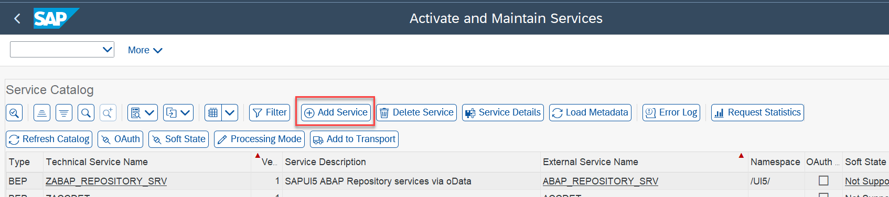

2. In the **Add selected services** screen, enter the system alias `LOCAL` and press the **Get Services** button. 

   > **Hint:**  
   > You can use the input field **Technical Service Name** as a filter.

3. Select the service `API_CLFN_PRODUCT_SRV` and press the **Add Selected Services** button.

   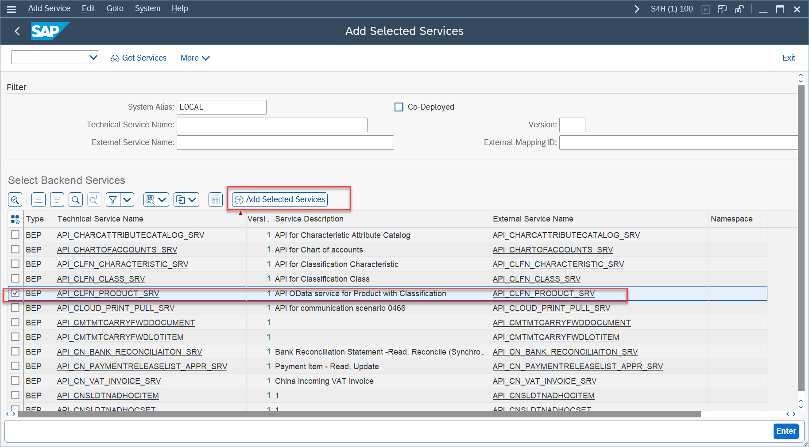

4. In the **Add service** screen choose a technical name, e.g. `ZAPI_CLFN_PRODUCT_API` and choose a package name and continue by pressing the green checkmark button.

   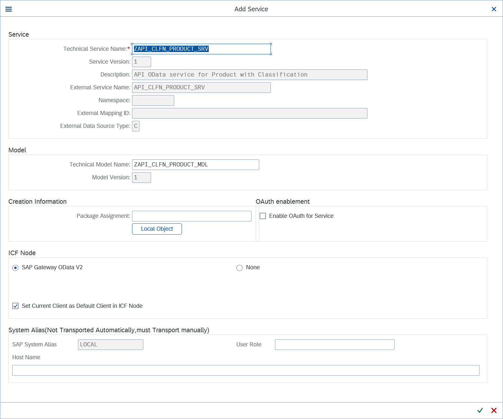

   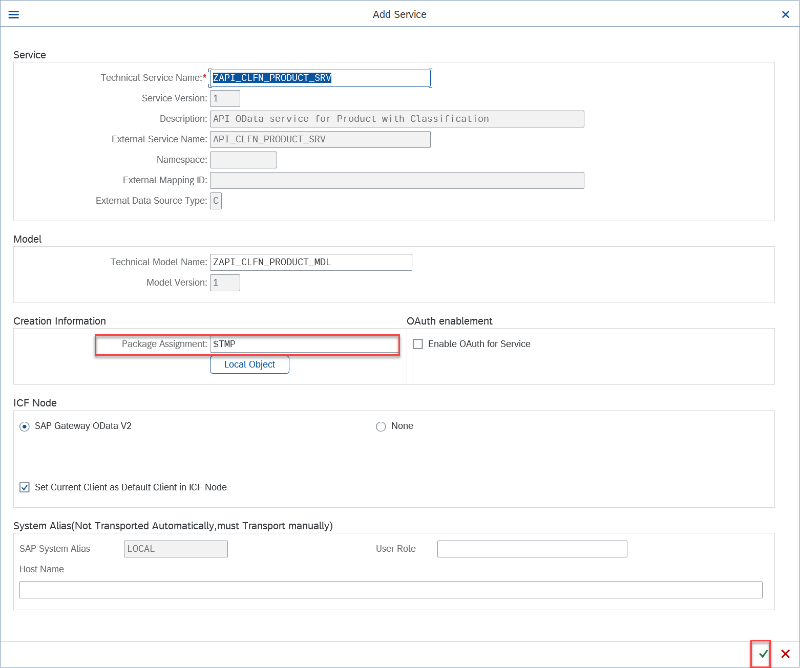

5. You should get a success message that the service `API_CLFN_PRODUCT_SRV` was successfully published. 

   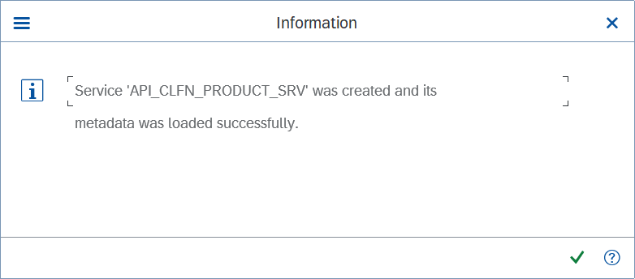

6. Repeat the same steps for the service with the technical service name `API_SALES_ORDER_SRV`.

### Setup an ABAP Environment using the booster

The setup of an ABAP Environment in your SAP BTP Global account can be conviniently be performed by using a so called booster. 

   

Click to expand

1. Log on to the SAP BTP Cockpit of your SAP BTP Global Account.

2. Click on **Boosters** in the menue of the left hand side.

3. Start the booster **Prepare an Account for ABAP Development** from within your BTP Global Account.

   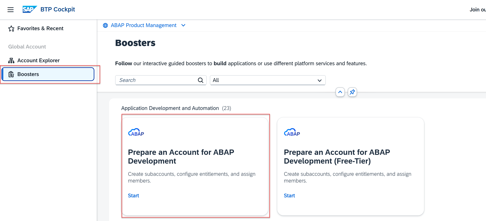

4. During the execution of the booster you need to decide whether you'd like to install the ABAP environment in a new subaccount or an existing one.  
   The installation in an existing subaccount for which a Cloud Connector and an IDP is already configured may will speed up the process since you will be able to reuse the existing connectivity setup.

   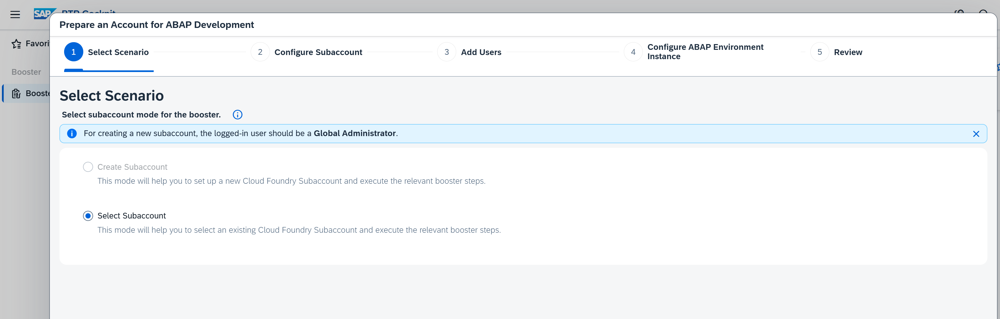

   > Additional information on how to use the booster for ABAP Cloud can be found here:  
   > [SAP Online Help: Using a Booster to Automate the Setup of the ABAP Environment](https://help.sap.com/docs/btp/sap-business-technology-platform/using-booster-to-automate-setup-of-abap-environment-optional)

### Create users in the SAP BTP ABAP Environment

After completing the booster, the ABAP Environment system has been setup with the administrative users you have specified during the setup process.
Two roles have been created for your convenience.
- `SAP_BR_DEVELOPER`
- `SAP_BR_ADMINISTRATOR`
with the administrative users having the role `SAP_BR_ADMINISTRATOR` assigned.  

You now need to sign in to your newly created ABAP Environment system as an administrator. Here you have to create business partners of type employee and business users for all the developers that participate in the ABAP Cloud workshop. 

The role `SAP_BR_DEVELOPER` has to be assgined to the newly created users using the identity and access management apps in the administrator’s launchpad.

The process is described in detail in the following tutorial:

[Tutorial: Create a Developer User in SAP BTP ABAP Environment](https://developers.sap.com/tutorials/abap-environment-developer-user..html)

### Connect sub account with SAP Cloud Connector with on prem system

As part of the ABAP Cloud Trial we're reading and writing data to your ERP System (S/4HANA on-prem oder S/4HANA private). In order to have access to the backend services the SAP Cloud Connector needs to be setup.  

Please follow the below descriptions for this.

https://learnsap.enable-now.cloud.sap/pub/mmcp/index.html?show=project!PR_58F2AD1C19B455B4:uebung#2

In addition more information can be found in the SAP Communities:

https://community.sap.com/t5/technology-blog-posts-by-members/how-to-connect-on-premise-sap-to-btp-using-sap-cloud-connector/ba-p/13523632

## Create Communication Arrangments

After setting up the technical connection, communication arrangements have to be created in your SAP BTP environment.   

These communication arrangements are based on communication scenarios that we have provided for your convenience.

Unfortunately the service consumption models that are needed as well have to be created manually.

### Import sample source code from GitHub

Use the abapGit plug-in to import the ABAP Artefacts of this repository by executing the following steps:

1. In your ABAP cloud project, create the ABAP package **`ZTRL_BTP_TRIAL`** (using e.g. the superpackage `ZLOCAL`) as the target package for the demo content to be downloaded (leave the suggested values unchanged when following the steps in the package creation wizard).  
2. To add the abapGit Repositories view to the ABAP perspective, click **Window** > **Show View** > **Other...** from the menu bar and choose abapGit Repositories.  
4. In the abapGit Repositories view, click the **`+`** icon to clone an abapGit repository.
5. Enter the following URL for this repository: `https://github.com/SAP-samples/abap-platform-basic-trial.git` and choose **Next**.
6. Select the branch **`refs/heads/main`** and enter the newly created package **`ZTRL_BTP_TRIAL`** as the target package and choose **Next**.  
7. Choose **Finish** to link the Git repository to your ABAP cloud project. The repository appears in the abapGit Repositories View with status **Linked**.
8. Right-click on the new ABAP repository and choose pull to start the cloning of the repository contents. Note that this procedure may take a few seconds.
9. After the import has been finished choose mass activation e.g. by pressing `Ctrl+Shift+F3`. 

### Create two service consumption models

Since service consumption models cannot yet be imported using abapGit you have to create them manually.

Please use the following names instead of the names described in the how-to-guides mentioned below: 

 | **Repository object name**                          | **replace by**                   |  
 |----------------------------------------|---------------------------------|            
| **`ZSC_AC000000U##_API_PRODUCT`**       | **`ZSC_TEST_API_CLFN_PRODUCT_SRV`**                                |
| **`ZSC_AC000000U##_API_SALES_ORDER`**       | **`ZSC_TEST_API_SALES_ORDER_SRV`**                                |

and perform the steps described below

1. [Download $metadata from API Hub](../505_BTP_ABAP-Cloud_OData-Service-Consumption/1_ABAP-Cloud_OData.md)   
2. [Create service consumption model for product service](../505_BTP_ABAP-Cloud_OData-Service-Consumption/2_ABAP-Cloud_OData.md)   
3. [Create service consumption model for sales order (a2x) service](../505_BTP_ABAP-Cloud_OData-Service-Consumption/3_ABAP-Cloud_OData.md)   

### Create two communication arrangements

We now can create the two communication arrangements that will be used from within ABAP code running in the SAP BTP ABAP Environment to call the remote OData services in your SAP S/4HANA Backend.

   

Click to expand

1. As an administrator from the Fior Launchpad of your SAP BTP ABAP Environment choose **Administration** > **Communication Management** > **Communication Arrangements**  

   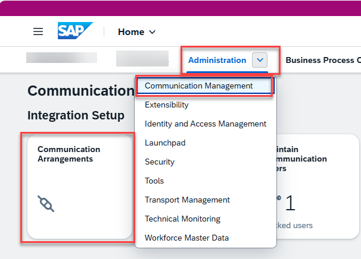
 
2. Press the **New** button

3. Use the value help in the **Scenario** field to select the communication scenario `ZBTP_TRIAL_SAP_COM_0309` that has been imported beforehand.  

   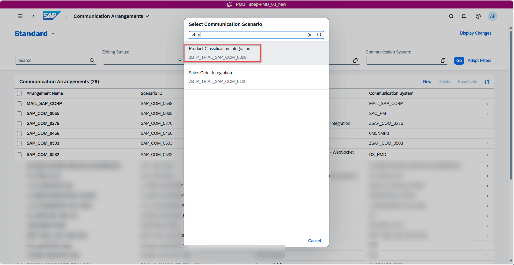

4. In the **New Communication Arrangement** dialogue select the same name `ZBTP_TRIAL_SAP_COM_0309` for the communication arrangment.  
   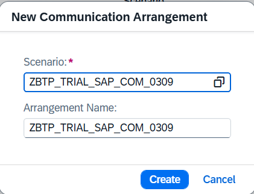

5. Press the **New** button beside the **Communication System** field and enter the following two values 

   - System ID: `ZBTP_TRIAL_SAP_COM_0309`
   - System Name: `ZBTP_TRIAL_SAP_COM_0309`  

   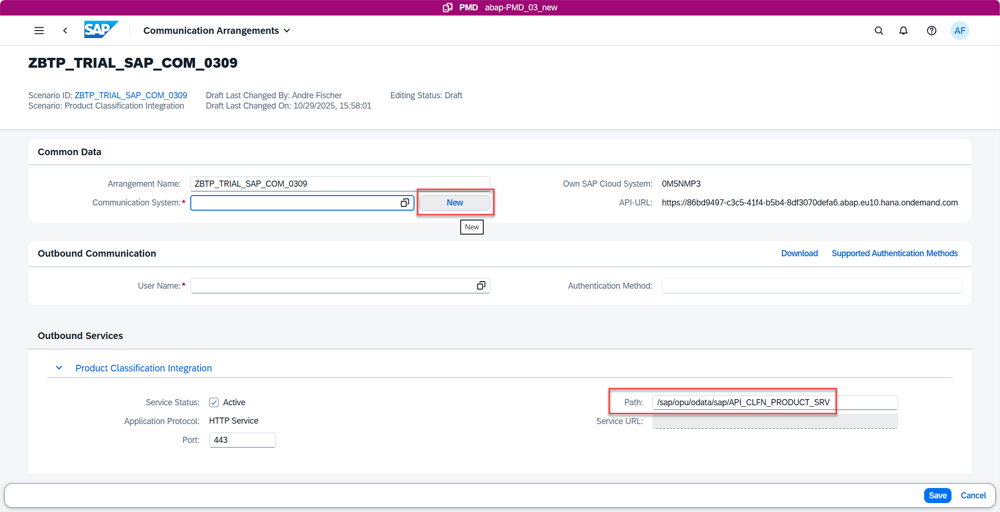

   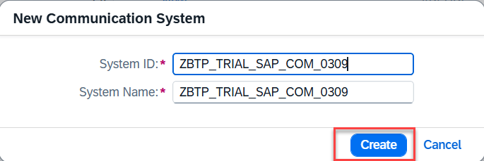

6. Enter the following information
   
   - Hostname of your SAP S/4HANA System under which this system is reachable from your Cloud Connector 
   - Port number
   - Location ID of your SAP Cloud Connector (if being used)   

   > here we use:   
   > `vhcals4hci.dummy.nodomain` and `44300` since we use a pre-configured SAP S/4HANA on prem system where the cloud connector is running on the same box
   > and `ABAPPMDevPMD` as location ID

   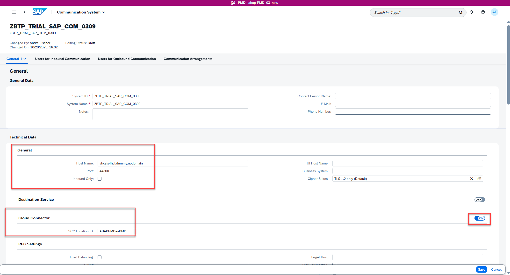

7. In the tab **Users for outbound communication** we have to specify username and password of the technical user being used in your SAP S/4HANA backend system

   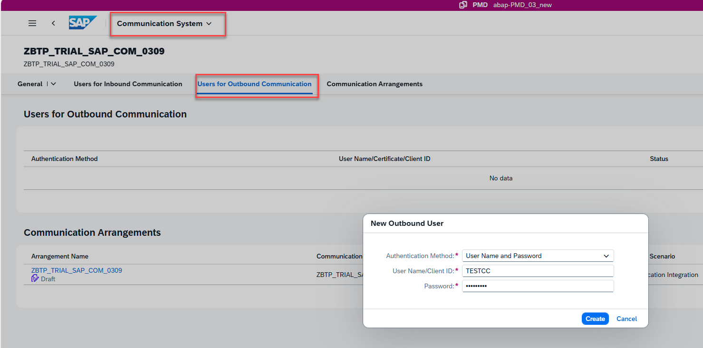

### Test communication arrangements

1. Use the **Check Connection** button to check the connectivity of your SAP BTP ABAP Environment system with your SAP S/4HANA backend system.

   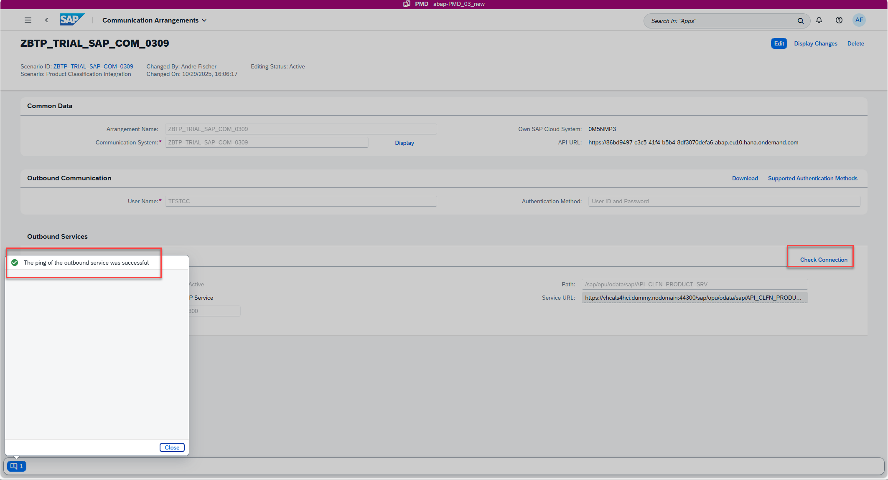

### Test API calls

In ADT run the following two classes via F9.

- `zcl_test_api_clfn_product_srv`

  You should see a list of products from your connected SAP S/4HANA System in the **Consol** tab in ADT. 

  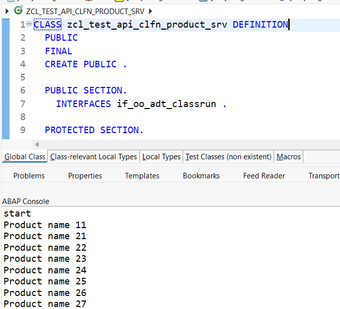  

- `zcl_test_api_sales_order_srv`  

  You should see the number of a newly created sales order. 

  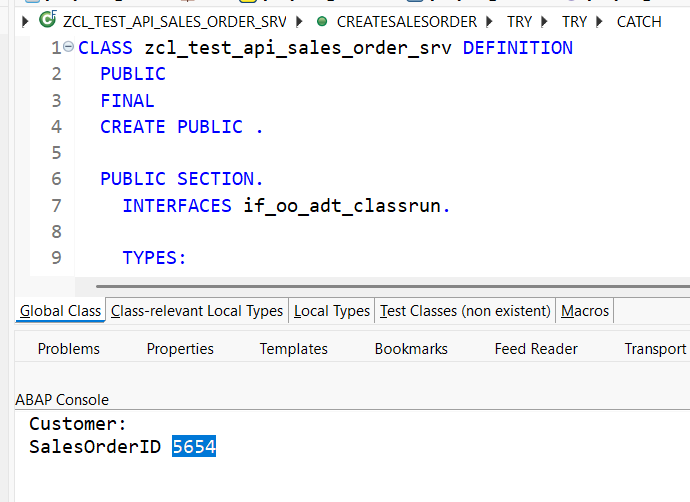

### AI enablement on SAP BTP (if you want to use AI in ABAP)

We're using AI capabilities as part of the learning. In order to use Joule for Developers you need to request the relevant entitlement for your BTP Global Account.  
Please follow the below community post on how to do this.

https://community.sap.com/t5/technology-blog-posts-by-sap/unlock-sap-joule-for-developers-claim-your-free-access-today/ba-p/14183158
